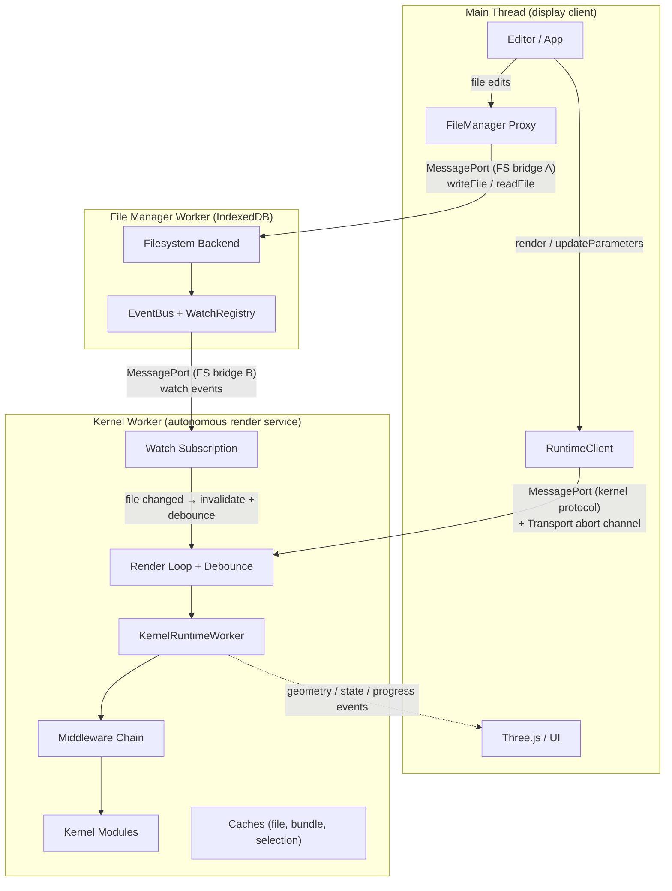
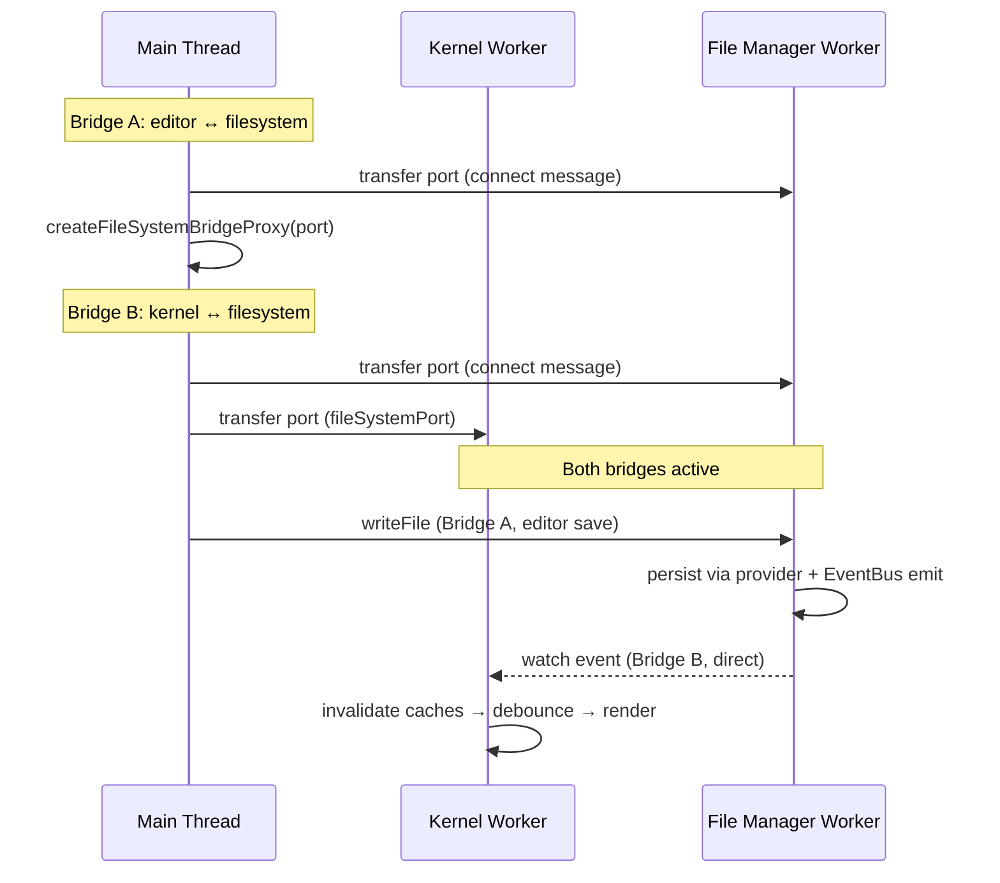
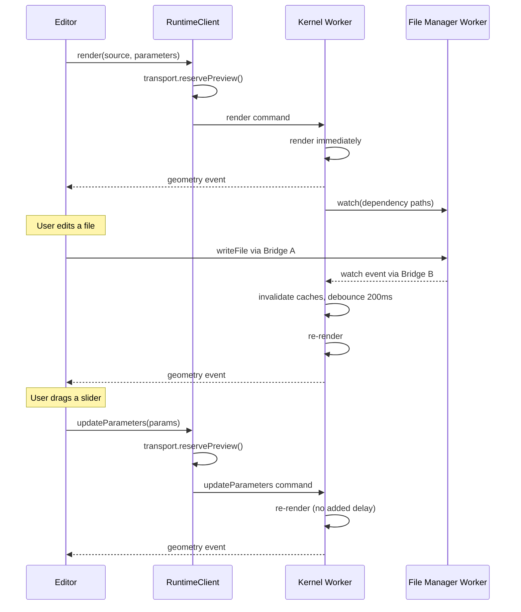

`@taucad/runtime` is an autonomous render service built on a three-thread topology. The kernel worker watches file dependencies, debounces changes, renders geometry, and pushes results to the main thread -- without the main thread telling it when to act. The design mirrors the Language Server Protocol: the worker is a "geometry server" and the main thread is a "display client."

## Context and Motivation

CAD kernels do heavy work: WASM geometry computation, bundling, tessellation. On the main thread this would freeze the UI. Isolation is only half the reason for the worker. The worker also owns the dependency graph, the caches, and every scheduling decision. A command-driven design would force the main thread to orchestrate renders without that context, paying a round-trip for each decision. The autonomous model moves scheduling into the worker and shrinks the main-thread vocabulary to "here is a file" and "here are new parameters."

## Thread Topology

Three threads, connected by MessagePort channels plus a transport-owned abort channel (backed by `SharedArrayBuffer` on SAB-capable transports):

**Main Thread** -- display and input. Houses the editor, the Three.js renderer, parameter controls, and progress indicators. The editor writes files to the File Manager Worker through a bridge proxy; the `RuntimeClient` sends commands to the kernel worker and subscribes to its events.

**Kernel Worker** -- the render service. Holds the current file, parameters, watch subscriptions, debounce timers, the render generation counter, all caches (file hash, file content, bundle result, kernel selection), and the render loop. Runs middleware and kernel code, and pushes results out as events.

**File Manager Worker** -- hosts the virtual filesystem behind multiple storage providers (`DirectIdbProvider`, `OPFSProvider`, `FileSystemAccessProvider`), an EventBus, and a WatchRegistry. It accepts two bridge connections: one from the main thread, one from the kernel worker.

## Filesystem Bridge

The File Manager Worker is the single owner of the virtual filesystem. Other threads reach it through `createFileSystemBridge`, which creates a `MessageChannel` and transfers one port to the worker; the worker-side `exposeFileSystem` serves filesystem operations over each port. Two bridges exist at startup:

**Bridge A (main thread → File Manager Worker):** the editor writes files, reads directory trees, and manages the file tree. A write persists through the active provider and emits a `fileWritten` event on the EventBus.

**Bridge B (kernel worker → File Manager Worker):** the kernel worker reads files, resolves dependencies, and subscribes to watch events. The WatchRegistry matches EventBus change events against those subscriptions and pushes watch events straight to the kernel worker.

The main thread creates both bridges but stays off the hot path: its own writes reach storage without kernel-worker involvement, and the kernel worker's watch events arrive without a main-thread relay.

## Protocol

The protocol is asymmetric: few commands in, many events out, plus an out-of-band abort channel. There is no request/response `render` call on the wire -- rendering is a fire-and-forget notification, and results correlate back by render identity, the same shape as LSP `didOpen` plus published diagnostics.

### Commands (main thread → worker)

| Command            | Trigger                          | Worker behavior                                        |
| ------------------ | -------------------------------- | ------------------------------------------------------ |
| `render`           | User opens a file                | Render immediately, discover deps, start watching      |
| `updateParameters` | User adjusts a slider or input   | Store params, re-render                                |
| `setOptions`       | User changes tessellation/format | Replace the options bag, re-render                     |
| `export`           | User exports                     | Export the last native handle, or self-render inline   |
| `abort`            | Transport without shared memory  | Wire-format equivalent of the transport's abort signal |

### Events (worker → main thread, pushed)

| Event                  | Trigger              | Main-thread use      |
| ---------------------- | -------------------- | -------------------- |
| `geometry`             | A render settles     | Update the 3D scene  |
| `parametersResolved`   | Parameters extracted | Rebuild parameter UI |
| `state`/`renderStatus` | Lifecycle transition | Progress indicator   |
| `progress`             | During a render      | Progress bar         |
| `error`                | A render fails       | Diagnostics panel    |
| `log` / `telemetry`    | Ongoing              | Console, perf panel  |

### Transport abort channel (out-of-band)

The active [transport](../api/transport) owns the abort channel end-to-end. Before posting `render`/`updateParameters`/`setOptions`, the runtime client calls the transport's `reservePreview()`, which synchronously advances the abort generation -- backed by `SharedArrayBuffer` + `Atomics` on SAB-capable transports, serialised as a wire-format `abort` notification elsewhere. The worker-side OC Proxy observes the new generation at its next WASM call boundary and unwinds the stale render with an internal abort marker, never a consumer-visible error. The runtime client itself never reads `Atomics` or touches a SAB. See [Worker Model](./worker-model).

### One-shot export

For programmatic pipelines, `client.export(format, input)` self-renders and resolves an `ExportResult` whose success payload is an ordered, non-empty file array -- companion files such as glTF + BIN are never dropped. The single-argument `client.export(format)` reuses the most recent render; calling it before one settles throws `NoRenderOutcomeError`.

## Autonomous Data Flow

After `render`, the worker manages its own lifecycle. File edits flow through the filesystem bridge; the worker notices, invalidates, and re-renders:

The main thread sends `render` and `updateParameters`; everything else -- scheduling, dependency watching, cache invalidation, abort, result delivery -- happens inside the worker. File changes debounce at 200ms to batch bursts; parameter changes schedule a re-render without added delay because supersession abort already keeps stale work cheap.

## Layer Responsibilities

Four layers stack inside the topology; each depends only on the one below.

**Client layer.** [`createRuntimeClient(options)`](../api/client) materializes the transport handle during construction (`TransportPlugin.materialize()`); worker spawn and the handshake stay lazy until `connect()` or the first auto-connecting command. Inline `source.files` input is staged into the transport-owned filesystem. Hosts that own a filesystem wire it into the transport plugin at construction -- for example `webWorkerTransport({ fileSystem: fromFileSystemBridge(openConnection) })` -- and a [runtime path](./path-namespaces) is always relative to that supplied filesystem, `''` naming its root. `client.on(event, handler)` consumes the event stream.

**Transport layer.** A `TransportPlugin` materializes into a `RuntimeTransportClient` -- the handle that owns the wire, abort reservations, the geometry delivery tiers, and the filesystem bridge port. Bundled transports cover Web Workers, Node worker threads, in-process (tests and CLIs), WebSocket, and Electron utility processes. See [Transport API](../api/transport).

**Framework layer.** [`KernelRuntimeWorker`](./worker-model) runs inside the kernel worker and orchestrates [kernel selection](./kernel-selection), the [middleware chain](./middleware-model), the lazily loaded bundler for JS/TS kernels, the [render loop](./render-lifecycle), and cooperative abort.

**Kernel layer.** Kernels are plain objects from `defineKernel`, implementing `getDependencies`, `getParameters`, `createGeometry`, and `exportGeometry`. No inheritance; state lives in the context returned by `initialize()`. See [Plugin System](./plugin-system).

## Key Relationships

- **Editor and filesystem:** file writes travel over Bridge A and trigger autonomous re-renders. The main thread never writes files through the kernel worker.
- **Worker and filesystem:** the kernel worker reads and watches over Bridge B, scoped to the current dependency graph. With an inline Node filesystem (`fromNodeFs`) there is no File Manager Worker: the adapter watches host directories and delivers the same events in-isolate.
- **Framework and kernel:** the framework loads kernel modules, initializes them, and invokes their methods with a `KernelRuntime` (filesystem, logger, bundler, execute, tracer).
- **Middleware and kernel:** middleware never references the kernel; it calls `handler(input)` to continue the chain.

## Implications

- **Testability** -- each layer mocks cleanly: in-process transports, kernel stubs.
- **Extensibility** -- kernels, middleware, and bundlers plug in through factories; no core changes.
- **Performance** -- transferables avoid copying geometry buffers; watch events skip the main thread; abort stops superseded renders early.
- **Single worker** -- one `KernelRuntimeWorker` hosts all registered kernels; selection picks one per file.

## Further Reading

- [Worker Model](./worker-model) -- workers, the abort channel, and topology recipes
- [Render Lifecycle](./render-lifecycle) -- the render loop and cancellation strategies
- [Plugin System](./plugin-system) -- how toolkits compose into a runtime
- [Path Namespaces](./path-namespaces) -- how consumer, plugin, and host paths relate
- [Client API](../api/client) -- `createRuntimeClient` and `RuntimeClient`
- [Set Up the Filesystem](../guides/filesystem-setup) -- connecting a filesystem to the worker
