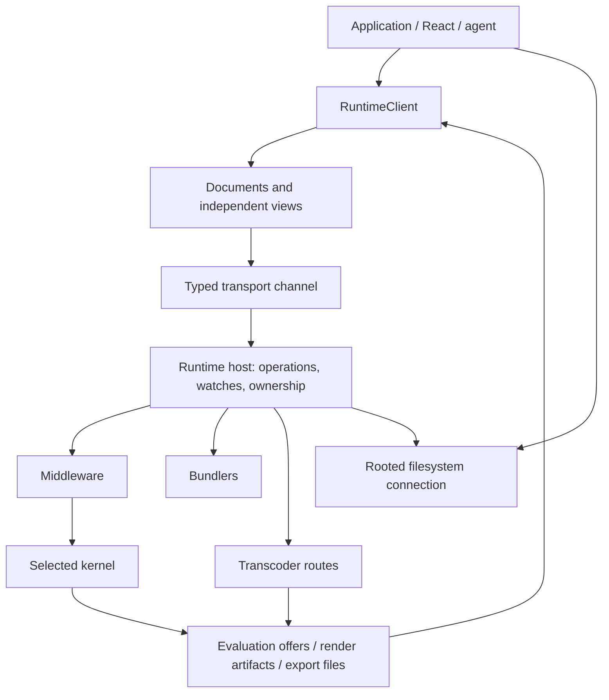
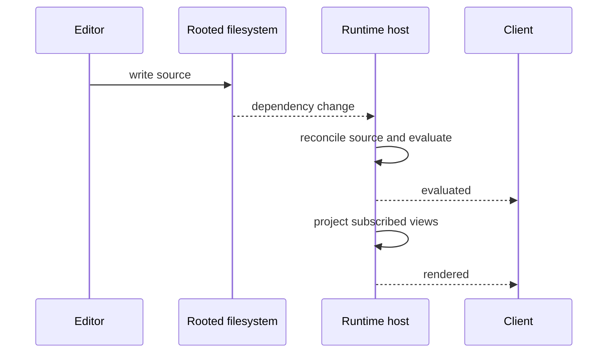

`@taucad/runtime` separates model evaluation from presentation and file output. Its client exposes documents and views, while plugins supply kernels, bundlers, middleware, and transcoders. The same ownership model supports 3D geometry, 2D drawings, boards, and models with exports but no visual view.

Execution location and storage are independent. A browser can run kernels in a Web Worker and keep files in a filesystem worker; Node can use a worker thread or an in-process host. A remote transport can connect the same client contract to another host.

## How It Works

```mermaid
flowchart TB
    App["Application / React / agent"] --> Client["RuntimeClient"]
    Client --> Document["Documents and independent views"]
    Document --> Transport["Typed transport channel"]
    Transport --> Host["Runtime host: operations, watches, ownership"]
    Host --> Middleware["Middleware"]
    Middleware --> Kernel["Selected kernel"]
    Host --> Bundler["Bundlers"]
    Host --> Transcoder["Transcoder routes"]
    Host --> FS["Rooted filesystem connection"]
    App --> FS
    Kernel --> Artifact["Evaluation offers / render artifacts / export files"]
    Transcoder --> Artifact
    Artifact --> Client
```

### Consumer Layer

The application opens a source through `client.open()`, observes evaluation, and creates the offered views it needs. Each view owns its settings and instance selection. Export selects an offered ID or reachable extension and returns producer-named files with MIME types and provenance.

The client contract contains no mandatory geometry field. Consumers dispatch artifacts by MIME type, and choose the presentation they support. A successful model with zero views remains usable through its exports.

### Plugin Layer

`defineRuntime()` composes registered capabilities. A kernel owns source detection and the `describe`, `resolve`, `evaluate`, `render`, and `write` behavior it implements. Bundlers prepare executable inputs. Middleware wraps operations through the same typed input and result contracts. Transcoders connect declared file types into reachable output routes.

Static declarations provide inference and option schemas. Evaluation offers describe what the actual model supports. The runtime validates requests and returned artifacts at their boundaries rather than trusting a TypeScript declaration to validate JavaScript or remote producers.

### Host Layer

The host owns dependency observation, operation scheduling, cache state, and native handles. It serializes operations that access shared state and checks ownership before publishing. Public evaluation and rendering results contain portable metadata and artifacts; native handles stay inside their owning host.

A source revision identifies evaluated bytes, not merely a path. Cache reuse and watch notifications do not replace freshness checks when a filesystem cannot establish reliable observation. Failed builds retain the dependency observation needed to recover after a missing file appears or an invalid source is corrected.

### Transport Layer

The checked document protocol has six acknowledged calls: initialization, description, export, source snapshot, transcode, and disposal. Document and view commands use notifications; corresponding host notifications carry evaluation and rendering identities. [Protocol API](../api/protocol) documents the validator authority and command names.

Transports materialize binary artifacts through their supported delivery mechanism. Shared memory, transferable buffers, and copying are transport concerns. Consumers receive the same artifact contract regardless of delivery tier.

## Filesystem Connections

The filesystem owns storage and authority. Runtime paths are canonical and relative to the rooted connection supplied by the host. The runtime neither interprets authority-global paths nor decides whether a caller may access another project.

In a browser topology, the editor and kernel worker can each connect to a filesystem worker through separate MessagePorts. Storage changes reach the kernel's watch directly; the editor does not relay each event. An inline filesystem or Node filesystem can supply equivalent operations without a separate filesystem worker.

```mermaid
sequenceDiagram
    participant Editor
    participant Files as Rooted filesystem
    participant Host as Runtime host
    participant Client
    Editor->>Files: write source
    Files-->>Host: dependency change
    Host->>Host: reconcile source and evaluate
    Host-->>Client: evaluated
    Host->>Host: project subscribed views
    Host-->>Client: rendered
```

## Key Relationships

- [Plugin System](./plugin-system) owns capability composition.
- [Worker Model](./worker-model) explains execution and cancellation boundaries.
- [Path Namespaces](./path-namespaces) connects source, dependency, and watch paths.

## Implications

Use an isolated host for code that can block or crash. Cooperative cancellation saves work where a kernel supports checkpoints; identity checks prevent stale publication on every transport. Independent views avoid treating one pane's options as global model state.

## Further Reading

- [Client API](../api/client)
- [Set Up the Filesystem](../guides/filesystem-setup)
- [Embedding in a Host](../guides/embedding-in-a-host)
