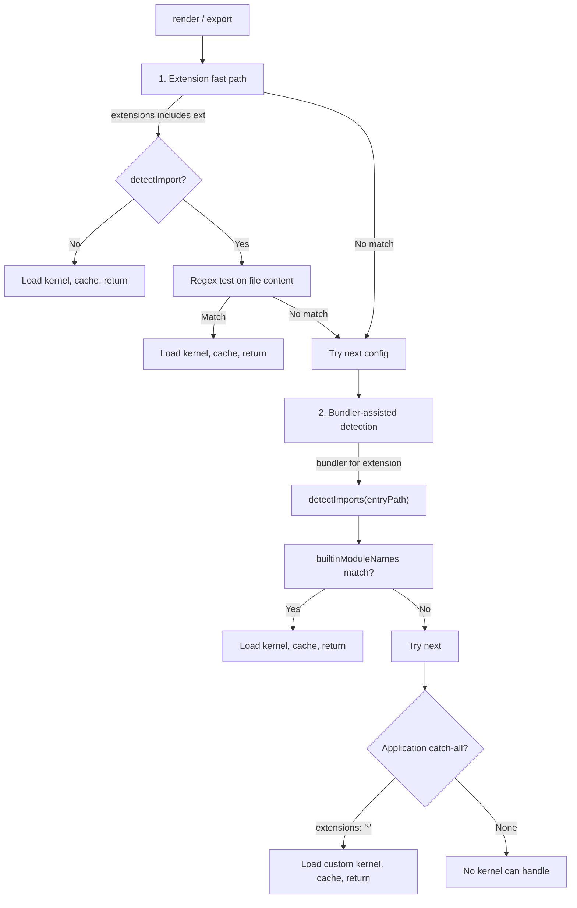

When you call `render({ source: { path } })` or `export(format, { source: { path } })`, the runtime must choose which kernel handles the file. Extension alone is not enough: a `.ts` file might use Replicad, OpenCASCADE, or JSCAD depending on what it imports. Selection therefore runs a three-pass cascade, with caching so repeated renders skip detection.

## Context and Motivation

Different kernels own different file types: OpenRSCAD for `.scad`, Zoo for `.kcl`, and Replicad, OpenCASCADE, and JSCAD all for `.ts`/`.js`. For JS/TS the decision hangs on which library the file imports -- possibly transitively, through a local module. Selection must stay cheap for the common case (extension match) and correct for the ambiguous one (import analysis), and consumer `source.path` is already a canonical [runtime path](./path-namespaces) by the time it arrives.

## How It Works

Selection runs inside [`KernelRuntimeWorker`](./worker-model)`.selectKernel()`. Three passes, first match wins:

Pass 1 matches extensions and entry-file regexes, pass 2 traces the import graph through the bundler, and pass 3 falls back to an application-registered catch-all.

### Pass 1: Extension Fast Path

For each kernel plugin in registration order:

1. Skip unless the file extension is in the plugin's `extensions`.
2. A `'*'` catch-all is deferred to pass 3 when any registered kernel declares `builtinModuleNames`, so import analysis gets first chance; with no such kernels registered, the catch-all matches here directly.
3. No `detectImport` regex: select this kernel immediately. Examples: `.scad` selects OpenRSCAD, `.kcl` selects Zoo.
4. With `detectImport`: read the entry file and test the regex. A match selects the kernel -- `.ts` containing `import ... from 'replicad'` selects Replicad.

Cost: at most one file read. No bundling.

### Pass 2: Bundler-Assisted Transitive Import Analysis

When the extension has a registered bundler (for example `.ts` with esbuild):

1. Call `bundler.detectImports({ entryPath })` -- a lightweight pass that discovers transitive imports without a full bundle.
2. Compare the detected bare specifiers against each kernel's `builtinModuleNames`; `replicad` and `replicad/utils` both match a `replicad` builtin.
3. The first matching kernel becomes primary. Dependencies found during detection are cached for the subsequent `getDependencies` call, so the bundler does not run twice.

This pass catches what the pass-1 regex cannot: an entry that imports a local module which in turn imports the kernel library.

### Pass 3: Application Catch-All

If the application registered a kernel with `extensions: ['*']`, it is selected now. No first-party package publishes a catch-all: import formats are owned by explicit `gltf`, `brep`, `rhino`, and `assimp` kernel IDs.

If nothing matches, selection returns `undefined` and the framework reports that no kernel can handle the file.

## Why This Layered Approach

- **Performance** -- extension and regex checks are cheap; bundler detection is not, and runs only when the cheap passes fail to decide.
- **Correctness** -- the regex sees only the entry file; the bundler sees the whole import graph.
- **Priority** -- plugin order in `defineRuntime({ plugins: [...] })` is selection priority. When several kernels match, the first registered wins.

## Caching of Selection Results

Results land in a selection cache keyed by entry path, recording the winning kernel and the method (`extension`, `regex`, `bundler`, `catchall`). A hit reuses the kernel without re-running detection.

In autonomous rendering mode (the default), the worker's filesystem watch subscription invalidates the cache when files change. For inline source supplied via `render({ source })`, the client notifies the worker of the inline file paths so selection and bundle caches re-resolve on the next render.

## Key Relationships

- **Selection and plugins** -- kernel plugins declare `extensions`, `detectImport`, and `builtinModuleNames`; those three fields drive all three passes.
- **Selection and bundler** -- pass 2 exists only where a bundler implements `detectImports`.
- **Selection and worker** -- selection runs worker-side, before `getParameters` or `createGeometry`.

## Implications

- **Order matters** -- register kernels in priority order; put Replicad before JSCAD if both match `.ts` and Replicad should win ambiguous files.
- **Catch-all last** -- register an application `'*'` kernel last so explicit format owners get first chance.
- **Automatic invalidation** -- in autonomous mode, file changes re-trigger selection through the watch subscription.

## Further Reading

- [Architecture](./architecture) -- where selection runs in the worker
- [Path Namespaces](./path-namespaces) -- how source paths become plugin entry paths
- [Plugin System](./plugin-system) -- how kernel plugins declare extensions and detection
- [Render Lifecycle](./render-lifecycle) -- how file changes trigger re-renders and re-selection
- [Choose a Kernel](../guides/choosing-a-kernel) -- practical guidance
- [API: Kernels](../api/kernels) -- kernel plugin types
