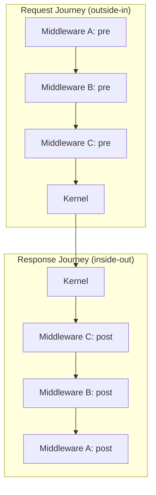

Middleware in `@taucad/runtime` uses the onion model: each layer wraps the next, and code after the inner call runs on the return journey. This gives caching, transformation, and cross-cutting concerns a single home outside kernel code.

## Context and Motivation

Kernel operations (`getParameters`, `createGeometry`, `exportGeometry`) often need cross-cutting behavior: caching results, transforming coordinates, adding edge data for rendering. Hard-coding these into each kernel would duplicate logic and couple kernels to UI concerns. Middleware composes such behavior declaratively at one interception point -- and because the model is an onion, even short-circuited results flow back through outer layers for consistent post-processing.

## How It Works

A middleware defines wrap-style hooks: `wrapGetParameters`, `wrapCreateGeometry`, and `wrapExportGeometry`. A hook receives `(input, handler, runtime)` and calls `handler(input)` to continue the chain. Code before `handler()` runs on the way down; code after runs on the way back up.

For `[A, B, C]` with A outermost: A pre, B pre, C pre, kernel; then C post, B post, A post, result to caller.

### The three hooks

- **wrapCreateGeometry** -- wraps geometry computation. Use for caching (short-circuit on a hit), coordinate transforms, or edge detection.
- **wrapGetParameters** -- wraps parameter extraction. Use for parameter caching or schema transformation.
- **wrapExportGeometry** -- wraps export. Use for format conversion or post-processing of export blobs.

Each hook has typed input and output mirroring its kernel operation. A middleware implements any subset; unimplemented hooks pass straight through to the next layer that implements them.

### KernelMiddlewareRuntime

Every hook receives a `KernelMiddlewareRuntime` as its third argument:

- `signal` -- operation-scoped cancellation signal, shared with the active kernel call
- `logger` -- logger with the middleware name pre-configured
- `tracer` -- span tracer for middleware-authored instrumentation
- `filesystem` -- [runtime filesystem](../api/filesystem) for file I/O such as cache files
- `state` -- type-safe `MiddlewareState<T>` with `.value` and `.update(partial)`, validated against `stateSchema`
- `options` -- resolved options: `optionsSchema` defaults merged with caller overrides
- `dependencies` -- read-only `Dependency` array for the current operation
- `dependencyHash` -- pre-computed SHA-256 over all dependencies, ready to use as a cache key

### State and options schemas

A middleware that persists data during an operation declares `stateSchema` (a Zod object schema). The framework creates a fresh `state` per operation and validates every `update` against the schema. State is scoped to one operation; it does not survive across renders. Options follow the same pattern through `optionsSchema`.

### Comparison to Express and Koa

Express and Koa use `(req, res, next)`. The runtime model differs in two ways:

1. **Wrap style** -- instead of `next()`, the hook receives `handler` and the return value flows back through the chain, which makes async composition and result transformation natural.
2. **Typed input/output** -- no generic request/response object; each hook's types reflect its operation.

## Key Relationships

- **Middleware and kernel:** middleware never calls the kernel directly. `handler(input)` eventually reaches it; the kernel is unaware of middleware.
- **Ordering:** registration order determines wrapping order -- first registered is outermost. Put caches early (outer) so they wrap the expensive inner computation.

## Implications

- **Short-circuiting** -- a cache hit can return without calling `handler()`. The result still flows through outer post-processing, so coordinate transforms and edge detection apply to cached results too.
- **No shared mutable state** -- state is per-operation. Cross-operation caches belong in the filesystem or an external store.
- **Error handling** -- a throwing middleware is caught by the framework and surfaced as a structured error; outer post-processing does not run on that path.

## Further Reading

- [Architecture](./architecture) -- where middleware sits in the stack
- [Plugin System](./plugin-system) -- how middleware plugins register
- [Use Middleware](../guides/using-middleware) -- add built-in middleware to your client
- [Create Custom Middleware](../guides/custom-middleware) -- implement middleware with `defineMiddleware`
- [API: Middleware](../api/middleware) -- `defineMiddleware` and wrap hook types
