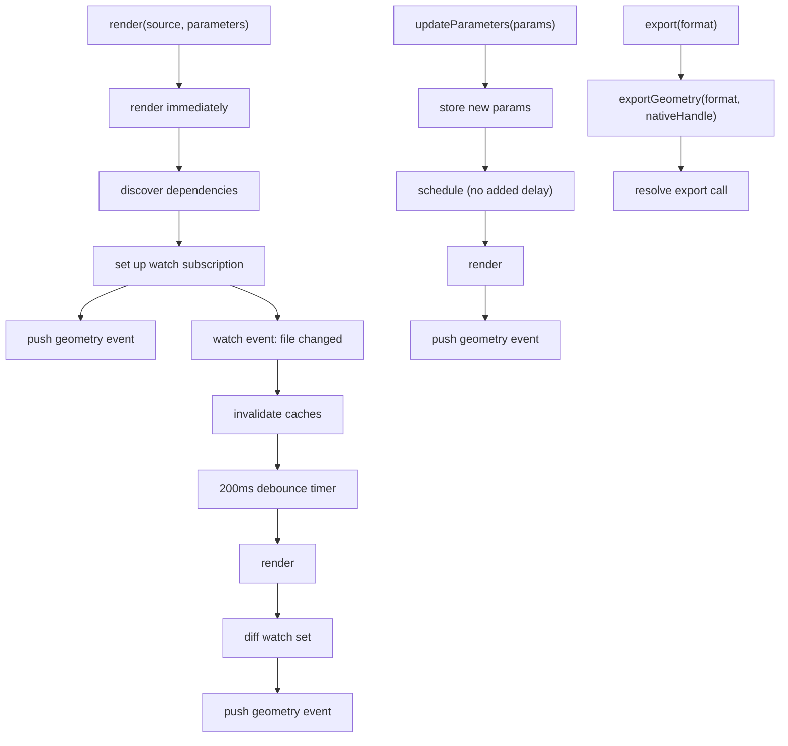

The runtime worker manages its own render lifecycle. After `render`, it renders immediately, discovers dependencies, watches for changes, and re-renders on file or parameter updates -- a watched-file rerender can supersede the originating call without a second API call. Every admitted preview reaches `idle` or `error` before its successor becomes active, and settled geometry is published over the `geometry` event. Three cancellation strategies abort superseded renders as early as possible while guaranteeing that stale results never surface.

## Context and Motivation

In a command-driven model the main thread decides when to render, yet it lacks the information that decision needs: the dependency graph, cache state, whether a render is stale. The autonomous model moves scheduling into the worker, which has all of it. The result is lower latency (no main-thread round-trips) and simpler client code (subscribe to events instead of orchestrating renders).

## How It Works

### The Render Loop



**render(source, parameters):** normalize the entry to a [runtime path](./path-namespaces), store it with the parameters, and render immediately, aborting any in-progress render. Afterwards, discover the entry's dependencies and subscribe to filesystem watches scoped to that set. Push the `geometry` event.

**Watch event:** the change arrives directly from the File Manager Worker over the [filesystem bridge](./worker-model#filesystem-bridge) -- never relayed through the main thread. Invalidate the relevant caches (synchronous `Map.delete()`), then start or reset a 200ms debounce timer. When it fires, render again, diff the watch set against the new dependency list (add new paths, drop stale ones), and push `geometry`.

**updateParameters(params):** store the new parameters and schedule a re-render with no added delay. Parameter changes are user-driven and latency-sensitive; there is nothing to batch.

**export(format):** export from the last native handle produced by `createGeometry` and resolve the export call with the artifact files.

### Why File Changes Debounce and Parameter Changes Do Not

File changes debounce at 200ms because several files often change together -- a save-all, a formatter pass, a filesystem sync -- and one batched render beats five aborted ones. Parameter changes carry no such burst pattern; they schedule immediately, and when a slider produces a genuine flood, supersession abort keeps each stale render cheap. When a file change and a parameter change land in the same window, the earlier-firing schedule wins and the render uses the latest state for both.

## Render Cancellation

Two goals hold simultaneously:

1. **Start the latest render as soon as possible** -- never queue behind an in-progress render.
2. **Abort the superseded render as early as possible** -- never spend CPU on geometry nobody will see.

Three strategies deliver this.

### Strategy 1: Proxy-Based Cooperative Abort (OC-Based Kernels)

The OC tracing Proxy intercepts every OpenCASCADE API call -- constructors, methods, property access. A typical user `main()` makes 500--5000 OC calls. On each one, the proxy reads the abort generation from the active [transport](../api/transport): an `Atomics.load` against a transport-owned `SharedArrayBuffer` where available, a slot bumped by the worker's wire-format `abort` handler elsewhere. That yields sub-millisecond abort granularity during the heaviest synchronous phase. Conceptually the checkpoint is:

```typescript
// Internal worker-side sketch — the abort throw is plumbing the consumer
// never sees. From the consumer's point of view, the superseded render's
// Promise resolves to `RenderOutcome.superseded === true`.

const readAbortGeneration = (): number => {
  return 0; // worker implementation: transport-owned SAB / wire-backed slot
};

class InternalRenderAbort extends Error {}

const expectedGeneration = readAbortGeneration();

function checkpoint() {
  if (readAbortGeneration() !== expectedGeneration) {
    throw new InternalRenderAbort();
  }
}

checkpoint();
```

Overhead: one read per OC call, about a nanosecond on the SAB-backed path -- noise against calls that take microseconds to milliseconds. This strategy covers the Replicad and OpenCASCADE kernels. Consumers never see `Atomics`, `SharedArrayBuffer`, or the slot layout; those live inside the transport.

### Strategy 2: Async Boundary Abort (All Kernels)

Between `await` points in the pipeline (bundle, execute, compute, tessellate, encode), the worker checks the generation counter:

```typescript
let renderGeneration = 0;

async function bundle(file: string): Promise<{ code: string }> {
  return { code: `/* bundled ${file} */` };
}
async function execute(code: string): Promise<{ output: unknown }> {
  return { output: code };
}
async function computeGeometry(input: { output: unknown }): Promise<unknown> {
  return input.output;
}

async function step(file: string, generation: number): Promise<unknown> {
  const bundleResult = await bundle(file);
  if (generation !== renderGeneration) return; // abort checkpoint

  const executeResult = await execute(bundleResult.code);
  if (generation !== renderGeneration) return; // abort checkpoint

  const geometry = await computeGeometry(executeResult);
  if (generation !== renderGeneration) return; // abort checkpoint
  return geometry;
}

renderGeneration += 1;
step('main.ts', renderGeneration).then((result) => console.log(result));
```

For JSCAD, Manifold, and other kernels without a WASM proxy, these boundary checks are the abort mechanism.

### Strategy 3: Generation Counter (Universal Correctness Guarantee)

Even when neither strategy interrupts in time -- one long WASM invocation cannot be unwound mid-call -- the generation counter guarantees correctness: a completed render whose generation no longer matches is silently discarded. Stale geometry never reaches the UI.

## Concurrency Model

A single-threaded worker cannot run two renders in parallel, but there is a window between "abort signalled" and "old render stops" where both exist:

```
t=0.000  Render A starts (generation=1), enters user main()
t=0.200  Slider tick -> updateParameters
           Main thread: transport.reservePreview() bumps abort generation  <- synchronous
           Main thread: updateParameters notify                            <- queues
t=0.200  Render A: next OC Proxy call reads generation -> mismatch
           internal abort throw
t=0.201  Event loop processes the queued updateParameters
t=0.201  Render B starts (generation=2)
t=0.401  Render B completes -> geometry event
```

Slider tick to geometry: about **200ms** (render B's own duration). Without abort, render A would run to completion first -- for a 3-second render, roughly **3200ms**.

### Overlap is Bounded and Safe

The overlap spans `reservePreview()` to the next proxy check -- typically under a millisecond on the SAB-backed path. During it, render A is still executing synchronously, render B is intended but queued, and there are no data races: the worker is single-threaded and cache mutations are sequential.

### Cache Invalidation During Overlap

Invalidation (`Map.delete()`) is synchronous and monotonically correct:

1. Render A consumed old data before invalidation: the result is stale, and the generation counter discards it.
2. Render A reads the invalidated cache after the watch event: it re-reads fresh data.
3. Invalidation never produces partial or corrupt state.

## Key Relationships

- **Render loop and worker:** the loop is worker-internal; the main thread never orchestrates scheduling.
- **Abort and transport:** the abort channel crosses the thread boundary outside MessagePort. SAB-capable transports let the worker observe it mid-WASM; SAB-less transports serialise it as a wire `abort` notification. Either way, the client only calls `reservePreview()` before posting the superseding command.
- **Dependencies and watch:** `getDependencies` returns runtime paths; the worker subscribes to them over the filesystem bridge, and watch events use the same namespace.
- **Debounce and parameters:** the 200ms file debounce is independent of immediate parameter scheduling; the earlier schedule wins when both change.

## Implications

- **Latency** -- proxy-based abort gives sub-millisecond cancellation for OC-based kernels; slider drags feel live.
- **Correctness** -- the generation counter is the universal safety net.
- **Memory** -- one render's geometry is live at a time; superseded geometry is discarded before transfer.
- **OpenRSCAD limitation** -- OpenRSCAD evaluates a model synchronously with no abort checkpoints. The generation counter preserves correctness, but the current evaluation runs to completion before a newer render begins.

## Further Reading

- [Worker Model](./worker-model) -- worker isolation, the abort channel, and per-kernel abort capabilities
- [Architecture](./architecture) -- how the render loop fits the layered design
- [Path Namespaces](./path-namespaces) -- the shared namespace for entries, dependencies, and watch events
- [Handle Errors](../guides/error-handling) -- `RenderTimeoutError` and `RenderOutcome` supersession
- [API: Client](../api/client) -- `render`, `updateParameters`, and event subscription
