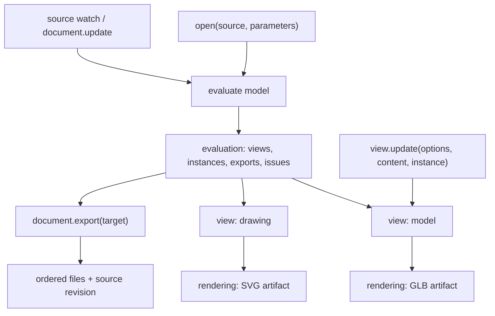

A runtime document owns a source and its evaluated model. A view projects that model into an artifact; an export produces files from an evaluated source. Keeping these operations separate lets a board expose PCB and schematic views, a geometry kernel expose a model, and an export-only kernel offer files without a viewer.

## How It Works

```mermaid
flowchart TD
    Source["open(source, parameters)"] --> Evaluation["evaluate model"]
    Changes["source watch / document.update"] --> Evaluation
    Evaluation --> Offers["evaluation: views, instances, exports, issues"]
    Offers --> Model["view: model"]
    Offers --> Drawing["view: drawing"]
    Model --> ModelArtifact["rendering: GLB artifact"]
    Drawing --> DrawingArtifact["rendering: SVG artifact"]
    Offers --> Export["document.export(target)"]
    Export --> Files["ordered files + source revision"]
    ViewUpdate["view.update(options, content, instance)"] --> Model
```

### Document Evaluation

`client.open()` creates a document synchronously and starts its work asynchronously. `document.evaluation()` waits for an outcome. A successful evaluation lists the views and exports offered by that particular model, which can differ from the kernel's static declarations. An empty view list is a valid success.

Source changes and parameter replacement produce a new evaluation. With watching enabled, the worker observes the entry and discovered dependencies, including paths needed to heal a failed build. Watches are scoped to rooted filesystem paths; the filesystem owns reachability. A watcherless filesystem requires source revalidation rather than assuming cached bytes are fresh.

Each outcome carries an identity. If a newer document intent replaces pending work, the earlier outcome reports `superseded`; it cannot publish as the current evaluation.

### Independent Views

`document.view(id, request)` creates a subscription with its own options, content, and optional instance. `view.rendering()` waits for that subscription's rendering. Different panes can project the same evaluation without changing each other's view settings.

A view update changes the projection request. It does not replace document parameters or evaluate an unchanged source again merely to change presentation. View and evaluation identities associate each rendering with the exact request it answered. Applications can retain their last successful artifact while newer work is pending or fails.

### Exports

`document.export(target, request)` resolves a declared export ID or an unambiguous reachable extension. It can evaluate and export before any view has rendered. Its successful result contains an ordered, nonempty `files` tuple and the resolved export ID. Required companion files remain together.

Transient parameter work is separate from committed document state. Export uses the committed state rather than treating an in-progress drag as a saved model. Source provenance identifies the bytes used; applications should compare revisions when external edits can race an operation.

## Cancellation and Concurrency

The host serializes access to shared kernel, cache, and native-handle state. A superseding intent marks older work stale immediately, but synchronous kernel code must reach a cooperative checkpoint before it can release the worker's event loop. There is no universal cancellation-latency guarantee.

Transport-owned shared memory can carry a targeted stop signal while a worker is blocked in synchronous native code. The active operation is identified precisely, so a late abort cannot stop its successor. Kernel bindings that check the signal can interrupt at their checkpoints. Wire-only cancellation requires the host to process its queued notification; it cannot interrupt a blocked event loop by itself.

All paths still check ownership before publishing. Work that finishes after supersession cannot become the current result, even if its kernel could not stop early. Closing a document cancels its owned work; closing a view stops that subscription without closing sibling views.

An operation deadline rejects with an operation-specific timeout error. On a terminable transport, failure to recover within the bounded grace can terminate that host. In-process execution cannot isolate an infinite synchronous loop. See [Configure Operation Timeouts](../guides/render-timeouts).

## Key Relationships

- [Worker Model](./worker-model) explains execution isolation and filesystem connections.
- [Kernel Selection](./kernel-selection) explains source-to-kernel matching.
- [Client API](../api/client) defines document, view, export, and outcome types.

## Implications

A successful evaluation does not guarantee every view succeeds. Diagnostics can accompany successful results, so consumers inspect `issues` as well as `success`. Unsupported view and export requests return structured failures instead of requiring a geometry-shaped fallback.

Close subscriptions and documents when their owners disappear, and shut down the client when the application releases the runtime. These lifetimes keep watches and native resources bounded.

## Further Reading

- [Render Live Geometry](../guides/live-rendering)
- [Handle Errors](../guides/error-handling)
- [Protocol API](../api/protocol)
