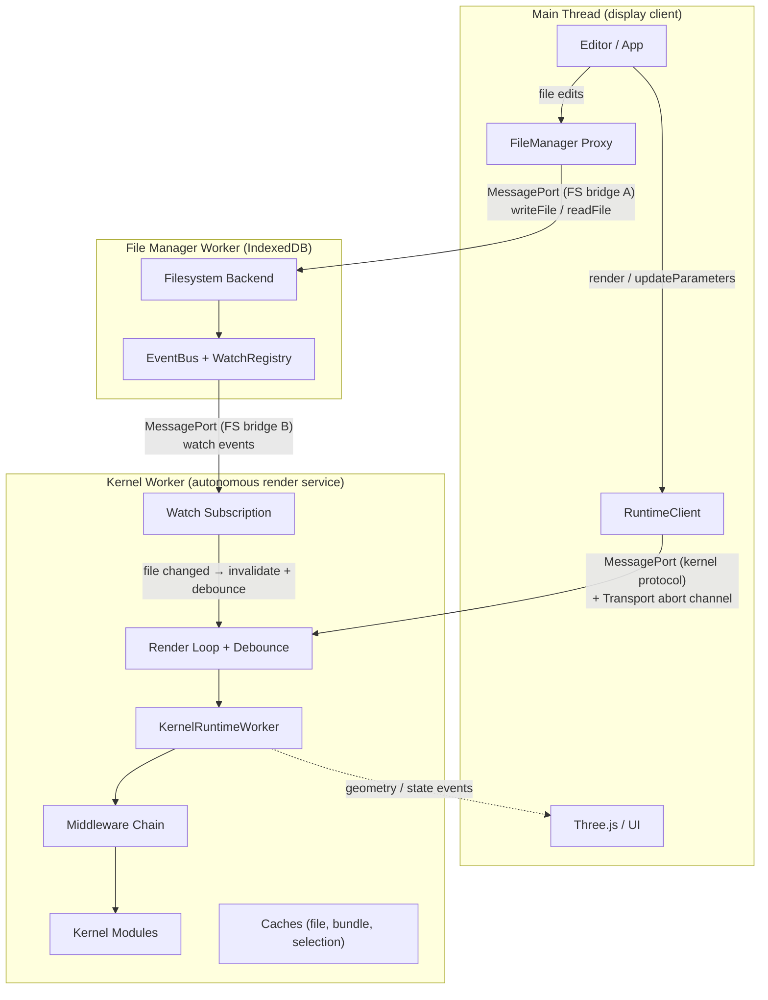

The runtime worker is an **autonomous render service**: it watches file dependencies, debounces changes, renders geometry, and pushes results without the main thread telling it when to act. MessagePort carries commands and events; a transport-owned abort channel (backed by `SharedArrayBuffer` where the transport supports it) carries immediate render abort. The design mirrors the Language Server Protocol -- the worker is a "geometry server," the main thread a display client.

Executable runtime composition lives in the worker or host process; deployment values reach it through a Zod `configSchema` and an allowlisted [boot config](../api/client#boot-config). The filesystem stays separate -- a transport-owned workspace resource, not runtime config.

## Context and Motivation

CAD kernels do heavy work -- WASM geometry computation, bundling, tessellation -- and on the main thread that freezes the UI. A Web Worker has its own global scope and event loop, so a crash or infinite loop in kernel code cannot lock the page, and WASM heaps and geometry buffers stay off the main thread's heap. The worker also owns scheduling: it holds the dependency graph and cache state, which removes round-trips and allows early abort of superseded renders.

## How It Works

### KernelRuntimeWorker as Multi-Kernel Host

One worker instance hosts every registered kernel: `KernelRuntimeWorker` loads kernel modules lazily, picks one per file ([Kernel Selection](./kernel-selection)), and delegates to its methods. One worker per kernel would multiply memory and startup cost for no isolation gain.

### Autonomous Render Loop

After `render`, the worker owns its lifecycle through one private serialized lane, so kernel work, exports, staging writes, and watch changes never race shared cache or native-handle state. File changes are debounced 200ms inside the worker, Vite-HMR style:

1. **render(source, parameters)** -- reserve exactly one preview generation, normalize and observe the entry before the first read, then discover dependencies from the esbuild metafile and kernel resolvers, accumulating resolved, unresolved, and middleware paths even when later work fails.
2. **Watch handoff** -- hold the old subscription until a complete replacement is acknowledged, revalidate only the additions, then swap atomically. A failed first render heals when its entry or a missing dependency changes.
3. **Watch or change event** -- path events, renames, and staging writes take the exact-change route; reset and overflow signals take the loss-recovery route. Only a change intersecting the current preview, or a genuine loss signal, invalidates the published artifact.
4. **updateParameters / setOptions** -- reserve one generation, schedule, and rerender under the same ownership and supersession rules.
5. **Exact export of another source** -- materializes under a request-local owner that may warm shared caches but never takes over the active preview. Snapshot export without a source exports the last valid published preview.

### Filesystem Bridge

The File Manager Worker owns the virtual filesystem, accepting bridge connections via `exposeFileSystem(...)`; trusted host composition picks a project mount per rooted connection. Two bridges exist at startup.

**Bridge A (main thread):** the editor and file manager UI pair `createFileSystemBridge(fsWorker)` with `createFileSystemBridgeProxy(bridge)` to write files and read directory trees. A write persists through the active provider and emits `fileWritten` on the EventBus.

**Bridge B (kernel worker):** the active [transport](../api/transport) owns this bridge end to end. Consumers pass an opaque `RuntimeFileSystem` at construction -- a worker-backed rooted arm or an inline one from the [Filesystem API](../api/filesystem) -- and the transport transfers a fresh filesystem `MessagePort` during `initialize`. That port is typed structurally (`MessagePortLike`), so an in-process or `node:worker_threads` host may pass its own instead of a transferable DOM one. The kernel worker reads, writes, resolves dependencies, and watches over it; inline arms speak the same protocol without a separate filesystem worker, and connections are disposed with the runtime session.

Bridge A writes reach Bridge B with no relay: the main thread is never on the hot path between a file change and a re-render.

Worker-side [runtime paths](./path-namespaces) are canonical and root-relative: the filesystem decides reachability and signals reset/overflow when path information is lost, and the runtime never sees authority-global paths or makes authorization decisions. Scoped writes carry an origin tag, so a runtime port receives peer writes but not its own echo.

### Transport Abort Channel

The abort signal must be readable during **synchronous WASM execution**, when the worker's event loop is blocked and cannot process messages. The active transport owns the channel end to end: SAB-capable transports back it with a `SharedArrayBuffer`, wire-only transports forward targeted abort notifications. Neither the client nor the application touches `Atomics` or the SAB.

Reserving a preview (or targeting a timeout) bumps the abort generation that the worker's OC Proxy reads. On `render()`, `updateParameters()`, or `setOptions()`:

1. `RuntimeTransportClient.reservePreview()` advances and captures the transport-owned generation synchronously, ahead of any staging or connection work.
2. The worker may be mid-WASM with a blocked event loop, so the message queues.
3. The next OC Proxy call sees the new generation and throws an internal abort marker -- consumers see `RenderOutcome.superseded`.
4. The render unwinds; the event loop resumes and processes the queued message.
5. The queued preview consumes its captured reservation unchanged: a stale one cannot be relabelled, reopen an old entry, commit watches, or publish geometry.

For wall-clock deadlines, a terminable transport's `abortRender(target)` forwards the exact `renderId`. If the host misses the bounded recovery grace, `terminate()` closes only that host, resolving `closed` with `{ cause: 'render-timeout' }`.

The channel is two main-to-worker `Int32` slots -- `abortGeneration` and `abortReason` (`superseded` versus `timeout`) -- internal to the SAB-backed [transport](../api/transport); runtime code only calls `reservePreview()`. Every worker-to-main signal travels over the single ordered, validated RPC channel and surfaces through `client.on(...)`.

### Per-Kernel Abort Capabilities

| Kernel          | Async abort | Proxy / mid-WASM abort | Worst-case latency   |
| --------------- | ----------- | ---------------------- | -------------------- |
| **Replicad**    | Yes         | Yes                    | < 1ms (next OC call) |
| **OpenCASCADE** | Yes         | Yes                    | < 1ms (next OC call) |
| **JSCAD**       | Yes         | N/A                    | < 10ms (next await)  |
| **Manifold**    | Yes         | N/A                    | < 10ms               |
| **Zoo/KCL**     | Yes         | N/A                    | < 50ms               |
| **OpenRSCAD**   | No          | No                     | Full render duration |

The generation counter backstops every row: even a kernel with no abort checkpoint cannot publish a stale result.

### MessagePort-Based Communication Protocol

`RuntimeTransportClient.open()` returns a validated `Channel<RuntimeProtocol>`; browser, Node, and Electron transports adapt their native `MessagePort` or worker interface behind it. Application code sees typed `RuntimeClient` methods and events, never protocol frames.

### Geometry Delivery Tiers

Geometry bytes reach the main thread through the transport's delivery tiers: shared-memory pool where available, then `postMessage` transfer, then copy. Transfer moves the `ArrayBuffer` and the worker gives up access, and the filesystem bridge extracts transferables too.

## Topology Recipes

Two orthogonal planes compose every shipped topology, with no environment detection or application-owned wiring: **transport** knows the wire and the execution location, **filesystem** knows reachability and storage. Separating them avoids a transport type per storage provider.

The browser-worker, in-process Node, and Electron utility-process recipes are written out in [Runtime Topology Recipes](https://github.com/taucad/tau/blob/main/docs/architecture/runtime-topology-recipes.md); [Embedding in a Host](../guides/embedding-in-a-host) and the [Framework Integrations API](../api/frameworks) carry the same wiring as runnable guides.

## Key Relationships

- **Transport and client** -- the client materializes its transport plugin into a `RuntimeTransportClient`; custom transports serve testing and alternative channels.
- **Dispatcher and worker** -- the dispatcher is the worker-side message handler: it validates commands, invokes worker methods, emits events.
- **Editor and filesystem** -- Bridge A writes emit EventBus changes that feed the worker's Bridge B watch subscriptions, scoped to the current dependency graph. An inline Node filesystem (`fromNodeFs`) has no File Manager Worker: it watches host directories itself, in-isolate.

## Implications

- **Async by design** -- every kernel operation is async; the client API is Promise-based or event-driven.
- **Single-threaded worker** -- one render at a time; abort keeps stale renders short so the latest starts sooner.
- **Cross-origin isolation** -- the default worker transports back the abort channel and geometry pool with `SharedArrayBuffer`, requiring COOP + COEP headers. Degradation never throws: the pool falls back to copy delivery, abort to wire notification, and OCCT runs single-threaded. See [Cross-Origin Isolation](../guides/cross-origin-isolation).

## Further Reading

- [Architecture](./architecture) -- the layered design
- [Render Lifecycle](./render-lifecycle) -- cancellation and concurrency
- [Kernel Selection](./kernel-selection) -- how the worker picks a kernel
- [Set Up the Filesystem](../guides/filesystem-setup) -- connecting a filesystem
