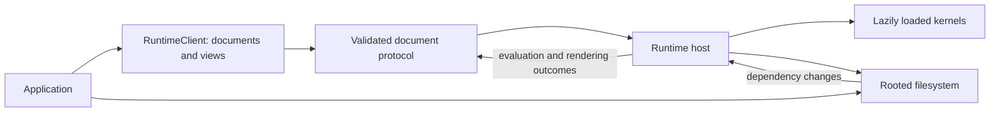

A runtime host owns executable kernel code, caches, native handles, and dependency watches. Running that host in a Web Worker, Node worker, or Electron utility process keeps expensive model computation away from application input and display work. An in-process host shares the application's event loop and has different isolation limits.

Deployment values reach executable composition through a Zod `configSchema` and allowlisted [boot config](../api/client#boot-configuration). The filesystem remains a separate workspace resource supplied by the transport.

## How It Works

```mermaid
flowchart LR
    App["Application"] --> Client["RuntimeClient: documents and views"]
    Client --> Channel["Validated document protocol"]
    Channel --> Host["Runtime host"]
    Host --> Kernels["Lazily loaded kernels"]
    App --> Files["Rooted filesystem"]
    Host --> Files
    Files -->|"dependency changes"| Host
    Host -->|"evaluation and rendering outcomes"| Channel
```

### Multi-Kernel Host

One host can load every registered kernel lazily and select a kernel for each source. Source detection, extension declarations, and bundler output participate in [Kernel Selection](./kernel-selection). Multiple documents and views share the host without exposing its native handles to consumers.

The host serializes operations that access shared kernel/cache state. Each document owns its source, committed parameters, pending intents, and watched dependencies. Each view owns its projection request. Closing one view does not close sibling views; closing a document releases its owned work and observation.

### Filesystem Bridge

In a browser, a filesystem worker can own IndexedDB, OPFS, or a user-selected storage provider. Trusted host composition roots a connection to a project. The editor and runtime connect separately, allowing persisted edits to reach the runtime's dependency watcher without an application relay.

Consumers supply an opaque `RuntimeFileSystem`. The transport connects it to the host through the filesystem protocol and disposes that connection with the runtime session. Inline filesystem arms speak the same operations without a separate filesystem worker. Node-backed storage watches its host directory through its owning adapter.

[Runtime paths](./path-namespaces) remain root-relative. The filesystem determines reachability and reports reset or overflow when precise change information is lost. The runtime revalidates affected state; an unreliable or absent watcher does not establish freshness by itself.

### Cancellation

A transport-owned shared-memory channel can deliver a targeted stop signal while synchronous native code blocks the host's event loop. It identifies the active operation, including its generation, so stale cancellation cannot stop newer work. Bindings that inspect the signal can unwind at a cooperative checkpoint.

Without shared memory, cancellation travels over the checked wire. A blocked host processes it only after returning to its event loop. Async boundaries provide checkpoints; a long synchronous invocation without checkpoints can run to completion. No fixed per-kernel latency follows from the API.

Ownership checks prevent superseded results from publishing even when early interruption is unavailable. Document replacement, view replacement, explicit abort, close, and operation deadlines retain their distinct owners and outcomes. Applications use document/view methods and `AbortSignal`; they do not manipulate atomic slots.

An isolated, terminable transport can terminate an unresponsive host after the deadline's recovery grace. This closes that runtime session; it does not transparently replay application work. In-process execution cannot terminate its own blocked event loop. See [Configure Operation Timeouts](../guides/render-timeouts).

### Protocol and Binary Delivery

`RuntimeTransportClient.open()` returns a checked `Channel<RuntimeDocumentProtocol>`. Native worker, MessagePort, and remote connections adapt their own channel primitives behind that contract. Application code uses typed documents and views rather than constructing protocol frames.

Artifacts use shared-memory pools where supported, transferable buffers where available, and copying otherwise. The client materializes bytes before delivering the public rendering or export result. Required companion files survive every delivery tier.

## Topology Recipes

Transport selects execution and communication; filesystem selects storage and reachability. This separation avoids a transport implementation for every storage provider. See [Framework Integrations](../api/frameworks) and [Embedding in a Host](../guides/embedding-in-a-host) for runnable compositions.

## Key Relationships

- [Architecture](./architecture) describes the consumer, plugin, and host layers.
- [Render Lifecycle](./render-lifecycle) separates evaluation, projection, and export.
- [Transport API](../api/transport) defines custom host connections.

## Implications

Browser shared-memory delivery and immediate native cancellation depend on cross-origin isolation. Without it, supported paths fall back to other delivery mechanisms; queued cancellation cannot promise synchronous interruption. Kernels may have their own deployment requirements. See [Cross-Origin Isolation](../guides/cross-origin-isolation).

## Further Reading

- [Set Up the Filesystem](../guides/filesystem-setup)
- [Handle Errors](../guides/error-handling)
- [Protocol API](../api/protocol)
