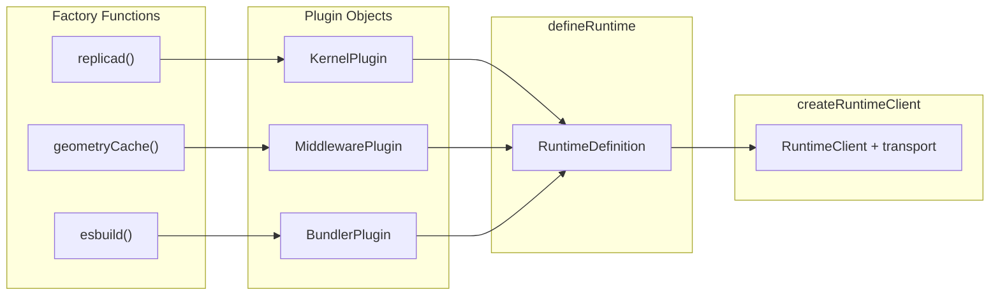

# Plugin System

The @taucad/runtime is extensible through a plugin system. Instead of inheritance hierarchies or configuration files, four plugin types compose via factory functions. This design keeps the core small, enables tree-shaking, and makes the extension surface explicit.

## Context and Motivation

CAD runtimes must support multiple engines (Replicad, OpenCASCADE, Manifold, OpenSCAD, JSCAD, Zoo), multiple preprocessing steps (caching, coordinate transforms), and multiple bundling strategies (esbuild for JS/TS, none for OpenSCAD). Inheritance would force a rigid class hierarchy; configuration files would push logic into strings. Plugins offer a middle path: typed, composable extensions that the framework discovers at runtime through explicit registration.

## How It Works

Four plugin types exist: [`KernelPlugin`](../api/kernels), [`MiddlewarePlugin`](../api/middleware), [`BundlerPlugin`](../api/bundler), and `TranscoderPlugin`. Each is a plain metadata object returned by a named factory function. Tau-owned plugin modules export these factories by name only; CAD user source files may still use kernel-specific default entrypoints such as `export default function main(...)`. Executable implementations stay in the worker-owned runtime definition.



### KernelPlugin

A [KernelPlugin](../api/kernels) describes a CAD engine. Factory functions like `replicad()`, `opencascade()`, `manifold()`, `jscad()`, `zoo()`, and `tau()` from `@taucad/runtime/kernels` -- plus `openscad()` from the separately-published `@taucad/openscad` package -- return a registration object:

- `id` -- Unique identifier (e.g., `'replicad'`)
- `extensions` -- File extensions this kernel handles (`['ts', 'js']`, `['scad']`, or `['*']` for catch-all)
- `detectImport` -- Optional regex for content-based selection (e.g., `import.*from\s+['"]replicad['"]`)
- `builtinModuleNames` -- Module names for bundler-assisted transitive import detection
- `options` -- Kernel-specific options passed to `initialize()`

The factory accepts options and merges them into the plugin. For example, `replicad({ withBrepEdges: true })` produces a plugin with `options: { withBrepEdges: true }`.

### MiddlewarePlugin

A [MiddlewarePlugin](../api/middleware) describes an interceptor. Factory functions like `geometryCache()` and `parameterCache()` return:

- `id` -- Unique identifier
- `options` -- Middleware-specific options

Middleware order matters: first registered is the outermost layer in the onion model. See [Middleware Model](./middleware-model) for details.

### BundlerPlugin

A [BundlerPlugin](../api/bundler) describes a bundler for specific file extensions. The built-in `esbuild()` handles `['ts', 'js', 'tsx', 'jsx']`:

- `id` -- Unique identifier
- `extensions` -- File extensions this bundler handles
- `options` -- Bundler-specific options (e.g., esbuild target)

Multiple bundlers can be registered; the framework routes by extension. A kernel that does not use the bundler (e.g., OpenSCAD) never loads it.

### Presets for Zero-Config Setup

The `presets.all()` function returns a runtime definition containing all built-in kernels, middleware, bundlers, and transcoders:

```typescript
import { createRuntimeClient } from '@taucad/runtime';
import { presets } from '@taucad/runtime/presets';
import { inProcessTransport } from '@taucad/runtime/transport/in-process';

const runtime = presets.all();
const client = createRuntimeClient({
  transport: inProcessTransport({ runtime }),
});
```

Presets are imported from `@taucad/runtime/presets` instead of the package root so browser clients can opt into a small, transport-only import graph.

### Composition in defineRuntime

When you call `defineRuntime({ kernels, middleware, bundlers })` in a worker or host process, the runtime definition owns executable modules. The client never sends plugin arrays over the wire. During initialization, the worker:

1. Loads kernel definitions from the worker-owned plugin registrations and registers them in [`KernelRuntimeWorker`](./worker-model)
2. Loads middleware modules and builds the onion chain
3. Loads bundler modules and registers them by extension

Plugins remain plain metadata on the public surface; executable definitions are attached internally by factory helpers and stay on the worker side.

## The Factory Function Pattern

Each plugin type uses a factory rather than a constructor or static method. Benefits:

- **Options validation** -- Factories can validate and default options before returning the plugin. Zod schemas (when used) run at factory call time.
- **Worker ownership** -- factory helpers keep executable definitions out of the client wire payload.
- **Immutability** -- The returned object is a snapshot. Callers cannot mutate shared state.
- **Tree-shaking** -- Unused plugins are never imported; the factory is the single entry point.

Under the hood, `defineKernel`, `defineMiddleware`, `defineBundler`, and `defineTranscoder` return callable factories and attach implementation definitions behind a non-enumerable runtime slot. That hidden slot is an internal detail; plugin authors use the one-call `define*` helpers.

## Why Zod Schemas for Validation

Kernels, middleware, and bundlers can define `optionsSchema` (a Zod object schema). When provided:

- **Type safety** -- `z.infer<typeof optionsSchema>` gives TypeScript the options type.
- **Runtime validation** -- Invalid options throw at initialization, not during a render.
- **Defaults** -- `.default()` on schema fields supplies missing values.

The framework calls `optionsSchema.parse(rawOptions)` before passing options to `initialize()`. This keeps validation in one place and avoids scattered type checks.

## Key Relationships

- **Plugins and Client**: The client connects to a runtime with a transport. It may import `typeof runtime` for type inference, but it does not own executable plugin arrays.
- **Plugins and Worker**: The worker owns `defineRuntime(...)`. Kernel definitions implement `KernelDefinition`; middleware implements wrap hooks via `defineMiddleware`; bundlers implement `BundlerDefinition`.
- **Plugins and Selection**: Kernel plugins drive [kernel selection](./kernel-selection). Extension lists, `detectImport`, and `builtinModuleNames` determine which kernel runs for a given file.

## Implications

- **No inheritance** -- Kernel authors use `defineKernel`, not `extends KernelWorker`. This reduces coupling and simplifies testing.
- **Lazy loading** -- Modules load on first use. A client with Replicad and OpenSCAD only loads the kernel for the file being rendered.
- **Explicit dependencies** -- Plugins declare what they need. The framework wires them together; there is no magic injection.

## Further Reading

- [Architecture](./architecture) -- How layers compose
- [Middleware Model](./middleware-model) -- How middleware wraps kernel operations
- [Kernel Selection](./kernel-selection) -- How plugins influence selection
- [API: Kernels](../api/kernels) -- Kernel factory functions and `KernelPlugin`
- [API: Middleware](../api/middleware) -- `defineMiddleware` and middleware types
- [API: Bundler](../api/bundler) -- `defineBundler` and `BundlerDefinition`
- [Create Custom Kernel](../guides/custom-kernel) -- Implement a kernel with `defineKernel`
- [Create Custom Middleware](../guides/custom-middleware) -- Implement middleware with `defineMiddleware`
