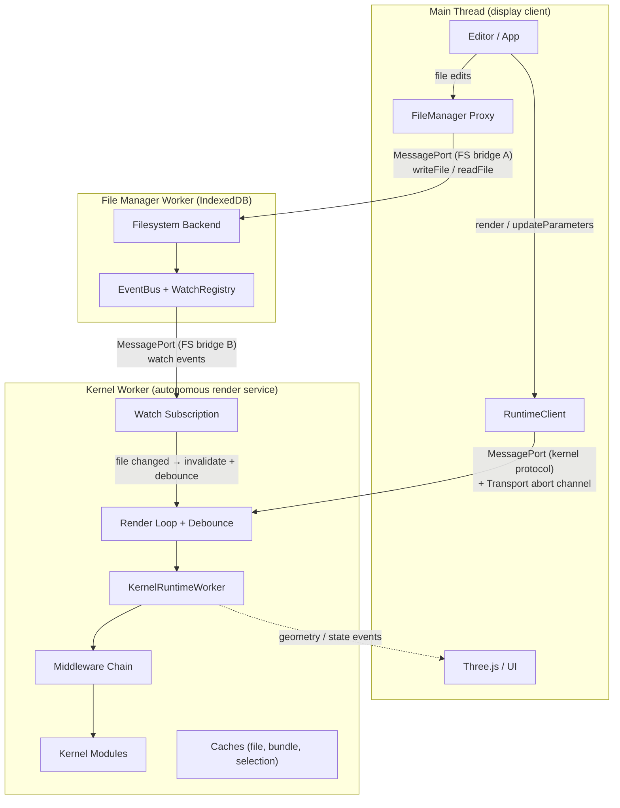
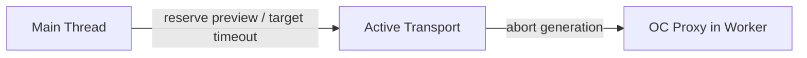

# Worker Model

The runtime worker is an **autonomous reactive render service**. It watches file dependencies, debounces changes, renders geometry, and pushes results -- without the main thread telling it when to act. Communication uses MessagePort for commands/events and a transport-owned abort channel (backed by `SharedArrayBuffer` on SAB-capable transports) for instant render abort. This design mirrors the Language Server Protocol pattern: the worker is a "geometry server" and the main thread is a display client.

Executable runtime composition lives in the worker or host process. If those executable plugins need deployment values, the runtime definition declares a Zod `configSchema` and the client supplies an allowlisted boot `config` during initialization. Filesystem remains separate: it is a transport-owned workspace resource, not part of runtime config.

## Context and Motivation

CAD kernels perform heavy work: WASM-based geometry computation, bundling, tessellation. Running this on the main thread would freeze the UI. Web Workers provide a separate thread with their own event loop. Beyond isolation, the worker owns scheduling decisions: it knows the dependency graph, cache state, and which renders are stale. Pushing this intelligence to the worker eliminates unnecessary main-thread round-trips and enables instant abort of superseded renders.

## How It Works



### Why Web Workers

- **Isolation** -- The worker has its own global scope and event loop. Crashes or infinite loops in kernel code do not freeze the main thread.
- **No main-thread blocking** -- Geometry computation, bundling, and WASM execution run off the main thread. The UI remains responsive.
- **Memory separation** -- Large allocations (WASM heaps, geometry buffers) live in the worker. The main thread can stay lean.

### KernelRuntimeWorker as Multi-Kernel Host

A single worker instance hosts all registered kernels. The `KernelRuntimeWorker` dynamically loads kernel modules via `defineKernel()`. When a render is requested, it selects the appropriate kernel (see [Kernel Selection](./kernel-selection)) and delegates to that kernel's methods. This avoids one worker per kernel, which would multiply memory and startup cost.

### Autonomous Render Loop

After receiving `render`, the worker manages its own render lifecycle through one private FIFO. Kernel/WASM work, exact exports, staging, change invalidation, and graceful cleanup never race shared cache, native-handle, or watch state:

1. **render(source, parameters)** -- Reserve exactly one preview generation, normalize the source entry, install and acknowledge entry-only observation before the first read, then discover dependencies. The complete generation-local candidate accumulates resolved, unresolved, and middleware paths even if later work fails.

2. **Watch handoff** -- Keep the old complete multi-path subscription live, acknowledge one complete replacement, batch-revalidate only additions, then atomically swap. Successful artifact publication does not own the watch map; a failed first render can still heal when its entry or missing dependency changes.

3. **Watch/change event** -- Concrete paths, rename endpoints, explicit notifications, staging writes, and concrete handoff mismatches enter the exact-change route; reset and overflow enter the loss-recovery route. Both routes use the same serialized operation lane. Only current-preview intersection, or a genuine loss signal, invalidates the published artifact and schedules a rerender.

4. **updateParameters / setOptions** -- Reserve one generation, debounce, and rerender with the same ownership and supersession rules.

5. **exact export(source B)** -- Materialize B with a request-local owner. It may populate reusable caches but cannot replace preview A's rerender map, published artifact, active kernel, or global native handle. Snapshot export without a source continues to export the last valid published preview.

### Filesystem Bridge

The File Manager Worker is the single owner of the virtual filesystem. It accepts multiple MessagePort bridge connections via `exposeFileSystem(...)`; trusted host composition selects a project mount when opening each rooted runtime connection. Two bridges are established at startup:

**Bridge A (main thread):** The editor and file manager UI use `createFileSystemBridge(fsWorker)` + `createFileSystemBridgeProxy(bridge)` to write files, read directory trees, and perform file management operations. When a file is written, `FileService` persists it via the active provider and emits a `fileWritten` event on the EventBus.

**Bridge B (kernel worker):** The active [transport](../api/client) owns the kernel-worker bridge end-to-end. Consumers pass an opaque `RuntimeFileSystem` to the transport at construction — `fromFileSystemBridge(() => openFileSystemBridge(fsWorker, { root: '/projects/widget' }))` for a worker-backed rooted arm, or `fromMemoryFs()`/`fromFsLike()`/`fromNodeFs()`/`fromBrowserFs()` for inline arms — and the transport transfers a fresh filesystem `MessagePort` to the kernel worker as part of `initialize`. That remains exactly true for worker transports; the handle's port is typed structurally (`MessagePortLike`), so an in-process or `node:worker_threads` host may pass its own port instead of a transferable DOM one. The kernel worker creates a bridge proxy for project-local file reads, writes, dependency resolution, and watch subscriptions. Bridge connections are disposed with the runtime session that opened them.

This dual-bridge design means editor writes (Bridge A) trigger watch events to the kernel worker (Bridge B) without any main-thread relay. The main thread never sits on the hot path between a file change and a re-render.

For environments without a separate filesystem worker (e.g., Node.js or testing), the inline arms wire `createFileSystemBridgePort(fileSystem)` internally and use the same protocol — `watch` is auto-propagated when the inlined object exposes a `watch` method.

A [runtime path](./path-namespaces) identifies a file within the filesystem supplied to the client. Normalized worker-side paths begin with `/`, but that slash names the supplied filesystem's root rather than the host operating system's root. The filesystem decides reachability, preserves concrete exact-path events, and emits explicit reset/overflow signals when path information is lost; runtime neither receives authority-global `/projects/<id>` paths nor makes authorization or filename-equivalence decisions. Scoped writes preserve an internal origin tag so the originating runtime port does not receive its own watch echo, while peer writes remain visible.

### Transport Abort Channel

The abort signal must be readable during **synchronous WASM execution**, when the worker's event loop is blocked and cannot process messages. The active [transport](../api/transport) owns this channel end-to-end. SAB-capable transports back it with a `SharedArrayBuffer`; wire-only transports forward targeted abort notifications. The runtime client and application never read `Atomics` or touch the SAB directly:



When the main thread calls `render()`, `updateParameters()`, or
`setOptions()`:

1. `RuntimeTransportClient.reservePreview()` advances and captures the transport-owned generation synchronously before asynchronous source staging or connection work.
2. The worker may be mid-WASM. Its event loop is blocked. The message queues.
3. The next OC Proxy call observes the new abort generation -- throws an internal abort marker (never surfaced to consumers; supersession is observed via `RenderOutcome.superseded`).
4. The render aborts. The worker's event loop resumes and processes the queued message.
5. The queued preview consumes the captured token unchanged. A stale queued preview cannot be relabelled with a newer generation, reopen an old entry, commit watches, or publish geometry.

For wall-clock deadlines, a terminable transport's `abortRender(target)` forwards the exact `renderId` and optional `abortGeneration`. If the host cannot acknowledge cancellation during bounded recovery, `terminate()` closes only that materialized host and its `closed` promise resolves with `{ cause: 'render-timeout' }`.

The transport-owned signal channel uses two `Int32` slots — every other worker-to-main signal flows through the single ordered `postMessage` event channel. The slot layout is `@internal` to the transport implementations; consumers of `RuntimeTransport` only see the `signalAbort(reason)` API:

| Slot                  | Direction      | Owner                  | Purpose                                                              |
| --------------------- | -------------- | ---------------------- | -------------------------------------------------------------------- |
| `abortGeneration` (0) | main -> worker | Transport (SAB-backed) | Bumped whenever the main thread supersedes/timeouts the render.      |
| `abortReason` (1)     | main -> worker | Transport (SAB-backed) | Carries `superseded` vs `timeout` so the worker can route the abort. |

Worker-to-main events (state transitions, progress, geometry, telemetry, parameters) are delivered over the validated runtime RPC channel and exposed through `client.on(...)`.

### Per-Kernel Abort Capabilities

| Kernel          | Proxy abort | Async abort | Mid-WASM abort? | Worst-case latency   |
| --------------- | ----------- | ----------- | --------------- | -------------------- |
| **Replicad**    | Yes         | Yes         | Yes             | < 1ms (next OC call) |
| **OpenCASCADE** | Yes         | Yes         | Yes             | < 1ms (next OC call) |
| **JSCAD**       | N/A         | Yes         | N/A             | < 10ms (next await)  |
| **Manifold**    | Possible    | Yes         | Possible        | < 10ms               |
| **Zoo/KCL**     | N/A         | Yes         | N/A             | < 50ms               |
| **OpenRSCAD**   | N/A         | No          | No              | Full render duration |
| **Tau**         | N/A         | Yes         | N/A             | < 10ms               |

### MessagePort-Based Communication Protocol

`RuntimeTransportClient.open()` returns a validated `Channel<RuntimeProtocol>`. Browser, Node, and Electron transports adapt their native `MessagePort` or worker interface behind that channel, while `runtimeProtocolSchemas` validates calls and notifications at both boundaries. Application code consumes typed `RuntimeClient` methods and events rather than sending protocol frames directly.

### Transferable Support for Zero-Copy Binary Data

When the worker returns geometry (e.g., glTF as `ArrayBuffer`), the dispatcher calls `port.postMessage(response, [buffer])`. The buffer is transferred to the main thread; the worker can no longer access it. No copy occurs. For large meshes, this significantly reduces latency and memory pressure.

The filesystem bridge also uses `extractTransferables()` to transfer `Uint8Array` buffers for file read/write operations, ensuring large CAD files are moved zero-copy between workers.

### Comparison to Prior Art

**VS Code Language Server Protocol:**

| Concept         | LSP                           | Tau Runtime                                  |
| --------------- | ----------------------------- | -------------------------------------------- |
| Server role     | Autonomous analysis service   | Autonomous render service                    |
| Client role     | Display + user input          | Display + user input                         |
| Communication   | JSON-RPC events               | MessagePort events + transport abort channel |
| File watching   | Server watches workspace      | Worker watches dependency graph              |
| Result delivery | Push diagnostics, completions | Push geometry, parameters, errors            |
| Lifecycle       | Client starts/stops server    | Main thread creates/terminates worker        |

**Vite HMR:**

| Concept          | Vite                           | Tau Runtime                                       |
| ---------------- | ------------------------------ | ------------------------------------------------- |
| File watcher     | chokidar (OS-level)            | FileSystem watch (VFS-level)                      |
| Dependency graph | Module graph (import analysis) | Bundle deps (esbuild metafile) + kernel resolvers |
| Debounce         | HMR batching                   | Worker-internal 500ms/50ms timers                 |
| Rebuild trigger  | HMR update pushed to browser   | `geometryComputed` pushed to main thread          |

## Key Relationships

- **Transport and Client** -- The client creates or receives a transport and passes it to `RuntimeWorkerClient`. Custom transports enable testing (mock) or alternative channels.
- **Dispatcher and Worker** -- The dispatcher is the worker-side message handler. It receives `RuntimeCommand`, invokes worker methods, and sends `RuntimeResponse`.
- **Editor and FileSystem** -- The editor writes files to the File Manager Worker through Bridge A. These writes trigger EventBus emissions that feed the kernel worker's watch subscriptions, closing the loop between user edits and autonomous re-renders.
- **FileSystem and Worker** -- The kernel worker accesses the filesystem through Bridge B. Watch events flow directly between the File Manager Worker and the kernel worker without main-thread relay. An inline Node filesystem (`fromNodeFs`) has no File Manager Worker at all: it watches the host directories itself and delivers the same events in-isolate. In autonomous mode, the kernel worker subscribes to file change events scoped to the current file's dependency graph.

## Topology Recipes

The runtime architecture exposes two orthogonal planes — **transport** (the wire plus execution location) and **filesystem** (the source of truth for files). Each shipped topology composes those planes without environment detection or application-owned protocol wiring.

### T1 — Browser UI (Tau today)

The host page owns a kernel `Worker` and a file-manager `Worker`. The transport runs the wire in the kernel worker; the runner hosts kernel modules in the same worker; the filesystem lives in the FM worker, accessed over a `MessagePort` bridge.

```typescript
import { createRuntimeClient } from '@taucad/runtime';
import { createWebWorkerClientOptions } from '@taucad/runtime/transport/web';
import { fromFileSystemBridge, openFileSystemBridge } from '@taucad/runtime/filesystem';

const fmWorker = new Worker(new URL('./fm-worker.ts', import.meta.url), { type: 'module' });

const clientOptions = createWebWorkerClientOptions({
  createWorker: () => new Worker(new URL('./runtime.worker.ts', import.meta.url), { type: 'module' }),
  fileSystem: fromFileSystemBridge(() => openFileSystemBridge(fmWorker, { root: '/projects/widget' })),
});
const client = createRuntimeClient(clientOptions);
await client.connect();
```

The worker entry composes `defineRuntime(...)` and `serveWebWorkerRuntime({ runtime })`. Vite, React Router, and Next.js keep the app-owned `new Worker(new URL(...))` expression in their own graph while Tau owns host initialization.

Config-backed runtimes pass `typeof runtime` to `createWebWorkerClientOptions` so the client-side `config` input is inferred from the worker-owned Zod schema. See [Client API](../api/client#boot-config).

### T2 — In-process Node CLI / tests

A single Node process owns everything. The transport bridges main thread ⇄ in-process dispatcher; the runner hosts the kernel in the same V8 isolate; the filesystem is a `RuntimeFileSystemBase` on a local directory. The TR16 fast path skips the `MessagePort` round-trip and hands the FS to the kernel directly.

```typescript
import { createNodeClient } from '@taucad/runtime/node';
import { defineRuntime } from '@taucad/runtime/worker';
import { replicad } from '@taucad/replicad';
import { esbuild } from '@taucad/esbuild';

const runtime = defineRuntime({ plugins: [replicad(), esbuild()] });
const client = await createNodeClient('/path/to/project', { runtime });
```

### T3 — Electron renderer + utility-process runtime

Electron uses one utility process per materialized runtime client. Main owns each utility lease and relays a `MessagePort`; preload exposes a narrow request/release bridge; the utility calls `serveElectronRuntime`; and the renderer consumes `createElectronClientOptions`. No executable kernel, filesystem, or bundler code enters the renderer graph.

```typescript
import { createRuntimeClient } from '@taucad/runtime/client';
import { createElectronClientOptions } from '@taucad/runtime/electron/renderer';

const provideClientOptions = createElectronClientOptions({ renderTimeout: 60_000 });

export const createElectronRendererClient = async () => createRuntimeClient(await provideClientOptions());
```

The process helpers and electron-vite configuration are documented in [Framework Integrations API](../api/frameworks#electron-process-boundaries). Each renderer client has an independent host lease, so timeout recovery can terminate a blocked utility without affecting sibling clients.

### Why two planes

A topology composes a transport with a filesystem authority. The transport knows about the wire and execution location; the filesystem knows reachability and storage. Keeping them separate avoids multiplying transport types for every storage provider.

## Implications

- **Async by design** -- All kernel operations are async. The client API is Promise-based or event-driven.
- **Single-threaded worker** -- The worker runs one render at a time. Abort ensures stale renders are cancelled quickly so the latest render starts with minimal delay.
- **Transfer semantics** -- Transferred buffers are moved, not copied. The worker must not retain references after transfer.
- **Cross-origin isolation** -- The default in-process and worker transports back the abort channel and geometry pool with `SharedArrayBuffer`, which requires COOP + COEP headers. This is already a prerequisite for OpenCASCADE's pthread support. Degradation never throws: kernel initialization reads `getIsolationStatus()` and logs one warn naming the reason, the geometry pool falls back to copy delivery, abort falls back to wire-notify, and OCCT runs single-threaded. Consumers never touch SAB directly; only the transport sees it.

## Further Reading

- [Architecture](./architecture) -- How the transport fits in the layered design
- [Render Lifecycle](./render-lifecycle) -- Detailed render loop, cancellation strategies, and concurrency model
- [Kernel Selection](./kernel-selection) -- How the runtime worker selects kernels
- [API: Transport](../api/transport) -- bundled topology helpers and transport-author contracts
- [Framework Integrations API](../api/frameworks) -- Vite, Next.js, React Router, Electron, and worker helpers
- [Bundling](../guides/bundling) -- framework and worker build configuration
- [Set Up the Filesystem](../guides/filesystem-setup) -- Connecting a filesystem to the worker
