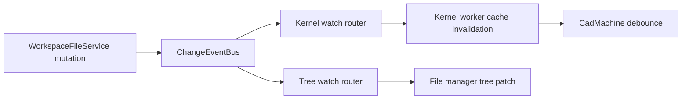

# Filesystem Policy

Internal reference for filesystem access, data transfer, caching, and concurrency in the Tau application. Applies to all code that reads or writes user project data, cache files, or metadata through the file-manager worker's provider stack. Topology — authority, providers, mounts, discovery, cross-tab coherence — lives in `docs/policy/filesystem-authority-policy.md`.

## Rationale

A single-writer topology with zero-copy binary transfer and bounded caches prevents backend index corruption and memory bloat. Separate kernel and UI watch planes avoid coupling render invalidation to tree refresh, and explicit overflow handling ensures deterministic behavior under load.

## Core Principles

1. **Registry-owned providers, one mutation authority** — `ProviderRegistry` is the sole provider owner; non-owning mounts only route; all mutations flow through `WorkspaceFileService` queues
2. **Transfer only owned binary buffers** — use transfer lists for disposable boundary-owned bytes; clone borrowed provider storage before transfer so reads never detach authority state
3. **Lazy loading over eager recursion** — never traverse a directory tree deeper than the consumer needs
4. **Bounded caches** — every in-memory cache must have an eviction policy (TTL, max size, or LRU)
5. **Debounce refresh, don't spam** — background tree refreshes must be debounced; rapid mutations must coalesce
6. **Kernel watcher fast path first** — file change -> kernel invalidation must not route through `use-project.tsx` fanout
7. **Server-side watch matching** — path/include/exclude matching happens in the worker, not in clients; do not expose unused event-kind filters
8. **Loss-aware event streams** — watcher overflow/dropped-event conditions must trigger explicit resync behavior
9. **Bridge skip-originator is internal** — when a filesystem bridge port initiates a mutation, the resulting `ChangeEvent` may carry an originating port id for intra-process routing only (`tagEventOrigin` / `getEventOrigin` on `@taucad/filesystem`). The filesystem bridge adapter (`@taucad/fs-bridge` `exposeFileSystem`) skips delivering `fileChanged` back to that port. This metadata is **not** part of the wire shape of `ChangeEvent`, is **not** passed as a second argument to `ChangeEventBus.emit`, and **must not** surface in consumer-facing UI APIs.
10. **Filesystem transport reports facts, not project recency** — filesystem APIs emit typed content-change facts; project-domain participants and machines decide whether those facts are activity.
11. **Virtual routes are projections, not physical identity** — `/projects/<id>` resolves through a persisted locator; provider paths come from `{ storageRootKey, providerBasePath }`, never from manifest fields.
12. **Runtime reachability is filesystem-owned** — issue one fully writable rooted view per selected project; runtime receives only that filesystem and local paths.

## Bridge self-write suppression (skip-originator)

Self-write suppression (so an editor port does not receive its own `fileChanged` echo) is enforced in `packages/fs-bridge` at `filesystem-bridge.exposeFileSystem`: `deliverToHandles` reads the origin via `getEventOrigin(event)` and skips the recipient whose port id matches.

- **Author boundary:** `WorkspaceFileService` mutating methods accept optional `context?: { originClientId?: string }`. Context is bound at port-connect time via `bindMutationContextForPort` (in `filesystem-bridge.ts`), which wraps each connection's handler with a per-port closure that injects `{ originClientId: portId }` as the trailing argument on every mutating call. Before `ChangeEventBus.emit(event)`, the worker calls `tagEventOrigin(event, id)` when context is present. The bridge primitive (`createBridgeServer`) is unaware of context — it dispatches user args verbatim.
- **Merge rule:** `EventCoalescer` / `coalesceChangeEvents` reads origins via `getEventOrigin` so mixed-origin batches clear the tag (every port receives the merged event), matching the blueprint Finding 14 rule.
- **Forwarders:** `ChangeEventBus` and `WatchRegistry` do not take a parallel `originClientId` parameter; the event object is the sole carrier.
- **Registry:** `packages/filesystem/src/event-origin-registry.ts` stores origin metadata in a `WeakMap`; coalescing creates an untagged survivor when the merged path history has mixed origins.

For rationale and alternatives considered, see [`docs/research/origin-client-id-propagation-audit.md`](../research/origin-client-id-propagation-audit.md).

```
Main Thread                       File Manager Worker              Kernel Worker
     │                                   │                               │
     │◄── createBridgeProxy             │              createBridgeProxy ──►│
     │    <FileManagerProtocol>         │              <RuntimeFileSystemBase>│
     │    (MessagePort)                  │              (MessagePort)        │
     │   readFile, writeFile, stat       │   readFile, readFiles, stat   │
     │   readShallowDirectory            │   exists, readdir             │
     │   configureProjectRoots           │   full read/write/watch       │
     │                                   │                               │
     │                                   │   MountTable + providers      │
     │                                   │   (DirectIdb / WebAccess /   │
     │                                   │   OPFS / Memory)             │
```

All browser filesystem I/O runs on the file manager worker. The main thread and kernel workers access it via the **same bridge mechanism** (`createFileSystemBridge` → `MessageChannel` → `createBridgeProxy`), but not through the same namespace:

- **Main thread**: `createBridgeProxy<FileManagerProtocol>` — full API including root configuration (`configureProjectRoots`), discovery (`listProjectManifests`), canonical-root disposal (`disposeStorageRoot`), workspace-scoped operations via the `{ scope }` options bag, diagnostics, and higher-level copy/move operations
- **Kernel worker**: `createBridgeProxy<RuntimeFileSystemBase>` over a `WorkspaceFileService.createRootedFileSystem('/projects/<id>')` handler — full primitive read/write/watch access, with `/` rebased to that project and no global file-pool shortcut

This is both interface segregation and reachability confinement: kernels receive the narrow API surface they need, and every path they can express resolves only inside the captured project mount. Both proxies talk to the same worker and provider authority, but scoped connections dispatch to a rooted handler instead of the global `fileManager`. No thread may instantiate providers or touch backing stores outside the worker (`docs/policy/filesystem-authority-policy.md` Rules 1 and 15).

## Rooted runtime filesystem rules

### Rule 0a: Canonicalize before routing or provider I/O

Use `resolveVirtualPath` as the single virtual-path boundary. Require an absolute POSIX path; reject URLs, backslashes, drive-like paths, control characters, and traversal above `/`. Apply the same contract in `MountTable`, WFS, fs-bridge root selection, browser adapters, Node adapters, and fs-client path resolution.

### Rule 0b: Capture one exact mount for each rooted view

`createRootedFileSystem(authorityRoot)` resolves the selected mount once and captures its provider and base path. Every operation joins a canonical local path to that captured base directly; it must not call the global mount table again. If the mount is replaced, reject later admissions with `ESTALE` instead of silently switching storage. Rename validates both local operands before either provider call.

### Rule 0c: Preserve full write and watch semantics inside the view

A rooted view supports the same writes, queues, cache invalidation, persistence, and events as global WFS operations. Do not add cache-only writes, read-only source trees, or path allowlists. Rebase watch requests and emitted events to local `/`, and never deliver sibling-project events. Scoped runtime bridges use transfer/copy delivery and must not receive the authority-global shared file pool, because a pool hit would bypass rooted RPC dispatch.

A rooted view preserves the exact canonical virtual paths carried by concrete create, change, delete, and rename events regardless of backing-filesystem naming semantics. It must not lowercase, normalize Unicode, infer aliases, or widen a concrete event to `reset`. Only explicit information-loss signals—such as overflow, observer `unknown`/`errored`, stale-root detection, backend replacement, or an irreducibly summarized change—use reset recovery. Preserve the hidden mutation origin through rooted writes and suppress only the originating scoped port's echo.

Every admitted operation retains the exact captured mount entry through provider I/O and every resulting cache, tree, event, and watch side effect. After suspension, do not attribute old-provider work to a replacement or nested route. Cross-tab facts carry the existing physical identity `{ storageRootKey, providerBasePath }` and refresh only a matching projection before delivery.

## Read Rules

### Rule 1: Shallow reads by default

Always read a single directory level unless the consumer provably needs deep recursion.

Deep reads are permitted only for: `getDirectoryContents` (ZIP/copy), startup-only `getDirectoryStat` hydration, and `readFiles` (kernel dependency batch). Deep reads are forbidden in mutation-triggered refresh paths.

### Rule 2: Parallel stat, sequential traversal

When listing a single directory, `readdir` + parallel `Promise.all(stat(...))` is preferred over sequential `stat` calls. Recursive traversal (when needed) should be sequential at the directory level to avoid overwhelming the storage backend.

**Backend performance context:** IndexedDB transaction creation has fixed overhead (~0.1–0.3ms each) regardless of payload size. Parallelizing stat calls within a directory lets the browser pipeline IDB transactions instead of sequentially awaiting each one.

**For metadata-only queries (tree display, file counts):** Prefer the in-memory tree in `WorkspaceFileService` over provider stat calls. See Rule 33.

### Rule 3: Read caching expectations

| Layer                    | Cache                          | Eviction                      | Notes                                       |
| ------------------------ | ------------------------------ | ----------------------------- | ------------------------------------------- |
| File manager `openFiles` | `Map<path, Uint8Array>`        | Must have max size + TTL      | Stores recently accessed file contents      |
| Monaco `syncedPaths`     | Internal set                   | TTL 1h, max 200               | Background-synced JS/TS models              |
| Kernel geometry cache    | `.tau/cache/geometry/*.bin`    | Max age + max entries         | MessagePack serialized meshes               |
| Kernel parameter cache   | `.tau/cache/parameters/*.json` | None currently                | JSON parameter snapshots                    |
| Standalone providers     | Per storage root               | Must be reused, not recreated | `filesystem-authority-policy.md` Rules 8/14 |

### Rule 4: File size awareness

Source files are typically <100 KB. Binary CAD files (STL, STEP, glTF) can be 10-100 MB. All read paths must handle large binaries without blocking the event loop:

- Kernel file reads transfer via `ArrayBuffer` transfer lists (zero-copy)
- Main thread reads should avoid storing large binaries in `openFiles`
- Future: streaming reads for files > 1 MB

## Write Rules

### Rule 5: Write serialization scope

All mutating operations (`writeFile`, `writeFiles`, `mkdir`, `rename`, `unlink`, `rmdir`) must route through `ResourceQueue` and cross-tab locks using the narrowest **physical** conflict key. Mount resolution retains `storageRootKey`, `providerBasePath`, and the resolved provider path so mounted and named authority operations touching the same bytes acquire the same token. A subtree/composite operation acquires every owner/path token needed for its admitted mutation set before the first mutation. Named project operations also retain their logical-project token.

Generic scoped mutation APIs are forbidden. Ordinary mutation uses a mounted authority path; only the named project commit and permanent-delete operations may mutate an unmounted physical locator, after re-establishing identity under the shared physical lock.

**Why**: A logical route and a physical locator may name the same bytes; exact virtual-path locks alone do not serialize them, while a global lock blocks unrelated files.

If a future backend reintroduces parent-directory read-modify-write metadata, use the parent directory as the queue key for that backend. Do not reintroduce a global write queue.

### Rule 5a: Batch mutations preserve canonical per-resource semantics

Implement batch and composite mutations by delegating each resource to the canonical primitive mutation unless the provider exposes a real transaction contract. Every committed resource must retain the primitive's path normalization, mount/backend resolution, queue and cross-tab lock, writer-owned cache invalidation, in-memory index update, exact change event, and origin metadata.

Delivery coalescers may batch exact mutation facts after commit. They must not replace affected paths with a lossy root-directory summary.

**Why**: A successful provider write is incomplete while writer caches retain old bytes or exact-path watchers cannot observe the committed path.

Batch results must be truthful. Without a provider transaction, wait for every admitted operation, report every completed and failed resource, and invalidate every resource whose commit state may have changed. Never claim atomicity, reverse completed operations with overwrite rollback, or reject while sibling writes continue in the background.

### Rule 5b: Provider projections change only after durable commit

Providers that maintain in-memory path, directory, size, mtime, or content-metadata projections update them only after the backing mutation commits. `FileSystemAccessProvider` aborts the writable stream when write or close fails. `DirectIdbProvider` performs same-store file rename as one put+delete transaction and stages write and rename projection changes until transaction completion. A failed or aborted transaction leaves the prior projection intact; if commit state is uncertain, rehydrate before serving another metadata read.

**Why**: Mutating the projection before durable completion turns a failed write into a false successful `stat`/`readdir`, which is data corruption at the API boundary.

### Rule 5c: Providers expose one valid path tree

Every provider must independently enforce one entry kind per canonical path. A file cannot be an ancestor or directory, `mkdir` cannot replace a file, `writeFile` cannot replace a directory, and `unlink`/`rmdir` must reject the wrong kind. Exact self-rename is a no-op; moving a directory beneath itself fails before mutation. A persistent provider must preserve explicit empty directories across reopen.

All fallible validation and serialization for a destructive multi-path ingress completes before the first provider mutation. Use an inline `Set` parent walk for small payload preflights; do not add a trie or second metadata authority.

### Rule 6: Transfer only bytes owned by the sending boundary

Use `extractTransferables` when the sending boundary owns a disposable byte buffer. If a provider, cache, or caller retains the bytes, clone once at the boundary and transfer that owned clone. The transferred buffer is detached; no retained state may reference it.

### Rule 7: Mutation → targeted invalidation

After a mutation (delete, rename, upload), invalidate only the parent directory of the affected path, not the entire tree. The caller must provide the affected path so the UI can selectively refresh.

### Rule 7a: No project-recency flags in filesystem APIs

Filesystem packages and UI file facades must not accept options that decide whether `ProjectLibraryState.lastActivityAt` changes. They should emit precise events (`written`, `batchWritten`, `fileCopied`, `directoryCopied`, `renamed`, `deleted`, etc.) with workspace-relative affected paths. The project route participant forwards those facts to `project.machine`, and the project machine applies the content-path classifier and owns the activity decision.

**Why**: A filesystem layer cannot distinguish navigation repair, derived metadata, hydration, housekeeping, and user-visible content activity reliably after intent has been erased. Pushing project recency into file APIs creates per-callsite debate and reintroduces recent-project list jumps.

### Rule 7b: System-artifact visibility is a UI projection

`tau.json`, `thumbnail.webp`, and `.tau/**` are real filesystem entries and remain readable through ordinary APIs. File-tree presentation may hide or decorate them as system artifacts, but must do so in its projection layer. Providers, discovery, copy/export, and publication code must not pretend these files do not exist; callers that omit them do so through explicit artifact filters.

## Tree Refresh Rules

### Rule 8: Debounce background refresh

The `spawnBackgroundRefresh` actor (triggered by `fileWritten`, `fileRenamed`, `fileDeleted`) must be debounced. Rapid mutations (AI code streaming, batch imports) should coalesce into a single refresh after the burst settles.

Recommended debounce: 300-500ms after the last mutation event. VS Code uses 500ms.

### Rule 9: Deduplication via in-flight map

Use a synchronous `Map<key, Promise>` (not React state) to deduplicate concurrent requests for the same directory. This prevents race conditions across render cycles.

### Rule 10: Error recovery on expand

If a directory load fails, do not cache the failure. Allow retry on the next expand attempt. Optionally collapse the failed node (VS Code pattern).

## Backend & Provider Rules (moved)

Former Rules 11–13e (backend isolation, standalone instance safety and reuse, webaccess handle lifecycle, backend downgrade, workspace binding, creation transaction, root FM pinning, provider cache keying) live in `docs/policy/filesystem-authority-policy.md`, which also states the single-filesystem-authority invariant they serve; a rule-number mapping table there resolves old citations. The ZenFS-era mechanics formerly prescribed by Rules 11–12 (`resolveMountConfig`, full-data mount preload) are retired — the live architecture is `MountTable` + `ProviderRegistry` + direct providers.

## RPC Pattern Rules

### Rule 14: Promise-based RPC for filesystem operations

Use `await proxy.method()` (promise-based RPC) for all standard filesystem operations. This is the correct pattern because FS operations are inherently request/response: one call, one result, no intermediate state.

VS Code confirms this — `DiskFileSystemProviderClient` uses `channel.call()` (returns `Promise<T>`) for `stat`, `readFile`, `readdir`, `writeFile`, and all other one-shot operations. Event-driven patterns (`channel.listen()`) are reserved for streaming and subscriptions.

Do not convert FS RPC to fire-and-forget or event-driven patterns unless the operation has intermediate results (streaming) or is a long-lived subscription (file watching).

```typescript
// CORRECT: Promise-based for one-shot operations
const stat = await proxy.stat(path);
const content = await proxy.readFile(path, 'utf8');
await proxy.writeFile(path, data);

// CORRECT: Event-driven for push notifications (future)
bridge.listen('treeChanged', (event) => {
  /* update UI */
});

// INCORRECT: Event-driven for simple reads (unnecessary complexity)
bridge.send({ type: 'readFile', requestId, path });
bridge.onMessage((msg) => {
  if (msg.requestId === requestId) resolve(msg.result);
});
```

### Rule 15: Event channels for push notifications (target)

For worker-to-main-thread push notifications (directory tree changes, file watching events), extend the bridge with an event channel alongside the existing RPC. This is a `listen()`-style subscription, not a replacement for `call()`.

Use cases: `treeChanged` events, batch operation progress, large file streaming.

## Watcher Architecture Rules

### Rule 18: Two watch planes with different goals

Implement and maintain two distinct watch planes:

- **Kernel fast path (primary)**: dependency-scoped file watchers used by kernel workers to invalidate render caches and emit `filesChanged`.
- **UI tree path (secondary)**: directory-scoped watchers used to incrementally update tree state.

Do not mix these planes into a single coarse "watch everything" stream.



### Rule 19: Watch API contract is first-class and explicit

`WorkspaceFileService.watch(...)` must support an explicit request contract:

- `paths`: absolute normalized watch roots
- `recursive`: default `false`
- `includes`: optional include patterns
- `excludes`: optional exclude patterns

`watch()` must return an unsubscribe function (`() => void`) and be wrappable into `Disposable` via `toDisposable`, per `library-api-policy.md`.

### Rule 20: Watch requests must be deduplicated and ref-counted

Identical watch requests must share one underlying subscription. Keep:

- request hash -> `{ subscription, refCount }`
- port/session -> watch IDs owned by that port

Unsubscribe decrements ref count. Actual disposal happens only when ref count reaches zero.

### Rule 21: Event pipeline requires normalize -> coalesce -> match -> deliver

Before delivery, watcher events must pass this worker-side pipeline:

1. **Normalize** paths and event shapes.
2. **Coalesce** short bursts into canonical events.
3. **Match** concrete events by canonical requested paths, recursion, includes, and excludes.
4. **Classify explicit loss** — overflow, observer `unknown`/`errored`, stale-root, backend replacement, or an irreducibly summarized directory change — as reset only for affected watch scopes.
5. **Deliver** the resulting concrete event or explicit loss signal to subscribed ports.

Coalescing requirements:

- A write does not prove creation; write followed by delete retains the final delete.
- Delete followed by write collapses to change.
- A typed ancestor-directory delete or rename resets exact descendant watches instead of guessing child facts.
- Rename preserves both old/new path invalidation semantics.
- Coalescing must clone a survivor before changing hidden origin metadata; subscriptions never mutate one shared event.

### Rule 22: Kernel path is direct and low-latency

For render reactivity, use this path only:

`WorkspaceFileService change event -> runtime worker watch handler -> serialized cache/current-preview router -> worker debounce -> autonomous render`

INCORRECT:

- `use-project.tsx` relaying `fileWritten` to all geometry units
- Sending `changedPaths` on each render command as the primary invalidation mechanism
- A separate `fileChanged` command from main thread to worker for every edit

### Rule 23: Complete watch replacement must preserve continuous coverage

Current-preview observation is independent of successful artifact publication. A fresh entry is observed and acknowledged before dependency discovery. When a generation produces a complete dependency candidate:

- keep the old complete multi-path request live
- subscribe the complete replacement and await one registration acknowledgement
- batch-revalidate only paths added relative to the old request
- route candidate-only events during validation as dirty handoff mismatches
- commit the preview map and replacement handle atomically only when the candidate remains current and clean
- dispose the old handle only after commitment; dispose only the replacement when dirty or superseded

The steady state is one multi-path subscription, not one stream per dependency. Unchanged paths stay continuously covered by the overlapping old request; no filesystem revision protocol or permanent root watch is required.

### Rule 24: Overflow and dropped-event handling is mandatory

Watcher streams are not lossless under all conditions. Define explicit overflow behavior:

- emit internal `WatchEvent { type: 'reset' }` to watch subscribers
- map worker-to-client overflow or refresh failure to the existing transport-wide `ChangeEvent { type: 'backendChanged' }`; do not add another wire variant
- kernel subscribers clear dependency-related caches and request a fresh dependency pass on next render
- tree subscribers trigger targeted parent/subtree resync (not blind full tree unless required)

No silent event drop is allowed.

### Rule 25: External change detection uses capability fallback

External changes (outside Tau writes) are handled in this order:

1. `FileSystemObserver` when available and stable for the active backend/browser
2. visibility-aware polling fallback when observer is unavailable
3. one coalesced root reconcile scan whenever event quality is uncertain (`unknown`, `errored`, reset, or overflow)

Treat `FileSystemObserver` as progressive enhancement, not a universal baseline.

Every successful local or remote mutation, and every concrete observer event, enters the same invalidation plane: invalidate shared file-pool bytes and provider/file-tree projections, repair a DirectIDB index miss from backing storage when necessary, emit the ordinary change event, and refresh discovery when a project manifest may have appeared or disappeared. Web Locks serialize multi-path mutations when available; BroadcastChannel notification and invalidation still occur when locks are unavailable.

Apply remote facts in arrival order. Resolve only an already registry-owned provider by `storageRootKey`; notification data must not instantiate a provider. Build refreshed provider metadata off to the side and swap it only after successful hydration; a refresh failure emits `backendChanged` through the same channel consumed by kernel, tree, and fs-client caches. One `EventCoalescer` is the only bounded queue in the worker delivery path.

### Rule 26: Exclude self-generated churn from kernel watch streams

Runtime dependency watchers must exclude only the runtime cache namespace:

- `/.tau/cache/**`

The exclusion applies to concrete cache-path events, including peer writes. It must not suppress genuine reset or overflow signals because those signals no longer contain a complete path set. Do not treat `/src/.tau/cache/**` as cache. Do not exclude `/node_modules/**`; installed or vendored package files may be live bundle inputs.

### Rule 27: Concrete paths remain exact

All watch matching must use normalized paths in the namespace owned by the watched filesystem. Runtime watches therefore use runtime paths beginning with `/`; authority-global watches use explicitly qualified authority-global paths:

- normalize separators and duplicate slashes
- preserve the exact spelling carried by every concrete provider event
- preserve both old and new canonical paths for renames, matching a request when either endpoint qualifies
- reserve reset for explicit information loss rather than backing-filesystem case or Unicode behavior

Do not lowercase, Unicode-normalize, or synthesize equivalence keys in the registry or runtime.

Tau accepts that a rare out-of-band case-only or Unicode-equivalent edit may not match a differently spelled dependency path on some Web Access roots. A refresh or project reopen may be required in that case. If measured product behavior later requires alias-aware matching, add a provider-native canonical identity contract; do not reintroduce a speculative case-sensitivity boolean or broaden ordinary concrete events.

### Rule 28: Lifecycle safety for ports and watches

On port disconnect/dispose:

- remove all watch registrations owned by that port
- decrement shared ref-counted subscriptions
- clear pending delivery queues for that port

On backend mount change:

- make previously materialized rooted views reject new admissions with `ESTALE`
- dispose old service/client/watch ownership once and create a fresh rooted binding from the new successful service identity

### Rule 29: Tree refresh remains incremental after startup

`getDirectoryStat` may be used for initial hydration only. Post-startup updates must use:

- parent-directory re-read on file create/delete/write
- subtree invalidation on directory rename/remove
- incremental patching of `fileTree` rather than full replacement

### Rule 30: Watch observability is part of correctness

Expose watcher diagnostics from worker internals:

- active watch count
- deduped subscription count
- queue depth and coalescing window stats
- dropped/overflow event counters
- average and p95 delivery latency

A watcher path that cannot be observed cannot be trusted at scale.

## Required Watch Test Matrix

Minimum required test coverage for watcher correctness and performance:

- **Contract tests**: `watch` request parsing, include/exclude matching, recursive behavior, and structural request identity.
- **Dedup tests**: N identical requests -> 1 underlying subscription; proper ref-count disposal.
- **Coalescing tests**: overwrite-delete, delete-write, rename bursts, typed ancestor-directory reset, and origin isolation.
- **Overflow tests**: forced queue overflow emits reset and triggers deterministic resync path.
- **Kernel integration tests**: file change invalidates caches and emits `filesChanged` without main-thread relay.
- **Tree integration tests**: mutation updates only affected directory/subtree entries.
- **Disconnect tests**: no leaked watches after proxy dispose/port disconnect.
- **Cross-backend tests**: indexeddb/webaccess/memory behavior parity where applicable.
- **Stress tests**: rapid edit storm, large directory, and long-lived session leak checks.

## Port & Bridge Rules

### Rule 31: Port cleanup

When a bridge proxy is disposed, the main-thread port (`port2`) is closed. The worker-side port (`port1`) should also be cleaned up. Each `exposeFileSystem` handler should track active ports and close them when the counterpart disconnects.

### Rule 32: Report mutation deadlines causally

A bridge client may report that a mutation timed out only when the server-side operation is causally cancelled before that result is returned. Never reject a mutation locally while allowing the authority to continue writing in the background.

Keep the 30-second default for ordinary bridge calls. A journal-backed, idempotent authority command may explicitly opt out of the wall-clock client timer when its durable operation can be replayed and its caller does not place unrelated discovery or navigation behind completion. Configure that exception by method identity; do not add a generic “disable timeouts” option.

CORRECT:

```typescript
createBridgeProxy(port, {
  resolveCallTimeout: (method) => (method === 'commitPendingProjectDirectory' ? 'none' : undefined),
});
```

INCORRECT:

```typescript
await Promise.race([authorityMutation(), rejectAfter(30_000)]);
// The authority mutation continues after the caller reports failure.
```

**Why**: A client-only deadline creates split truth: durable storage may commit after the journal owner has already classified the same operation as failed.

## Provider Performance Rules

### Rule 33: In-memory file tree for metadata queries

`WorkspaceFileService.getDirectoryStat` and related metadata queries must use its in-memory file tree, not per-path provider stat/readdir calls. Backend metadata calls pay per-operation IndexedDB transaction overhead (~0.1–0.3ms each); for 6265 files this accumulates to seconds.

The in-memory tree seeds from the provider's hydrated path index (`DirectIdbProvider._paths`) and is maintained incrementally on writes (not rebuilt).

```typescript
// CORRECT: Metadata from in-memory tree (O(1))
const stat = inMemoryTree.stat(path);
const entries = inMemoryTree.readdir(path);

// INCORRECT: Metadata via provider (1 IDB transaction per call)
const stat = await provider.stat(path);
const entries = await provider.readdir(path);
```

### Rule 34: Bulk writes use provider-native batching

For bulk writes (GitHub import, ZIP upload), the canonical `writeFiles` path may let the IndexedDB provider drain admitted writes in as few native transactions as possible — per-transaction overhead dominates at thousands of files. Do not expose a second provider `bulkImport` mutation path. After commit, update the provider path index and `WorkspaceFileService` tree before the next read; after uncertain failure, refresh before serving metadata.

### Rule 35: Provider hydration awareness

`DirectIdbProvider` hydrates a path index once per instance at initialization (`getAllKeys()`, ~26ms for 10k entries) — a metadata index, not a full-data preload. Hydration cost and index divergence are why provider instances are per-storage-root singletons (`filesystem-authority-policy.md` Rule 2): every extra instance repeats hydration and holds an index that never learns of the others' writes. (The ZenFS-era full-data mount preload this rule previously described is retired.)

## Project-root configuration sync

The main thread owns persisted `ProjectFileSystemConfig` and storage-root handles. It sends a cloneable `ProjectRootConfiguration` to the file-manager worker at boot and after a binding/discovery change. The worker atomically replaces non-owning project routes while reusing registry-owned providers. Reads and writes may proceed only after that sync resolves; page navigation is not a configuration event.

## Performance Budget

| Operation                           | Target              | Current                           |
| ----------------------------------- | ------------------- | --------------------------------- |
| Shallow directory read (20 entries) | < 50ms              | ~30ms (IndexedDB)                 |
| Single file read (source, <100KB)   | < 20ms              | ~10ms (IndexedDB)                 |
| File tree initial load (root only)  | < 100ms             | ~2s (full recursive)              |
| Background refresh after mutation   | < 200ms (debounced) | ~500ms-5s (immediate, full)       |
| Folder expand (lazy load)           | < 100ms perceived   | N/A (not implemented)             |
| Watch event -> kernel invalidate    | < 25ms p95          | N/A (not implemented)             |
| Watch event -> UI tree patch        | < 75ms p95          | N/A (not implemented)             |
| Sustained edit burst (100 events)   | 0 silent drops      | N/A (not implemented)             |
| Bulk import (6265 files)            | < 5s                | ~143s (sequential, pre-DirectIdb) |
| `getDirectoryStat` (6265 files)     | < 10ms (in-memory)  | ~2s (sequential IDB tx)           |
