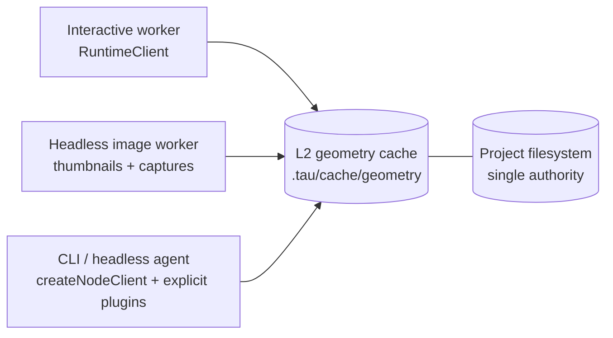

# Runtime Architecture Policy

Internal reference for the CAD runtime worker architecture: from editor to geometry computation.

## Rationale

A layered runtime API (Client, Transport, Protocol) separates consumer convenience from framework primitives. The runtime package owns engine orchestration, contracts, filesystem, transport, route planning, and lifecycle; concrete CAD toolchains live in package-owned plugin toolkits. Single-worker-per-compilation-unit and lazy capability loading minimize memory footprint without forcing browser consumers to install native, Python, or daemon payloads.

## Architecture Overview

```text
Route (projects_.$id)
  └─ ProjectMachine (1 per project)
       ├─ FileManagerMachine (1 per project, shared)
       ├─ EditorMachine (1 per project, UI state)
       ├─ ViewGraphics: Map<viewId, GraphicsMachine>
       │    └─ GraphicsMachine (1 per viewer panel, WebGL rendering)
       └─ CompilationUnits: Map<entryPath, CadMachine>
            └─ CadMachine (1 per entry path, headless computation)
                 └─ KernelMachine (1 per CadMachine)
                      └─ RuntimeClient → RuntimeTransport → Worker
                           └─ KernelRuntimeWorker (1 Web Worker per KernelMachine)
                                ├─ Plugin toolkits (via definePlugin)
                                ├─ Loaded kernel modules (via defineKernel)
                                ├─ Loaded transcoder modules (via defineTranscoder)
                                ├─ Loaded bundler modules (via defineBundler, routed by extension)
                                └─ Middleware chain (via defineMiddleware)
```

## Layered Architecture

The kernel API follows a three-layer design. Each layer has a distinct audience and abstraction level:

```text
┌────────────────────────────────────────────────────────┐
│  RuntimeClient (consumer-facing)                        │
│  Promise-based, lazy initialization, event subscription│
├────────────────────────────────────────────────────────┤
│  RuntimeTransport (framework-level)                     │
│  Event-driven, transport-agnostic, zero Promises       │
├────────────────────────────────────────────────────────┤
│  RuntimeCommand / RuntimeResponse (protocol)             │
│  Typed discriminated unions, requestId correlation      │
└────────────────────────────────────────────────────────┘
```

**Why both Client and Transport?** Transport is the primitive -- pure messages with zero abstraction overhead. Client adds Promise correlation (~1μs overhead vs 100ms–10s render times). Both are exposed: consumers use `RuntimeClient`, framework authors use `RuntimeTransport` directly.

## Filesystem supply seam (transport topology)

The opaque {@link RuntimeFileSystem} attaches on the isolate that owns filesystem authority:

- **`TransportDescriptor.fileSystem = 'inline' | 'bridged'`** → supply via **`webWorkerTransport({ fileSystem })`**, **`nodeWorkerTransport({ fileSystem })`**, or **`inProcessTransport({ runtime, fileSystem })`** (bundled transports: `inProcessTransport`, CLI `createNodeClient`, `webWorkerTransport`, `nodeWorkerTransport`).
- **`'host-local'`** → host-side **`RuntimeTransportHost`** constructed with **`electronUtilityHost({ fileSystem })`** (example app: Electron utility bootstrap).
- **`'unbound'`** → omit the filesystem option altogether (none bundled yet).

Concrete option placement MUST be enforced by **per-transport Zod schemas**. The dispatcher binds only `inlineFileSystem` and `fileSystemPort` transferables — phantom `bindings.fileSystem`-style seams are forbidden.

Third-party transports pick the descriptor row matching their wire. `@taucad/runtime-testing` is a development-only package root; ESLint bans it from production source.

For persisted browser projects, trusted application composition selects the authority-global route and supplies a writable rooted filesystem. Runtime transports, workers, kernels, bundlers, middleware, GeoSpec, and headless rendering receive only that opaque filesystem plus root-relative runtime paths. The capability's root is `''`; it is not the host OS root. None may receive a project id, `projectRootPath`, global mount table, global `/projects/<id>` path, grant/rights object, authority-global file-pool buffer, or host filesystem path.

## Entity Model

| Entity                     | Purpose                                                                                                                                                                                                                                                                                                                                   | Layer          |
| -------------------------- | ----------------------------------------------------------------------------------------------------------------------------------------------------------------------------------------------------------------------------------------------------------------------------------------------------------------------------------------- | -------------- |
| **RuntimeClient**          | High-level facade. Lazy, Promise-based, event-subscribable. Supports inline code rendering (`RuntimeSource`) and filesystem rendering (filesystem `RuntimeSource`). Emits `geometry` event on render completion. Auto-cancels superseded renders. Created by `createRuntimeClient()`.                                                     | Consumer       |
| **RuntimeTransportPlugin** | Legacy name — superseded by **`TransportPlugin`** callable (`webWorkerTransport({...})`). Bundled implementations: `inProcessTransport`, `webWorkerTransport`, `nodeWorkerTransport`. Standalone **`webWorkerHost` / `nodeWorkerHost` / `electronUtilityHost`** furnish worker/host entries — no `.host` accessor on the plugin callable. | Framework      |
| **RuntimeTransportClient** | Fat consumer-facing transport handle. Owns SAB, abort, geometry pool, FS bridge. `client.connect()` takes no arguments — every wire concern is closed over by the transport at construction.                                                                                                                                              | Framework      |
| **RuntimeWorkerClient**    | Protocol client wrapping a `RuntimeTransportClient` with request/response correlation and typed callbacks.                                                                                                                                                                                                                                | Framework      |
| **KernelRuntimeWorker**    | Worker-side orchestrator. Manages plugin expansion, kernel selection, middleware chain, bundler routing, transcoders, and export route planning.                                                                                                                                                                                          | Worker         |
| **RuntimeFileSystem**      | Opaque consumer-facing filesystem value produced by `fromMemoryFs`, `fromNodeFs`, `fromBrowserFs`, `fromFsLike`, or `fromFileSystemBridge`. Passed into **`webWorkerTransport({ fileSystem })`** / **`inProcessTransport({ runtime, fileSystem })`**. Internal handle representation lives under `transport/_internal`.                   | Consumer       |
| **PluginDefinition**       | Package-level toolkit contract (author API, via `definePlugin`). Expands to one or more kernels, transcoders, middleware, bundlers, or future runtime capabilities. Root package exports it as named `plugin`.                                                                                                                            | Plugin Author  |
| **KernelDefinition**       | Kernel capability contract (author API, via `defineKernel`). Runs in worker or an explicitly configured host/runner.                                                                                                                                                                                                                      | Plugin Author  |
| **TranscoderDefinition**   | Artifact transcoder capability contract (author API, via `defineTranscoder`). Converts exported artifacts such as glTF to image formats without becoming a kernel.                                                                                                                                                                        | Plugin Author  |
| **BundlerDefinition**      | Bundler capability contract (author API, via `defineBundler`). Declares supported `extensions`.                                                                                                                                                                                                                                           | Plugin Author  |
| **KernelMiddleware**       | Middleware capability contract (author API, via `defineMiddleware`). Wraps kernel operations.                                                                                                                                                                                                                                             | Plugin Author  |
| **Plugin Factory**         | Consumer-callable named export such as `replicad()`, `image()`, or `middleware()`. Configures and returns a package toolkit plugin without requiring a default export.                                                                                                                                                                    | Consumer       |
| **Core Package**           | Shared implementation helper package named `@taucad/*-core`. Exposes reusable logic to plugin packages but never exports `plugin` or initializes concrete backends at root import.                                                                                                                                                        | Implementation |
| **KernelRuntime**          | Services injected into kernel methods: filesystem, logger, bundler, tracer.                                                                                                                                                                                                                                                               | Plugin Author  |
| **Realm**                  | Execution environment: main thread, Web Worker, Node.js `worker_threads`, remote server.                                                                                                                                                                                                                                                  | Conceptual     |

## API Audiences

Runtime authoring APIs serve three distinct audiences:

| Audience                  | Pattern                                                                                               | Example                                      | Runs In                    |
| ------------------------- | ----------------------------------------------------------------------------------------------------- | -------------------------------------------- | -------------------------- |
| **Capability author**     | `defineKernel()`, `defineTranscoder()`, `defineBundler()`, middleware                                 | Implement one kernel, transcoder, or bundler | Worker or configured host  |
| **Plugin package author** | `definePlugin()`                                                                                      | Group Assimp import/export capabilities      | Package root / worker load |
| **Consumer or host**      | Package-named authoring factory, mechanical `plugin` alias, or role-named direct capability factories | `assimp()`, `plugin()`, `assimpKernel()`     | Main thread or host setup  |

## Plugin Toolkit Model

All concrete CAD capabilities are provided by plugin packages, not hardcoded in `@taucad/runtime`:

| Capability role | Author API                                  | Package export                       | Purpose                                                          | Example package                   |
| --------------- | ------------------------------------------- | ------------------------------------ | ---------------------------------------------------------------- | --------------------------------- |
| Kernel          | `defineKernel` → `KernelDefinition`         | Toolkit `plugin`, role-named factory | Geometry computation, parameter extraction, export               | `@taucad/replicad`                |
| Transcoder      | `defineTranscoder` → `TranscoderDefinition` | Toolkit `plugin`, role-named factory | Artifact-to-artifact conversion after source export              | `@taucad/image`, `@taucad/assimp` |
| Bundler         | `defineBundler` → `BundlerDefinition`       | Toolkit `plugin`, role-named factory | File bundling, code execution, module registry, import detection | `@taucad/esbuild`                 |
| Middleware      | `defineMiddleware` → `KernelMiddleware`     | Toolkit `plugin`, role-named factory | Operation wrapping, caching, transforms, content contributors    | `@taucad/middleware`              |
| Runner          | Future runner/host adapter contract         | Explicit implementation package      | Native, Python, daemon, or remote execution                      | `@taucad/build123d`               |

A plugin package is a toolkit. It may contain several roles when one backend naturally owns them together: `@taucad/assimp` may expose both Assimp import-kernel and transcoder capabilities; `@taucad/replicad` may later expose a Replicad kernel plus a STEP transcoder over its own OCCT-backed import path. This mirrors established plugin ecosystems where one package owns a collection of related rules, loaders, transforms, or commands.

Capability ids stay flat and author-declared (`replicad`, `geometry-cache`). Plugin metadata is only `meta: { name }`; loaders use `meta.name` for toolkit identity and diagnostics identify a selected capability as `${meta.name}/${capabilityPath}`. Presets select capability paths and role-nested plugin options configure only factories selected by that preset. Direct capability buckets append after plugin-expanded capabilities and are reserved for app-local capabilities, isolated tests, or a whole role whose outer ordering must interleave differently.

### Package Ownership Boundaries

`@taucad/runtime` owns only the generic production engine: contracts, authoring helpers, route planning, worker/client/transport/filesystem infrastructure, and diagnostics. Concrete kernels, middleware, bundlers, transcoders, testing helpers, toolchain assets, and backend lifecycle code live outside runtime.

Plugin packages live under `packages/plugins/*` and publish as `@taucad/<toolkit>`. They declare the package-named camelCase callable factory and re-export that binding as `plugin` (`export { replicad, replicad as plugin }`), expose role-named direct factories, and have no default export. Plugin and core packages declare `@taucad/runtime` as a required peer dependency, never a hard dependency, so one runtime instance serves the install (see `docs/policy/npm-policy.md`). Every dynamic loader checks the resolved package manifest's peer range warn-only; runtime composition never performs this package-level check.

The five globally registered plugin slots and their reachable shapes form a frozen same-realm ABI, pinned by `runtimePluginAbiVersion`. Factory and instance brands carry that exact integer, so loaders and `defineRuntime` distinguish an incompatible ABI from an unbranded value. Symbol brands do not cross structured clone; worker and transport boundaries instead validate the discriminated `CapabilitiesManifest.registrations` schema, which preserves unknown fields and tolerates future capability kinds.

Shared helper packages live under `packages/core/*` and publish as `@taucad/<name>-core`. Core packages are not plugins: they expose reusable implementation functions and types, have no root `plugin` export, and must not initialize WASM, native, Python, or daemon backends at root import.

### Payload Isolation

Tree shaking is not an install-boundary guarantee. A browser/WASM-safe plugin package must not hard-depend on native, Python, or daemon implementation packages even if those imports appear unreachable to bundlers. Split incompatible host payloads into explicit packages such as `@taucad/opencascade-native` or `@taucad/build123d`, then let UI, CLI, desktop, or daemon recipes opt into them deliberately.

`@taucad/opencascade` is the browser/WASM-safe OpenCascade package. Native OpenCascade uses an explicit implementation package; Python-backed Build123d uses its own package and runner/daemon requirements.

### Multi-Bundler Support

Multiple bundlers can be registered simultaneously. Each bundler declares the file extensions it handles via `extensions: string[]` in its `BundlerDefinition`. The framework routes operations to the correct bundler by file extension:

- `registerModule` calls are broadcast to all loaded bundlers
- `bundle`, `detectImports`, `resolveDependencies` are routed to the bundler matching the file extension
- Bundlers are lazily loaded -- only initialized when a file with a matching extension is encountered
- Managed internally via `Map<extension, BundlerDefinition>` and `Map<extension, LoadedBundler>`

### Machine Multiplicity

| Component           | Per-project count       | Per-viewer-panel count | Notes                                          |
| ------------------- | ----------------------- | ---------------------- | ---------------------------------------------- |
| ProjectMachine      | 1                       | --                     | Root state machine                             |
| FileManagerMachine  | 1                       | --                     | Shared across all units                        |
| CadMachine          | 1 per unique entry path | --                     | Shared when multiple panels view the same file |
| KernelMachine       | 1 per CadMachine        | --                     | Always 1:1 with CadMachine                     |
| RuntimeClient       | 1 per KernelMachine     | --                     | Manages Worker lifecycle                       |
| KernelRuntimeWorker | 1 per RuntimeClient     | --                     | Single worker, loads kernel on demand          |
| GraphicsMachine     | --                      | 1                      | WebGL renderer per panel                       |

### Memory Impact

With the single-worker-per-geometry-unit architecture, only the backend for the selected plugin capability is loaded. After plugin extraction, these weights are plugin-package measurements rather than `@taucad/runtime` dependencies:

- replicad file: ~55-66 MB (OpenCASCADE WASM)
- manifold file: ~14 MB (Manifold WASM)
- openrscad file: ~14 MB (Manifold WASM)
- jscad file: ~5 MB
- kcl file: ~3 MB (KCL WASM)
- STEP/STL/3DM/glTF file: package-owned import-kernel backend (`@taucad/brep`, `@taucad/assimp`, `@taucad/rhino`, `@taucad/gltf` after the converter dissolution)

Runtime itself must not import these concrete backends from its root or engine subpaths. Previously, all five kernels were loaded eagerly (~90 MB per CadMachine).

## RuntimeClient Lifecycle

```text
1. createRuntimeClient(options)                          → RuntimeClient created, no Worker yet
2. client.on('geometry', handler)                       → Subscribe to render results (any time)
3. client.render({ source: { files: { 'box.ts': '...' } } }) → Stages files into the transport-owned filesystem, auto-connects, renders
4. client.render({ source: { path }, parameters })      → Renders from the connected transport-owned filesystem
5. client.connect()                                     → Explicit connection for worker bridges
6. client.shutdown({ drain: true })                     → Admission closes, accepted work settles, cleanup is acknowledged, transport closes
7. client.terminate()                                   → Hard stop; transport closes without claiming remote cleanup
```

### RenderInput Type

The `render()` method accepts two input shapes via generic overloads:

**Inline source mode** (`InlineRuntimeSource<Files>`): A runtime-path-to-content map under `source.files`. Keys may include directory segments. When the map has a single key, `entry` is optional (the runtime picks the only key). When multiple keys exist, `entry` is required and selects one key from that map. The runtime stages files into the transport-owned filesystem, then connects and renders. High-level helpers provide a filesystem automatically; raw transports require `fileSystem`.

**Filesystem mode** (`FilesystemRuntimeSource`): Renders from a connected filesystem. `source.path` is a canonical root-relative path such as `'src/main.ts'`. `RuntimeClient` validates and splits that path into the runtime-owned worker locator. Plugin authoring APIs receive the same canonical runtime `entryPath`. File-change invalidation is owned by the worker's filesystem watch path, not a public render-input field. Persisted projects expose source, `.tau/cache`, generated files, and mounted package content through one fully writable rooted tree.

### Geometry Event

When the selected preview completes (success or failure), the `geometry` event fires with the full `HashedGeometryResult`. This is the authoritative output stream for both public commands and autonomous watched-filesystem rerenders. Stale previews never publish.

### Auto-Cancellation (Latest-Wins)

When a newer selected preview arrives while a public render is in-flight, the previous preview is cooperatively superseded via the abort signal slot. The successor may be a public `render`/`updateParameters`/`setOptions` command or an autonomous watched-filesystem rerender. The prior outcome resolves as `{ superseded: true }` — never as a thrown exception — and only the selected preview publishes to the `geometry` event. Autonomous successors have no public Promise of their own, so consumers must not assume a newer `RenderOutcome` carries their geometry. Pull consumers such as the CLI use request-scoped export and do not enter this preview race.

### Render Timeout Ownership

Keep render timeout enforcement on the main-thread runtime client. Configure the initial value through `createRuntimeClient({ renderTimeout })`; configure a connected client through synchronous `client.setRenderTimeout(renderTimeout)`.

Never place `renderTimeout` in kernel render options, worker runtime definitions, or worker protocol messages. A timeout update sends no render intent, performs no transport operation, and applies only to renders that begin after the call. An in-flight render retains the timeout captured when it began. Zero disables timeout enforcement.

## RuntimeFileSystem

10 required methods matching Node.js `fs.promises.*`. Every path is canonical and root-relative within the supplied filesystem; `''` is that filesystem's root.

| Method      | Signature                                           | Purpose                                 |
| ----------- | --------------------------------------------------- | --------------------------------------- |
| `readFile`  | `(path, encoding?) → Promise<string \| Uint8Array>` | Read file as text or binary             |
| `writeFile` | `(path, data) → Promise<void>`                      | Write text or binary file               |
| `mkdir`     | `(path, options?) → Promise<void>`                  | Create directory (optionally recursive) |
| `readdir`   | `(path) → Promise<string[]>`                        | List directory entries                  |
| `unlink`    | `(path) → Promise<void>`                            | Delete file                             |
| `rmdir`     | `(path) → Promise<void>`                            | Remove directory                        |
| `rename`    | `(oldPath, newPath) → Promise<void>`                | Rename/move file or directory           |
| `stat`      | `(path) → Promise<{ type, size, mtimeMs }>`         | Get file/directory metadata             |
| `lstat`     | `(path) → Promise<{ type, size, mtimeMs }>`         | Like stat, but does not follow symlinks |
| `exists`    | `(path) → Promise<boolean>`                         | Check if path exists                    |

The framework builds higher-level operations from these primitives internally:

- `ensureDirectoryExists(path)` via `mkdir(path, { recursive: true })`
- `readFiles(paths)` via `Promise.all(paths.map(readFile))`
- `getDirectoryContents(dir)` via `readdir(dir)` + `Promise.all(names.map(readFile))`
- `getDirectoryStat(dir)` via `readdir(dir)` + `Promise.all(names.map(stat))`

Convenience constructors (all opaque, transport-ready): `fromNodeFs(basePath)`, `fromMemoryFs()`, `fromFsLike(fsLike)`, `fromBrowserFs(...)`, and `fromFileSystemBridge(openConnection)`. `fromFsLike` adapts an already-confined filesystem and does not accept an authority root. The bridge factory opens a fresh scoped connection for each runtime binding or initialize retry.

Runtime filesystem access is intentionally authorization-blind. It resolves, reads, writes, watches, bundles, caches, and renders paths exposed by the supplied filesystem. Confinement belongs to the filesystem implementation; `cwd = /` is lookup context, not an authorization check. Node lexical/symlink containment protects the adapter boundary, but direct malicious `node:fs` access requires a separate OS/container sandbox.

## Transport Abstraction

A transport is a `TransportPlugin` built with `defineRuntimeTransport` (`packages/runtime/src/transport/runtime-transport.types.ts`, `@taucad/runtime/transport`): `{ id, describe(), materialize() }`. `describe()` returns the diagnostic `TransportDescriptor` (`wire`, `memory.geometryDelivery`, `memory.abortSignal`, `fileSystem`) and runtime behaviour MUST NOT branch on it. `materialize()` returns the client-side fat handle `RuntimeTransportClient` — `open()` yields a typed RPC channel and hello, `closed` settles exactly once with a `RuntimeTransportCloseResult` (`requested | render-timeout | host-exit | wire-failure`), and `renderTimeoutRecovery` is the behavioural (not descriptor-derived) recovery contract. Host-side constructors are standalone named exports (`RuntimeTransportHost`), never accessors on the plugin.

Every wire is carried by `@taucad/rpc`'s callback-shaped `Port<T>` (`postMessage` / `onMessage` / `start?` / `close`); adapters map the concrete substrate onto it — `wrapMessagePort` for DOM and `worker_threads` ports (`MessagePortLike`), `wrapWorkerAsPort` for a `Worker`, `wrapMessagePortMain` for Electron. A new wire is a new adapter to `Port<T>` plus a codec if the substrate is not structured-clone; the `WireMessage` envelope and `protocolVersion` do not change.

**Built-in:** `webWorkerTransport`, `nodeWorkerTransport`, `inProcessTransport`, `electronUtilityTransport` (+ `electronUtilityHost`), `webSocketTransport` (+ `webSocketHost`).

**Remote wire (shipped):** `webSocketTransport` (client, browser-safe — `@taucad/runtime/transport/websocket`) and `webSocketHost` (Node `ws` server — `@taucad/runtime/transport/websocket-host`) carry the runtime wire to a kernel host in another process or on another machine: `wire: 'remote'`, `copy` delivery, `wire-notify` abort, one kernel worker per connection, msgpack on the wire (`wrapWebSocket` + the codec in `@taucad/rpc`), and an exact-match origin allowlist that default-denies browsers. The consumer's own filesystem is served to the remote kernel over a **second socket** (`/fs`), never multiplexed onto the runtime socket — no multiplexer exists and `sessionKey` never crosses the wire, so two channels on one port would consume each other's frames. Remote hosts are bound to the same build (`docs/policy/runtime-compatibility-policy.md:74`); `TransportProtocolVersionError` is the enforced arm and a cross-version compatibility matrix is the add-when. See `docs/research/runtime-websocket-transport-blueprint.md`.

**Future transports:** HTTP + SSE (serverless endpoints).

## Data Flow: File Edit to Geometry Display

```
1. User edits code in Monaco editor
   │
2. Filesystem authority writes the file and emits a concrete runtime-path watch event
   │  (not the exclusive source: a watch-capable adapter such as `fromNodeFs` also
   │   emits one for an edit made outside the runtime entirely)
   │
3. KernelRuntimeWorker matches the path against its active entry and dependency watch set
   │  ├─ Related path → invalidate affected caches and schedule one preview
   │  └─ Unrelated path → no render work
   │
4. CadMachine reflects the worker-owned render lifecycle
   │
5. KernelMachine pipeline:
   │  ├─ Lazily creates RuntimeClient (ensureRuntimeClient)
   │  ├─ Subscribes to geometry/progress/parametersResolved events once
   │  ├─ RuntimeClient creates Worker + Transport on first connect
   │  ├─ Worker selects kernel via three-pass detection
   │  ├─ render: unified pipeline (deps → params → geometry)
   │  ├─ filesystem watch events invalidate caches inside the worker
   │  └─ Auto-cancellation: new render supersedes in-flight render
   │
6. CadMachine receives geometryComputed → updates context.geometry
   │
7. ViewerContent useEffect bridges geometry → GraphicsMachine
   │
8. GraphicsMachine → CadViewer → GltfMesh renders to WebGL canvas
```

### Debouncing

| Trigger                         | Debounce | Rationale                                |
| ------------------------------- | -------- | ---------------------------------------- |
| File content change (same file) | 500ms    | Avoids recompiling on every keystroke    |
| Parameter change                | 50ms     | Slider drags need responsive feedback    |
| File switch (different file)    | 0ms      | User intent is clear, render immediately |

## Worker Lifecycle

### Lazy Initialization

The RuntimeClient creates the Worker lazily on first `connect()` or `render()`:

1. `createRuntimeClient({ transport })` — returns client, no Worker yet
2. `client.connect()` — materializes the transport and creates the Worker
3. `RuntimeWorkerClient.initialize()` sends boot config and transport-owned filesystem handles
4. The worker resolves its own `defineRuntime(...)` definition and reports capabilities
5. Kernel initialization is deferred until `selectKernel()` determines which kernel is needed

Only the WASM runtime for the selected kernel is ever loaded.

### Cleanup Chains

Graceful shutdown closes client admission, waits for already-admitted intents, sends one acknowledged `cleanup` call that runs behind the worker FIFO, and closes the transport only after that call settles. Cleanup is idempotent.

Hard `terminate()` and non-draining `shutdown()` reject pending work and close the transport promptly. They deliberately make no claim that worker cleanup ran before the transport disappeared.

## Kernel Selection (Three-Pass Detection)

### Detection Strategy

```
1. Check selectionCache (full file path as key) → hit? return immediately

2. Pass 1: Extension + regex fast path
   - Try each kernel config's detectImport regex against the entry path
   - Extension-only kernels (openrscad, zoo) match immediately
   - Regex kernels (replicad, manifold, jscad) test entry path content

3. Pass 2: Bundler-assisted detection (transitive)
   - If no kernel matched AND a bundler handles this file's extension:
   - Route to the correct bundler via extension matching
   - Call bundler.detectImports(entryPath) — no modules need to be registered
   - detectImports marks bare specifiers as external, walks the full import tree
   - Returns { detectedModules: ['replicad'], dependencies: [...] }
   - Match detectedModules against each kernel config's builtinModuleNames
   - Select highest-priority match; initialize ALL matching kernels (multi-module)

4. Pass 3: Catch-all fallback
   - Try any registered extension `'*'` import/converter kernel
```

### Detection Priority

Kernel detection priority comes from the registered kernel capabilities in the selected runtime definition. Product recipes may choose different priorities; the browser editor recipe currently prefers extension-owned kernels first, import-detected JavaScript kernels next, and catch-all import/converter kernels last. After the converter dissolution, first-party import kernels declare explicit disjoint extension sets and no first-party kernel registers `'*'`; the catch-all pass remains framework capability for third-party kernels.

| Kernel class               | Detection Method              | Scope                   |
| -------------------------- | ----------------------------- | ----------------------- |
| Extension-owned kernels    | Declared extension            | Immediate               |
| Import-detected JS kernels | Regex + bundler detectImports | Entry path + transitive |
| Catch-all import/converter | Extension: `*`                | Fallback                |

### Multi-Module Registration

When detection finds imports matching multiple kernels (e.g., both `replicad` and `@jscad/modeling`), the framework:

1. Selects the highest-priority kernel for geometry computation
2. Initializes ALL matching kernels so their modules are registered

This ensures all library modules are available at bundle time.

### Selection Cache Invalidation

The selection cache is invalidated by worker-owned filesystem watch events, since changed imports may shift which kernel handles a file. The cache uses full file paths as keys to prevent collisions.

## Plugin Architecture

### `defineBundler`

Bundler plugins handle file bundling, code execution, and module registry. The esbuild toolkit package is the default product recipe implementation, not a runtime-owned backend.

Each bundler declares which file extensions it handles via `extensions: string[]`:

```typescript
export const myBundler = defineBundler({
  extensions: ['ts', 'js', 'tsx', 'jsx'],
  // ...methods
});
```

Key methods:

- `detectImports(input)` — lightweight pass that discovers bare-specifier imports transitively using esbuild externals mode. No modules need to be registered. Used for kernel selection.
- `bundle(input)` — full production bundle with all registered modules resolved. Called after kernel selection and initialization.
- `execute(code)` — run bundled code via dynamic import (Blob URL / data URL).
- `registerModule(name, module)` — register/update a builtin module for resolution during bundle().
- `resolveDependencies(input)` — optional fast-path dependency resolution.

### `defineKernel`

Kernel modules define geometry computation logic. Each kernel is an ES module loaded via `import(kernelModuleUrl)`. The pipeline has three phases — build, mesh (display), export — each a pure `native → X` transform:

- `initialize(options, runtime)` — load WASM, register builtin modules. `options` is type-safe via the `Options` generic inferred from `optionsSchema`
- `getDependencies(input, runtime, ctx)` — return file dependencies
- `getParameters(input, runtime, ctx)` — extract parameters from code
- `createGeometry(input, runtime, ctx)` — evaluate source → `{ nativeHandle, geometry? }`. The nativeHandle carries **all export-facing evidence** (shapes, resolved interfaces, datum frames). Manifold, OpenRSCAD, and Tau return display-ready inline `geometry`; Replicad, OpenCascade, Zoo, and JSCAD return reusable native evidence and implement `meshGeometry`. Every input contains only `entryPath` and `parameters`; `options` exists only when the kernel positively declares a Zod-object `createOptionsSchema`. Content and render/export route intent never cross this boundary
- `meshGeometry(input, runtime, ctx)` _(optional)_ — nativeHandle → display artifact (`GeometryResponse`) at preview tessellation or display packing. Runs **only on the display path**, at the kernel boundary; export-only requests never call it. Contract invariant: a kernel provides a display path either via inline `geometry` or via `meshGeometry` — the orchestrator rejects display renders when neither exists
- `exportGeometry(input, runtime, ctx)` — export using the framework-materialized nativeHandle. Mesh formats tessellate internally at export quality; BRep formats (STEP/IGES) never tessellate

### `defineTranscoder`

Transcoders convert framework-produced artifacts after a source route materializes. They do not select or initialize kernels, and they consume artifact `files` rather than unresolved model `source` or an evaluation `entryPath`.

Image routes are the canonical example: a kernel exports glTF, then the selected image transcoder converts that artifact to PNG, JPEG, or WebP. Heavy transcoder backends such as Assimp, browser canvas renderers, native encoders, or WASM codecs belong to plugin packages. Load them inside the capability's `initialize(options, runtime)` and carry them in the returned context — the framework guarantees once-per-worker initialization — never per request, and never through module-level promise caches inside capability code (those are reserved for code outside a capability lifecycle).

### MessagePort Protocol

The kernel machine communicates with the worker via typed MessagePort events through the `RuntimeTransport` interface:

- Request/response calls (`initialize`, `export`, `exportModel`, and `cleanup`) carry a `requestId` for correlation
- Preview intent and mutation notifications (`openFile`, `stage-and-render`, `updateParameters`, `setOptions`, `fileChanged`, and `abort`) are fire-and-forget
- `setRenderTimeout` is not a protocol notification; it is synchronous main-thread client control state
- `abort` carries the preview token reservation used by latest-wins cooperative supersession; execution consumes that reservation without incrementing it again
- `fileChanged` command is internal to filesystem watch delivery and is not exposed as a public render-input field
- `progress` events stream render phase transitions to the UI
- `telemetry` events batch performance entries for the kernel panel

### ESBuild Metafile

The bundler produces a metafile with all resolved module paths:

| Namespace   | Example Key                           | Description                              |
| ----------- | ------------------------------------- | ---------------------------------------- |
| `zenfs:`    | `zenfs:/main.ts`                      | Engine-private key for runtime `main.ts` |
| `zenfs:`    | `zenfs:/node_modules/lodash/index.js` | Engine-private key for cached packages   |
| `builtin:`  | `builtin:replicad`                    | Runtime-registered kernel module         |
| `http-url:` | `http-url:https://esm.sh/...`         | HTTP-fetched module                      |

During detection, bare specifiers appear as external imports in `metafile.outputs[chunk].imports` rather than in `metafile.inputs`, since they are not resolved.

## Package Exports

Target runtime exports are engine and authoring surfaces only:

```text
@taucad/runtime             → createRuntimeClient, filesystem constructors, public engine types
@taucad/runtime/worker      → defineRuntime and worker/runtime definition helpers
@taucad/runtime/plugin      → definePlugin and plugin toolkit types
@taucad/runtime/kernel      → defineKernel and kernel authoring types
@taucad/runtime/transcoder  → defineTranscoder and transcoder authoring types
@taucad/runtime/middleware  → defineMiddleware and middleware authoring types
@taucad/runtime/bundler     → defineBundler and bundler authoring types
@taucad/runtime/transport   → defineRuntimeTransport and transport implementations
```

Testing utilities live in a separate development package, not runtime or core subpaths:

```text
@taucad/runtime-testing → public-client harnesses, runtime/plugin mocks, glTF inspection, and geometry assertions
```

`@taucad/runtime-testing` may import only public runtime entries and exercises `createRuntimeClient` through `inProcessTransport`. It may depend on production geometry libraries for output inspection, but no production source may import it. Runtime's own white-box worker fixture remains under `packages/runtime/test/support`, outside the build and package files. Callers own and shut down clients returned by `createTestRuntimeClient`; one-shot helpers shut down the clients they create.

Runtime package exports must not include legacy preset or concrete-capability barrels. Concrete kernels, middleware, transcoders, and bundlers live in plugin packages:

```text
@taucad/assimp        → named plugin export plus assimpKernel and assimpTranscoder
@taucad/image         → named plugin export plus imageTranscoder
@taucad/middleware    → named plugin export plus individual middleware factories
@taucad/opencascade   → browser/WASM-safe OpenCascade plugin toolkit
@taucad/occt-core     → shared OCCT helper package, no plugin export
@taucad/geometry-core → shared geometry helper package, no plugin export
```

## Tessellation

Tessellation controls the quality of geometry meshing across the render and export pipelines. It is a first-class, cross-cutting concern formalized as a shared type in `@taucad/types`.

### Shared Type

```typescript
type Tessellation = {
  linearTolerance: number; // Maximum chord deviation (mm)
  angularTolerance: number; // Maximum angle between face normals (degrees)
};
```

### Configuration Levels

Tessellation can be configured at two levels, with per-call overrides taking precedence:

1. **Client-level defaults** — set once in `createRuntimeClient(options)`:

```typescript
createRuntimeClient({
  transport,
  tessellation: {
    preview: { linearTolerance: 0.1, angularTolerance: 30 }, // Faster, lower quality
    export: { linearTolerance: 0.01, angularTolerance: 30 }, // Slower, higher quality
  },
  // ...
});
```

Two explicit slots (`preview` and `export`) make the quality distinction visible and intentional. Preview tessellation is used by the display path (`meshGeometry` for kernels that defer it, inline `createGeometry` otherwise); export tessellation is normally used by `exportGeometry` for mesh formats. When tessellation changes native construction, as in OpenRSCAD, the kernel declares those construction keys with `createOptionsSchema`. The framework projects the matching resolved render or selected source-export values, deep-merges them over the schema defaults, validates once, and passes only that result to `createGeometry`. BRep exports (STEP/IGES) tessellate nothing.

2. **Per-call overrides** — passed as `callOptions` to individual methods:

```typescript
client.render({
  file,
  parameters,
  tessellation: { linearTolerance: 0.05, angularTolerance: 15 },
});
client.export('stl', {
  tessellation: { linearTolerance: 0.005, angularTolerance: 10 },
});
```

### Resolution Order

For both `render` and `export`: `callOptions.tessellation > client option (preview/export) > kernel default`.

If no tessellation is specified at any level, each kernel applies its own internal defaults.

### Per-Kernel Interpretation

| Kernel        | Preview Default | Export Default | Mechanism                                                                                                                                                                 |
| ------------- | --------------- | -------------- | ------------------------------------------------------------------------------------------------------------------------------------------------------------------------- |
| **Replicad**  | `0.02 / 20°`    | `0.01 / 20°`   | Passed to `.mesh()` and `.meshEdges()`; locked by `occt-tessellation-defaults.test.ts`                                                                                    |
| **Manifold**  | ignored         | ignored        | Uses Manifold's own tessellation; fixed by model/API output                                                                                                               |
| **OpenRSCAD** | schema default  | schema default | Framework-resolved tessellation is injected as `$fn`/`$fa`/`$fs`; create returns exact mesh evidence plus display GLB and export rewrites that evidence deterministically |
| **Zoo/KCL**   | ignored         | ignored        | Tessellation is server-side; future integration point                                                                                                                     |
| **JSCAD**     | ignored         | ignored        | Uses fixed internal tessellation                                                                                                                                          |

### Threading Path

```
RuntimeClient.render({ source, parameters, renderOptions? })
  → resolves: input.renderOptions ?? active render options
    → RuntimeWorkerClient.openFile(..., renderOptions?)
      → RuntimeCommand { type: 'openFile', options? }
        → dispatcher → KernelWorker.handleOpenFile(..., options?)
          → KernelWorker.createGeometry(..., options?)          // publish path
            → resolve optional createOptionsSchema projection
              → CreateGeometryInput { entryPath, parameters, options? }
              → KernelDefinition.createGeometry(input, runtime, ctx)
            → MeshGeometryInput { nativeHandle, options }        // when geometry deferred
              → KernelDefinition.meshGeometry(input, runtime, ctx)
```

Export follows the same pattern via `exportGeometry` → `ExportGeometryInput { tessellation? }` — without the mesh phase.

## Plugin Options & Validation

All plugins use Zod schemas for option validation via a common `optionsSchema` pattern:

| Plugin Type | Schema Property                   | Validated At                                        |
| ----------- | --------------------------------- | --------------------------------------------------- |
| Kernel      | `KernelDefinition.optionsSchema`  | `ensureKernelInitialized()` before `initialize()`   |
| Bundler     | `BundlerDefinition.optionsSchema` | `ensureBundlerForExtension()` before `initialize()` |
| Middleware  | `KernelMiddleware.optionsSchema`  | `loadMiddleware()` during middleware resolution     |

Consumer-facing input uses `options` naming; validated output uses `config` internally within `defineX` implementations. The `Options` generic type is inferred from the Zod schema, giving plugin authors type-safe access in their callbacks without manual casting.

## Caching Strategy

### Geometry Caches (mesh/build/export split)

The `geometryCache()` middleware persists three role-aligned entries under `.tau/cache/geometry/`:

| Cache      | File                | Wraps            | Stores                                                                          |
| ---------- | ------------------- | ---------------- | ------------------------------------------------------------------------------- |
| **build**  | `{hash}.bin`        | `createGeometry` | `serializedNativeHandle` (+ inline display geometry when the kernel returns it) |
| **mesh**   | `mesh-{hash}.bin`   | `meshGeometry`   | Display `GeometryResponse` at preview tessellation                              |
| **export** | `export-{hash}.bin` | Final export leg | Target `ExportFile[]` after selected content contributors/transcoders           |

The native-build key is exact rather than scope-selected. It covers source/import hashes, parameters, kernel version and initialization, implementation assets, concrete mutative create-phase middleware and dependencies, and the parsed create options when `createOptionsSchema` exists. The complete artifact `dependencyHash` remains separate and additionally covers the selected route, target options, requested content, contributors, and transcoders. Request-specific display packing belongs in `meshGeometry`; file encoding belongs in `exportGeometry`.

A warm exact-match export reuses the artifact's live native slot, restores its serialized slot, or reheats from that artifact's retained `CreateGeometryInput`, in that order, through one resolver. Any export-only request writes no mesh entry. Cache temperature must not change export output: live, reheated, and deserialized handles produce structurally identical STEP (verified by the replicad conformance suite), and `exportSTEP` pins its `Interface_Static` state on every call so unit statics cannot leak between exports sharing a wasm instance.

### File-Level Caches

| Cache               | Invalidation                                                                                | Purpose                                             |
| ------------------- | ------------------------------------------------------------------------------------------- | --------------------------------------------------- |
| `fileHashCache`     | Concrete exact-path event, filesystem reset, or next source-bearing watcherless operation   | Avoid re-hashing unchanged observed files           |
| `fileContentCache`  | Concrete exact-path event, filesystem reset, or next source-bearing watcherless operation   | Avoid re-reading unchanged observed files           |
| `bundleResultCache` | Dependency-aware exact event; broadly on reset or next source-bearing watcherless operation | Avoid re-bundling when deps haven't changed         |
| `selectionCache`    | Cleared on relevant exact change, reset, or next source-bearing watcherless operation       | Ensure kernel detection re-runs when imports change |

Watched filesystems retain volatile entries only while the complete cache-observation subscription keeps them coherent. A watcherless filesystem has no evidence that retained bytes are current, so serialized `render()`, autonomous preview execution, and exact `exportModel()` clear volatile file-derived caches before dependency resolution. Kernel/WASM state and durable content-addressed `.tau/cache/**` entries remain reusable.

### Per-Render Caches (cleared each render cycle)

| Cache                   | Purpose                                                           |
| ----------------------- | ----------------------------------------------------------------- |
| `renderDependencyCache` | Reuse dependency computation between getParams and createGeometry |
| `cachedDetectionDeps`   | Reuse deps from detectImports for getDependencies (zero cost)     |

## Multi-Client Topology & Cache Parity

One project filesystem serves **N runtime clients**: the interactive worker, one shared headless-image worker for thumbnails and plain captures, and CLI/headless clients — peers over the same files and the same L2 geometry cache (`.tau/cache/geometry`). The single-client-per-project assumption is retired.



### Hash-Parity Rule

Clients that intend to share cache entries MUST be byte-identical everywhere the selected phase/route identity looks. `dependencyHash` folds in file hashes, kernel options, parameters, selected route/export options including `content`, and each selected mutative middleware participant's stable plugin ID, version, options, and selected order. Non-mutative taps (`mutates: false`) are excluded. A mismatched client does not error — it forks the cache and recomputes. Any new runtime client MUST land with a parity test proving that a warm compatible operation on one client is a cache hit on the other.

### Middleware Placement Rules

- The middleware array is an onion: earlier entries are **outer** layers; the cache stores what inner layers return _after_ transforms have run on the way back up.
- Transform and content-contributor middleware declares the phases/routes and content properties it supports. Display transforms remain on the mesh leg; an export route may select an export-leg contributor such as glTF edge inclusion without making all exports display artifacts.
- Per-client non-mutative taps are permitted. Per-client byte-changing middleware is not cache-transparent and therefore participates in the selected identity instead of relying on a blanket chain hash.
- `geometryCache`'s position is deliberate: it stores post-transform artifacts. Do not reorder the shared chain without re-deriving every consumer's expectations — reordering is also a hash change for everyone.

### Content-Aware Export Sourcing

`content` is the framework-level request for semantic output content, independently inferred per selected route property. Provider declarations are optional, positive-only, non-empty tuples: omit `content` when the route fulfills no framework content, and omit `render` when it has neither options nor content. `defineKernel`, `defineMiddleware`, and `defineTranscoder` reject empty tuples, duplicate keys, and unknown keys once at definition time. Supporting `includeEdges` does not imply `includeTopology`; unsupported consumer properties disappear from exact route-aware types and are rejected before kernel work, while provider hooks simply receive no `content` property when they declare none.

Rendering defaults `includeTopology` to `true` only on routes that declare it; exports default supported content properties to `false`. `includeEdges` is supported only where the selected route can preserve edge primitives. These declarations do not enable or disable export formats: for example, omitting topology content from Zoo's STL/STEP definitions leaves STL/STEP export support intact.

Image routes use the export leg so callers can select export tessellation and content without overloading renderer options. On a final-cache miss, the runtime materializes the selected source artifact once, applies selected content contributors and transcoders, and caches only the final target. Direct glTF routes may request edges; image transcoders consume the resulting glTF source. Interop routes retain their own coordinate/unit/tessellation conventions and do not receive display-only mesh middleware. A separately persisted source stage requires evidence and an explicit lifecycle contract; it is not part of the current middleware API.

## Serialized Worker Ownership and Cooperative Supersession

One private promise tail serializes every operation that can mutate shared kernel or filesystem-derived state: staging, synchronous and autonomous render materialization, exact export, file-change routing, and cleanup. No second kernel context or scheduler abstraction exists. Request-local `OperationOwner` values keep exact exports from replacing the active preview, its published artifact, its native-handle ownership, or its rerender policy.

Materialized artifacts are the sole owners of reusable live and serialized native-handle slots. The worker keeps no mirrored native payload or fallback slot. One resolver performs live validation, serialized restoration, and exact-input reheat; every path uses the operation's single `AbortSignal`. At the serialized operation boundary, pending handles are cleared before the existing reachability sweep so cancelled or failed unpublished materializations are disposed exactly once.

A preview intent reserves exactly one abort-generation token synchronously at admission. The SharedArrayBuffer path carries the reserved token on the wire; wire-only and direct paths reserve through the same contract. Queued execution adopts that value unchanged. A timeout may advance its separate local abort plane, but it does not reserve another preview generation. Stale queued generations can therefore neither publish geometry nor commit watch ownership.

Every admitted preview has a total lifecycle. `KernelWorker` emits a terminal `idle` or `error` state for a superseded or timed-out preview even when it is still buffered or queued and never enters geometry execution. Only after that terminal frame may a successor become active. `RuntimeWorkerClient` is the sole selected-preview admission boundary and filters all render-scoped frames, including after asynchronous geometry materialization. `RuntimeClient` owns public Promise settlement and derived status; it must not maintain a second current/retired render-ID state machine.

### Current-Preview Observation

The current preview generation, not retained cache membership and not the last successful artifact, owns autonomous rerender paths. Opening an entry first installs and acknowledges an entry-only watch. Dependency discovery accumulates a complete candidate containing the entry plus resolved, unresolved, and middleware-declared paths, even when materialization later fails.

Reconciliation opens one complete multi-path replacement subscription while the old request remains live, awaits its acknowledgement, batch rereads and hashes newly added paths, rejects a candidate dirtied or superseded during validation, and atomically swaps only a clean candidate. The old handle is disposed after commitment. This keeps one steady-state bridge stream and closes the subscribe-versus-read window without per-path subscriptions.

All invalidation work remains serialized, but event truth determines the route. Explicit `fileChanged` notifications, staging writes, concrete watch events, and concrete handoff-validation mismatches enter the exact-path route. Only explicit reset, overflow, stale-root, backend-replacement, or summarized-loss signals enter conservative reset recovery. Exact routing invalidates and schedules only when a changed path intersects the active preview dependency set; unrelated project writes cannot supersede or rerender it. Runtime identity is never lowercased or otherwise folded. Concrete `.tau/cache/**` events are excluded, while `node_modules/**` stays observable because package files can be live bundle inputs; genuine loss signals cannot be excluded by path.

### Lifecycle

Hard termination closes promptly without a remote cleanup guarantee. Graceful drain closes admission, settles already-admitted work, awaits one acknowledged idempotent cleanup call behind the FIFO, then closes transport and owned resources exactly once.

Kernel-level cancellation remains cooperative at safe yield points and inside kernels that expose a synchronous WASM cancellation hook. Serialization protects shared ownership even when a native call cannot stop immediately.

## Monaco IntelliSense Type Pipeline

The editor provides IntelliSense (autocompletion, hover, diagnostics) for kernel imports via bundled `.d.ts` files registered with Monaco's TypeScript language service.

### Architecture

```text
Kernel package .d.ts files
  → extract-<id>-types.ts (extraction script)
    → <id>.bundled.json (JSON map: module path → raw .d.ts content)
      → @taucad/api-extractor
        ├─ raw KernelTypesMap → API prompt consumers
        └─ package projection (root content + relative files)
          → file-manager worker
            → strict /node_modules mount
              → recursive loadKernelStaticTypesFromMount
                → TypeAcquisitionService
                  → TypeScript and JavaScript Monaco defaults
```

### Why JSON Maps

Each kernel exports a JSON map of `Record<string, string>` where keys are module paths (e.g. `@jscad/modeling`, `@jscad/modeling/primitives`) and values are raw `.d.ts` content. This uniform format exists because:

- **Package identity and module identity remain distinct**: `@jscad/modeling` is the root package. Its `primitives` import subpath is stored at `/node_modules/@jscad/modeling/primitives/index.d.ts` and registered at the corresponding `file://` URI.
- **No `declare module` wrappers**: Earlier versions wrapped content in `declare module '<pkg>' { ... }` blocks. This caused TS1038 errors (`'declare' modifier cannot be used in an already ambient context`) because the source `.d.ts` files already use `export declare`. Raw module files registered at the correct virtual path avoid this entirely.
- **Filesystem containment**: `BundledTypesMountEntry.packageName` is always a root npm package. Subpath declarations live only in its validated relative `files` map.
- **Two intentional projections**: Individual raw `KernelTypesMap` values remain available to prompt consumers. `kernelTypePackageMaps` groups the same strings into package-shaped filesystem payloads without regenerating artifacts.
- **Canonical metadata**: Each package has one root `package.json`. `TypeAcquisitionService` registers that metadata once and receives the real content regardless of declaration enumeration order.

### Adding Types for a New Kernel

1. Create `libs/api-extractor/src/extract-<id>-types.ts` with a `buildBundledTypes(): Record<string, string>` function
2. Write output to `libs/api-extractor/src/generated/<id>/<id>.bundled.json`
3. Also write individual `.d.ts` files under `generated/<id>/modules/` for type-level testing
4. In `libs/api-extractor/src/kernel-types.ts`, import the raw JSON, export its typed `KernelTypesMap`, and add the known package root to `kernelTypePackageMaps`
5. Verify that root declarations become `content` and every import subpath becomes `<subpath>/index.d.ts` in `files`
6. Add `.test-d.ts` type-level tests under `generated/<id>/` using `tsconfig.typetest.json` path mappings

### Type-Level Testing

Type-level tests (`.test-d.ts` files) verify that the generated types resolve correctly when imported via module names. They use a separate `tsconfig.typetest.json` with `moduleResolution: Bundler` and path mappings pointing at the `modules/` directory structure. These tests run via `vitest --typecheck` (not `tsgo`) because the path mappings require Bundler resolution mode.
