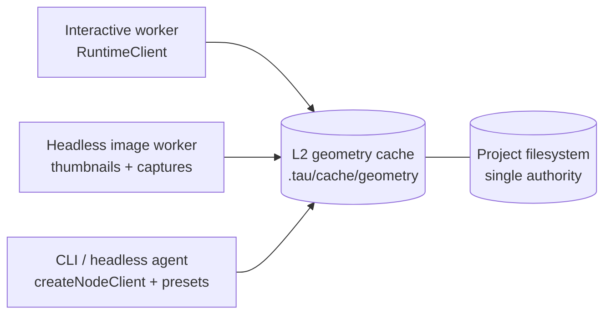

# Kernel Architecture Policy

Internal reference for the CAD runtime worker architecture: from editor to geometry computation.

## Rationale

A layered kernel API (Client, Transport, Protocol) separates consumer convenience from framework primitives. The plugin model (kernels, bundlers, middleware) keeps the framework generic while enabling CAD-specific capabilities. Single-worker-per-compilation-unit and lazy kernel loading minimize memory footprint.

## Architecture Overview

```text
Route (projects_.$id)
  └─ ProjectMachine (1 per project)
       ├─ FileManagerMachine (1 per project, shared)
       ├─ EditorMachine (1 per project, UI state)
       ├─ ViewGraphics: Map<viewId, GraphicsMachine>
       │    └─ GraphicsMachine (1 per viewer panel, WebGL rendering)
       └─ CompilationUnits: Map<entryFile, CadMachine>
            └─ CadMachine (1 per entry file, headless computation)
                 └─ KernelMachine (1 per CadMachine)
                      └─ RuntimeClient → RuntimeTransport → Worker
                           └─ KernelRuntimeWorker (1 Web Worker per KernelMachine)
                                ├─ Loaded kernel modules (via defineKernel)
                                ├─ Loaded bundler modules (via defineBundler, routed by extension)
                                └─ Middleware chain (via defineMiddleware)
```

## Layered Architecture

The kernel API follows a three-layer design. Each layer has a distinct audience and abstraction level:

```text
┌────────────────────────────────────────────────────────┐
│  RuntimeClient (consumer-facing)                        │
│  Promise-based, lazy initialization, event subscription│
├────────────────────────────────────────────────────────┤
│  RuntimeTransport (framework-level)                     │
│  Event-driven, transport-agnostic, zero Promises       │
├────────────────────────────────────────────────────────┤
│  RuntimeCommand / RuntimeResponse (protocol)             │
│  Typed discriminated unions, requestId correlation      │
└────────────────────────────────────────────────────────┘
```

**Why both Client and Transport?** Transport is the primitive -- pure messages with zero abstraction overhead. Client adds Promise correlation (~1μs overhead vs 100ms–10s render times). Both are exposed: consumers use `RuntimeClient`, framework authors use `RuntimeTransport` directly.

## Filesystem supply seam (transport topology)

The opaque {@link RuntimeFileSystem} attaches on the isolate that owns filesystem authority:

- **`TransportDescriptor.fileSystem = 'inline' | 'bridged'`** → supply via **`webWorkerTransport({ fileSystem })`**, **`nodeWorkerTransport({ fileSystem })`**, or **`inProcessTransport({ runtime, fileSystem })`** (bundled transports: `inProcessTransport`, CLI `createNodeClient`, `webWorkerTransport`, `nodeWorkerTransport`).
- **`'host-local'`** → host-side **`RuntimeTransportHost`** constructed with **`electronUtilityHost({ fileSystem })`** (example app: Electron utility bootstrap).
- **`'unbound'`** → omit the filesystem option altogether (none bundled yet).

Concrete option placement MUST be enforced by **per-transport Zod schemas**. The dispatcher binds only `inlineFileSystem` and `fileSystemPort` transferables — phantom `bindings.fileSystem`-style seams are forbidden.

Third-party transports pick the descriptor row matching their wire; avoid `@taucad/runtime/testing` in any production bundle (ESLint bans it).

For persisted browser projects, trusted application composition selects the authority-global route and supplies a writable rooted filesystem. Runtime transports, workers, kernels, bundlers, middleware, GeoSpec, and headless rendering receive only that opaque filesystem plus project-local absolute paths. Their virtual working directory is always `/`; none may receive a project id, `projectRootPath`, global mount table, global `/projects/<id>` path, grant/rights object, or authority-global file-pool buffer.

## Entity Model

| Entity                     | Purpose                                                                                                                                                                                                                                                                                                                                   | Layer         |
| -------------------------- | ----------------------------------------------------------------------------------------------------------------------------------------------------------------------------------------------------------------------------------------------------------------------------------------------------------------------------------------- | ------------- |
| **RuntimeClient**          | High-level facade. Lazy, Promise-based, event-subscribable. Supports inline code rendering (`RuntimeSource`) and filesystem rendering (filesystem `RuntimeSource`). Emits `geometry` event on render completion. Auto-cancels superseded renders. Created by `createRuntimeClient()`.                                                     | Consumer      |
| **RuntimeTransportPlugin** | Legacy name — superseded by **`TransportPlugin`** callable (`webWorkerTransport({...})`). Bundled implementations: `inProcessTransport`, `webWorkerTransport`, `nodeWorkerTransport`. Standalone **`webWorkerHost` / `nodeWorkerHost` / `electronUtilityHost`** furnish worker/host entries — no `.host` accessor on the plugin callable. | Framework     |
| **RuntimeTransportClient** | Fat consumer-facing transport handle. Owns SAB, abort, geometry pool, FS bridge. `client.connect()` takes no arguments — every wire concern is closed over by the transport at construction.                                                                                                                                              | Framework     |
| **RuntimeWorkerClient**    | Protocol client wrapping a `RuntimeTransportClient` with request/response correlation and typed callbacks.                                                                                                                                                                                                                                | Framework     |
| **KernelRuntimeWorker**    | Worker-side orchestrator. Manages kernel selection, middleware chain, bundler routing.                                                                                                                                                                                                                                                    | Worker        |
| **RuntimeFileSystem**      | Opaque consumer-facing filesystem value produced by `fromMemoryFs`, `fromNodeFs`, `fromBrowserFs`, `fromFsLike`, or `fromFileSystemBridge`. Passed into **`webWorkerTransport({ fileSystem })`** / **`inProcessTransport({ runtime, fileSystem })`**. Internal handle representation lives under `transport/_internal`.                   | Consumer      |
| **KernelDefinition**       | Kernel plugin contract (author API, via `defineKernel`). Runs in worker.                                                                                                                                                                                                                                                                  | Plugin Author |
| **BundlerDefinition**      | Bundler plugin contract (author API, via `defineBundler`). Declares supported `extensions`.                                                                                                                                                                                                                                               | Plugin Author |
| **KernelMiddleware**       | Middleware plugin contract (author API, via `defineMiddleware`). Wraps kernel operations.                                                                                                                                                                                                                                                 | Plugin Author |
| **KernelPlugin**           | Registration object returned by consumer factory functions like `replicad()`. Runs on main thread.                                                                                                                                                                                                                                        | Consumer      |
| **MiddlewarePlugin**       | Registration object returned by consumer factory functions like `parameterCache()`.                                                                                                                                                                                                                                                       | Consumer      |
| **BundlerPlugin**          | Registration object returned by consumer factory functions like `esbuild()`.                                                                                                                                                                                                                                                              | Consumer      |
| **KernelRuntime**          | Services injected into kernel methods: filesystem, logger, bundler, tracer.                                                                                                                                                                                                                                                               | Plugin Author |
| **Realm**                  | Execution environment: main thread, Web Worker, Node.js `worker_threads`, remote server.                                                                                                                                                                                                                                                  | Conceptual    |

## API Audiences

Two distinct "define" patterns serve different audiences:

| Audience          | Pattern                                                   | Example                      | Runs In      |
| ----------------- | --------------------------------------------------------- | ---------------------------- | ------------ |
| **Plugin author** | `defineKernel()`, `defineBundler()`, `defineMiddleware()` | Implement a new CAD kernel   | Worker realm |
| **Consumer**      | `replicad()`, `esbuild()`, `parameterCache()`             | Select and configure plugins | Main thread  |

## Three-Pillar Plugin Model

All non-generic capabilities are provided by injectable plugins, not hardcoded in the framework:

| Plugin Type | Author API                              | Consumer API                            | Purpose                                                          | Example                                       |
| ----------- | --------------------------------------- | --------------------------------------- | ---------------------------------------------------------------- | --------------------------------------------- |
| Kernel      | `defineKernel` → `KernelDefinition`     | `replicad()` → `KernelPlugin`           | Geometry computation, parameter extraction, export               | replicad, manifold, jscad, openscad, zoo, tau |
| Bundler     | `defineBundler` → `BundlerDefinition`   | `esbuild()` → `BundlerPlugin`           | File bundling, code execution, module registry, import detection | esbuild bundler                               |
| Middleware  | `defineMiddleware` → `KernelMiddleware` | `parameterCache()` → `MiddlewarePlugin` | Operation wrapping (caching, transforms, edge detection)         | geometry-cache, parameter-cache               |

### Multi-Bundler Support

Multiple bundlers can be registered simultaneously. Each bundler declares the file extensions it handles via `extensions: string[]` in its `BundlerDefinition`. The framework routes operations to the correct bundler by file extension:

- `registerModule` calls are broadcast to all loaded bundlers
- `bundle`, `detectImports`, `resolveDependencies` are routed to the bundler matching the file extension
- Bundlers are lazily loaded -- only initialized when a file with a matching extension is encountered
- Managed internally via `Map<extension, BundlerDefinition>` and `Map<extension, LoadedBundler>`

### Machine Multiplicity

| Component           | Per-project count       | Per-viewer-panel count | Notes                                          |
| ------------------- | ----------------------- | ---------------------- | ---------------------------------------------- |
| ProjectMachine      | 1                       | --                     | Root state machine                             |
| FileManagerMachine  | 1                       | --                     | Shared across all units                        |
| CadMachine          | 1 per unique entry file | --                     | Shared when multiple panels view the same file |
| KernelMachine       | 1 per CadMachine        | --                     | Always 1:1 with CadMachine                     |
| RuntimeClient       | 1 per KernelMachine     | --                     | Manages Worker lifecycle                       |
| KernelRuntimeWorker | 1 per RuntimeClient     | --                     | Single worker, loads kernel on demand          |
| GraphicsMachine     | --                      | 1                      | WebGL renderer per panel                       |

### Memory Impact

With the single-worker-per-geometry-unit architecture, only the WASM runtime for the selected kernel is loaded:

- replicad file: ~55-66 MB (OpenCASCADE WASM)
- manifold file: ~14 MB (Manifold WASM)
- openscad file: ~14 MB (Manifold WASM)
- jscad file: ~5 MB
- kcl file: ~3 MB (KCL WASM)
- STEP/STL file: ~5 MB (converter)

Previously, all 5 kernels were loaded eagerly (~90 MB per CadMachine).

## RuntimeClient Lifecycle

```text
1. createRuntimeClient(options)                          → RuntimeClient created, no Worker yet
2. client.on('geometry', handler)                       → Subscribe to render results (any time)
3. client.render({ source: { files: { 'box.ts': '...' } } }) → Stages files into the transport-owned filesystem, auto-connects, renders
4. client.render({ source: { path }, parameters })      → Renders from the connected transport-owned filesystem
5. client.connect()                                     → Explicit connection for worker bridges
6. client.terminate()                                   → Worker terminated, resources cleaned up
```

### RenderInput Type

The `render()` method accepts two input shapes via generic overloads:

**Inline source mode** (`InlineRuntimeSource<Files>`): A filename-to-content map under `source.files`. When the map has a single key, `entry` is optional (the runtime picks the only key). When multiple keys exist, `entry` is required to specify the entry point. The runtime stages files into the transport-owned filesystem, then connects and renders. High-level helpers provide a filesystem automatically; raw transports require `fileSystem`.

**Filesystem mode** (`FilesystemRuntimeSource`): Renders from a connected filesystem. `source.path` can be a project-local string shorthand (e.g., `'/src/main.ts'`) or a `GeometryFile` object. File-change invalidation is owned by the worker's filesystem watch path, not a public render-input field. Persisted projects expose source, `/.tau/cache`, generated files, and project-local `/node_modules` through one fully writable rooted tree.

### Geometry Event

When any render completes (success or failure), the `geometry` event fires with the full `HashedGeometryResult`. This enables fire-and-forget render calls where the consumer subscribes once and receives all results reactively.

### Auto-Cancellation (Latest-Wins)

When a follow-up render request arrives while a previous render is in-flight, the previous render is cooperatively superseded via the abort signal slot. The prior outcome resolves as `{ status: 'superseded' }` on the discriminated `RenderOutcome` returned from `render`/`updateParameters`/`setOptions` — never as a thrown exception. Only the latest render's result fires the `geometry` event. For pull consumers (CLI), renders are sequential so supersession never triggers.

## RuntimeFileSystem

10 required methods matching Node.js `fs.promises.*`. All paths are absolute.

| Method      | Signature                                           | Purpose                                 |
| ----------- | --------------------------------------------------- | --------------------------------------- |
| `readFile`  | `(path, encoding?) → Promise<string \| Uint8Array>` | Read file as text or binary             |
| `writeFile` | `(path, data) → Promise<void>`                      | Write text or binary file               |
| `mkdir`     | `(path, options?) → Promise<void>`                  | Create directory (optionally recursive) |
| `readdir`   | `(path) → Promise<string[]>`                        | List directory entries                  |
| `unlink`    | `(path) → Promise<void>`                            | Delete file                             |
| `rmdir`     | `(path) → Promise<void>`                            | Remove directory                        |
| `rename`    | `(oldPath, newPath) → Promise<void>`                | Rename/move file or directory           |
| `stat`      | `(path) → Promise<{ type, size, mtimeMs }>`         | Get file/directory metadata             |
| `lstat`     | `(path) → Promise<{ type, size, mtimeMs }>`         | Like stat, but does not follow symlinks |
| `exists`    | `(path) → Promise<boolean>`                         | Check if path exists                    |

The framework builds higher-level operations from these primitives internally:

- `ensureDirectoryExists(path)` via `mkdir(path, { recursive: true })`
- `readFiles(paths)` via `Promise.all(paths.map(readFile))`
- `getDirectoryContents(dir)` via `readdir(dir)` + `Promise.all(names.map(readFile))`
- `getDirectoryStat(dir)` via `readdir(dir)` + `Promise.all(names.map(stat))`

Convenience constructors (all opaque, transport-ready): `fromNodeFs(basePath)`, `fromMemoryFs()`, `fromFsLike(fsLike, rootPath?)`, `fromBrowserFs(...)`, and `fromFileSystemBridge(openConnection)`. The bridge factory opens a fresh scoped connection for each runtime binding or initialize retry.

Runtime filesystem access is intentionally authorization-blind. It resolves, reads, writes, watches, bundles, caches, and renders paths exposed by the supplied filesystem. Confinement belongs to the filesystem implementation; `cwd = /` is lookup context, not an authorization check. Node lexical/symlink containment protects the adapter boundary, but direct malicious `node:fs` access requires a separate OS/container sandbox.

## Transport Abstraction

```typescript
type RuntimeTransport = {
  send(message: RuntimeCommand, transferables?: Transferable[]): void;
  onMessage(handler: (message: RuntimeResponse) => void): void;
  close(): void;
};
```

**Built-in:** `createWorkerTransport(workerUrl)` wraps a Web Worker as a `RuntimeTransport`.

**Future transports:** WebSocket (remote kernel server), HTTP + SSE (serverless endpoints), `worker_threads` (Node.js).

## Data Flow: File Edit to Geometry Display

```
1. User edits code in Monaco editor
   │
2. FileManager writes file → emits fileWritten event
   │
3. use-project.tsx iterates all geometryUnits with changed path (absolute)
   │
4. Each CadMachine receives setFile event
   │  ├─ Different file → immediate render
   │  └─ Same file → 500ms debounce (bufferingFile state)
   │
5. CadMachine enters rendering state → sends createGeometry to KernelMachine
   │
6. KernelMachine pipeline:
   │  ├─ Lazily creates RuntimeClient (ensureRuntimeClient)
   │  ├─ Subscribes to geometry/progress/parametersResolved events once
   │  ├─ RuntimeClient creates Worker + Transport on first connect
   │  ├─ Worker selects kernel via three-pass detection
   │  ├─ render: unified pipeline (deps → params → geometry)
   │  ├─ filesystem watch events invalidate caches inside the worker
   │  └─ Auto-cancellation: new render supersedes in-flight render
   │
7. CadMachine receives geometryComputed → updates context.geometry
   │
8. ViewerContent useEffect bridges geometry → GraphicsMachine
   │
9. GraphicsMachine → CadViewer → GltfMesh renders to WebGL canvas
```

### Debouncing

| Trigger                         | Debounce | Rationale                                |
| ------------------------------- | -------- | ---------------------------------------- |
| File content change (same file) | 500ms    | Avoids recompiling on every keystroke    |
| Parameter change                | 50ms     | Slider drags need responsive feedback    |
| File switch (different file)    | 0ms      | User intent is clear, render immediately |

## Worker Lifecycle

### Lazy Initialization

The RuntimeClient creates the Worker lazily on first `connect()` or `render()`:

1. `createRuntimeClient({ transport })` — returns client, no Worker yet
2. `client.connect()` — materializes the transport and creates the Worker
3. `RuntimeWorkerClient.initialize()` sends boot config and transport-owned filesystem handles
4. The worker resolves its own `defineRuntime(...)` definition and reports capabilities
5. Kernel initialization is deferred until `selectKernel()` determines which kernel is needed

Only the WASM runtime for the selected kernel is ever loaded.

### Cleanup Chain

```
ProjectMachine.stopStatefulActors()
  → enqueue.stopChild(cadMachine)
    → CadMachine stops
      → KernelMachine exit action: destroyWorkers()
        → kernelClient.terminate()
          → workerClient.cleanup()
          → transport.close()
```

## Kernel Selection (Three-Pass Detection)

### Detection Strategy

```
1. Check selectionCache (full file path as key) → hit? return immediately

2. Pass 1: Extension + regex fast path
   - Try each kernel config's detectImport regex against the entry file
   - Extension-only kernels (openscad, zoo) match immediately
   - Regex kernels (replicad, manifold, jscad) test entry file content

3. Pass 2: Bundler-assisted detection (transitive)
   - If no kernel matched AND a bundler handles this file's extension:
   - Route to the correct bundler via extension matching
   - Call bundler.detectImports(entryPath) — no modules need to be registered
   - detectImports marks bare specifiers as external, walks the full import tree
   - Returns { detectedModules: ['replicad'], dependencies: [...] }
   - Match detectedModules against each kernel config's builtinModuleNames
   - Select highest-priority match; initialize ALL matching kernels (multi-module)

4. Pass 3: Catch-all fallback
   - Try any extensions: ['*'] config (tau converter)
```

### Detection Priority

```
Priority: openscad → zoo → replicad → manifold → jscad → tau
```

| Kernel   | Detection Method              | Scope                   |
| -------- | ----------------------------- | ----------------------- |
| OpenScad | Extension: `.scad`            | Immediate               |
| Zoo      | Extension: `.kcl`             | Immediate               |
| Replicad | Regex + bundler detectImports | Entry file + transitive |
| Manifold | Regex + bundler detectImports | Entry file + transitive |
| Jscad    | Regex + bundler detectImports | Entry file + transitive |
| Tau      | Extension: `*` (catch-all)    | Fallback                |

### Multi-Module Registration

When detection finds imports matching multiple kernels (e.g., both `replicad` and `@jscad/modeling`), the framework:

1. Selects the highest-priority kernel for geometry computation
2. Initializes ALL matching kernels so their modules are registered

This ensures all library modules are available at bundle time.

### Selection Cache Invalidation

The selection cache is invalidated by worker-owned filesystem watch events, since changed imports may shift which kernel handles a file. The cache uses full file paths as keys to prevent collisions.

## Plugin Architecture

### `defineBundler`

Bundler plugins handle file bundling, code execution, and module registry. The esbuild bundler (`esbuild.bundler.ts`) is the default implementation.

Each bundler declares which file extensions it handles via `extensions: string[]`:

```typescript
export const myBundler = defineBundler({
  extensions: ['ts', 'js', 'tsx', 'jsx'],
  // ...methods
});
```

Key methods:

- `detectImports(input)` — lightweight pass that discovers bare-specifier imports transitively using esbuild externals mode. No modules need to be registered. Used for kernel selection.
- `bundle(input)` — full production bundle with all registered modules resolved. Called after kernel selection and initialization.
- `execute(code)` — run bundled code via dynamic import (Blob URL / data URL).
- `registerModule(name, module)` — register/update a builtin module for resolution during bundle().
- `resolveDependencies(input)` — optional fast-path dependency resolution.

### `defineKernel`

Kernel modules define geometry computation logic. Each kernel is an ES module loaded via `import(kernelModuleUrl)`. The pipeline has three phases — build, mesh (display), export — each a pure `native → X` transform:

- `initialize(options, runtime)` — load WASM, register builtin modules. `options` is type-safe via the `Options` generic inferred from `optionsSchema`
- `getDependencies(input, runtime, ctx)` — return file dependencies
- `getParameters(input, runtime, ctx)` — extract parameters from code
- `createGeometry(input, runtime, ctx)` — evaluate source → `{ nativeHandle, geometry? }`. The nativeHandle carries **all export-facing evidence** (shapes, resolved interfaces, datum frames). Manifold and Tau return display-ready inline `geometry`; Replicad, OpenCascade, Zoo, and JSCAD return reusable native evidence and implement `meshGeometry`
- `meshGeometry(input, runtime, ctx)` _(optional)_ — nativeHandle → display artifact (`GeometryResponse`) at preview tessellation or display packing. Runs **only on the display path**, at the kernel boundary; export-only requests never call it. Contract invariant: a kernel provides a display path either via inline `geometry` or via `meshGeometry` — the orchestrator rejects display renders when neither exists
- `exportGeometry(input, runtime, ctx)` — export using the framework-materialized nativeHandle. Mesh formats tessellate internally at export quality; BRep formats (STEP/IGES) never tessellate

### MessagePort Protocol

The kernel machine communicates with the worker via typed MessagePort events through the `RuntimeTransport` interface:

- All request/response commands carry a `requestId` for correlation
- Fire-and-forget commands (`fileChanged`, `cleanup`) have no requestId
- `cancel` command is used by auto-cancellation (latest-wins semantics) when a new `render()` supersedes an in-flight one
- `fileChanged` command is internal to filesystem watch delivery and is not exposed as a public render-input field
- `progress` events stream render phase transitions to the UI
- `telemetry` events batch performance entries for the kernel panel

### ESBuild Metafile

The bundler produces a metafile with all resolved module paths:

| Namespace   | Example Key                           | Description                      |
| ----------- | ------------------------------------- | -------------------------------- |
| `zenfs:`    | `zenfs:main.ts`                       | Project-relative file            |
| `zenfs:`    | `zenfs:/node_modules/lodash/index.js` | CDN-cached module                |
| `builtin:`  | `builtin:replicad`                    | Runtime-registered kernel module |
| `http-url:` | `http-url:https://esm.sh/...`         | HTTP-fetched module              |

During detection, bare specifiers appear as external imports in `metafile.outputs[chunk].imports` rather than in `metafile.inputs`, since they are not resolved.

## Package Exports

```
@taucad/runtime          → createRuntimeClient, types, presets, fromMemoryFs, fromFsLike, fromFileSystemBridge
@taucad/runtime/transport → defineRuntimeTransport, inProcessTransport, webWorkerTransport, nodeWorkerTransport
@taucad/runtime/kernels  → replicad(), manifold(), zoo(), openscad(), jscad(), tau()
@taucad/runtime/middleware → parameterCache(), geometryCache(), gltfCoordinateTransform(), gltfEdgeDetection()
@taucad/runtime/bundler  → esbuild()
@taucad/runtime/transport → RuntimeTransport, createWorkerTransport()
@taucad/runtime/testing  → Testing utilities (createTestFilesystem, mocks)
```

Individual plugin subpaths are also maintained for direct imports (e.g., `@taucad/runtime/kernels/replicad`).

## Tessellation

Tessellation controls the quality of geometry meshing across the render and export pipelines. It is a first-class, cross-cutting concern formalized as a shared type in `@taucad/types`.

### Shared Type

```typescript
type Tessellation = {
  linearTolerance: number; // Maximum chord deviation (mm)
  angularTolerance: number; // Maximum angle between face normals (degrees)
};
```

### Configuration Levels

Tessellation can be configured at two levels, with per-call overrides taking precedence:

1. **Client-level defaults** — set once in `createRuntimeClient(options)`:

```typescript
createRuntimeClient({
  transport,
  tessellation: {
    preview: { linearTolerance: 0.1, angularTolerance: 30 }, // Faster, lower quality
    export: { linearTolerance: 0.01, angularTolerance: 30 }, // Slower, higher quality
  },
  // ...
});
```

Two explicit slots (`preview` and `export`) make the quality distinction visible and intentional. Preview tessellation is used by the display path (`meshGeometry` for kernels that defer it, inline `createGeometry` otherwise); export tessellation is used by `exportGeometry` for mesh formats. BRep exports (STEP/IGES) tessellate nothing.

2. **Per-call overrides** — passed as `callOptions` to individual methods:

```typescript
client.render({
  file,
  parameters,
  tessellation: { linearTolerance: 0.05, angularTolerance: 15 },
});
client.export('stl', {
  tessellation: { linearTolerance: 0.005, angularTolerance: 10 },
});
```

### Resolution Order

For both `render` and `export`: `callOptions.tessellation > client option (preview/export) > kernel default`.

If no tessellation is specified at any level, each kernel applies its own internal defaults.

### Per-Kernel Interpretation

| Kernel       | Preview Default | Export Default | Mechanism                                                                                                                              |
| ------------ | --------------- | -------------- | -------------------------------------------------------------------------------------------------------------------------------------- |
| **Replicad** | `0.02 / 20°`    | `0.01 / 20°`   | Passed to `.mesh()` and `.meshEdges()`; locked by `occt-tessellation-defaults.test.ts`                                                 |
| **Manifold** | ignored         | ignored        | Uses Manifold's own tessellation; fixed by model/API output                                                                            |
| **OpenSCAD** | none            | n/a            | Injected as `$fs` (linear) and `$fa` (angular) CLI arguments at render time. Export reuses baked geometry — override logged as warning |
| **Zoo/KCL**  | ignored         | ignored        | Tessellation is server-side; future integration point                                                                                  |
| **JSCAD**    | ignored         | ignored        | Uses fixed internal tessellation                                                                                                       |

### Threading Path

```
RuntimeClient.render({ source, parameters, renderOptions? })
  → resolves: input.renderOptions ?? active render options
    → RuntimeWorkerClient.openFile(..., renderOptions?)
      → RuntimeCommand { type: 'openFile', options? }
        → dispatcher → KernelWorker.handleOpenFile(..., options?)
          → KernelWorker.createGeometry(..., options?)          // publish path
            → CreateGeometryInput { options? }
              → KernelDefinition.createGeometry(input, runtime, ctx)
            → MeshGeometryInput { nativeHandle, options }        // when geometry deferred
              → KernelDefinition.meshGeometry(input, runtime, ctx)
```

Export follows the same pattern via `exportGeometry` → `ExportGeometryInput { tessellation? }` — without the mesh phase.

## Plugin Options & Validation

All plugins use Zod schemas for option validation via a common `optionsSchema` pattern:

| Plugin Type | Schema Property                   | Validated At                                        |
| ----------- | --------------------------------- | --------------------------------------------------- |
| Kernel      | `KernelDefinition.optionsSchema`  | `ensureKernelInitialized()` before `initialize()`   |
| Bundler     | `BundlerDefinition.optionsSchema` | `ensureBundlerForExtension()` before `initialize()` |
| Middleware  | `KernelMiddleware.optionsSchema`  | `loadMiddleware()` during middleware resolution     |

Consumer-facing input uses `options` naming; validated output uses `config` internally within `defineX` implementations. The `Options` generic type is inferred from the Zod schema, giving plugin authors type-safe access in their callbacks without manual casting.

## Caching Strategy

### Geometry Caches (mesh/build/export split)

The `geometryCache()` middleware persists three role-aligned entries under `.tau/cache/geometry/`:

| Cache      | File                | Wraps            | Stores                                                                          |
| ---------- | ------------------- | ---------------- | ------------------------------------------------------------------------------- |
| **build**  | `{hash}.bin`        | `createGeometry` | `serializedNativeHandle` (+ inline display geometry when the kernel returns it) |
| **mesh**   | `mesh-{hash}.bin`   | `meshGeometry`   | Display `GeometryResponse` at preview tessellation                              |
| **export** | `export-{hash}.bin` | Final export leg | Target `ExportFile[]` after selected content contributors/transcoders           |

A source-scoped build key has one operation-invariant create-result shape: request-specific display packing belongs in `meshGeometry`, while file encoding belongs in `exportGeometry`. A warm export deserializes the build entry's native handle instead of reheating, and any export-only request writes no mesh entry. Cache temperature must not change export output: live, reheated, and deserialized handles produce structurally identical STEP (verified by the replicad conformance suite), and `exportSTEP` pins its `Interface_Static` state on every call so unit statics cannot leak between exports sharing a wasm instance.

### File-Level Caches (persist across render cycles)

| Cache               | Invalidation                                                         | Purpose                                             |
| ------------------- | -------------------------------------------------------------------- | --------------------------------------------------- |
| `fileHashCache`     | Worker-owned filesystem watch invalidation                           | Avoid re-hashing unchanged files                    |
| `fileContentCache`  | Worker-owned filesystem watch invalidation                           | Avoid re-reading unchanged files                    |
| `bundleResultCache` | Dependency-aware: only entries whose deps overlap with changed files | Avoid re-bundling when deps haven't changed         |
| `selectionCache`    | Cleared entirely on any file change                                  | Ensure kernel detection re-runs when imports change |

### Per-Render Caches (cleared each render cycle)

| Cache                   | Purpose                                                           |
| ----------------------- | ----------------------------------------------------------------- |
| `renderDependencyCache` | Reuse dependency computation between getParams and createGeometry |
| `cachedDetectionDeps`   | Reuse deps from detectImports for getDependencies (zero cost)     |

## Multi-Client Topology & Cache Parity

One project filesystem serves **N runtime clients**: the interactive worker, one shared headless-image worker for thumbnails and plain captures, and CLI/headless clients — peers over the same files and the same L2 geometry cache (`.tau/cache/geometry`). The single-client-per-project assumption is retired.



### Hash-Parity Rule

Clients that intend to share cache entries MUST be byte-identical everywhere the selected phase/route identity looks. `dependencyHash` folds in file hashes, kernel options, parameters, operation options including `content`, and each selected mutative middleware participant's stable plugin ID, version, options, and selected order. Non-mutative taps (`mutates: false`) are excluded. A mismatched client does not error — it forks the cache and recomputes. Any new runtime client MUST land with a parity test proving that a warm compatible operation on one client is a cache hit on the other.

### Middleware Placement Rules

- The middleware array is an onion: earlier entries are **outer** layers; the cache stores what inner layers return _after_ transforms have run on the way back up.
- Transform and content-contributor middleware declares the phases/routes and content properties it supports. Display transforms remain on the mesh leg; an export route may select an export-leg contributor such as glTF edge inclusion without making all exports display artifacts.
- Per-client non-mutative taps are permitted. Per-client byte-changing middleware is not cache-transparent and therefore participates in the selected identity instead of relying on a blanket chain hash.
- `geometryCache`'s position is deliberate: it stores post-transform artifacts. Do not reorder the shared chain without re-deriving every consumer's expectations — reordering is also a hash change for everyone.

### Content-Aware Export Sourcing

`content` is the framework-level request for semantic output content, independently inferred per selected route property. `includeEdges` is supported only where the selected route can preserve edge primitives; `includeTopology` is independently advertised and inferred. Rendering defaults `includeTopology` to `true`; exports default it to `false`. Unsupported properties are rejected by route-aware types and runtime validation rather than broadcast to every kernel.

Image routes use the export leg so callers can select export tessellation and content without overloading renderer options. On a final-cache miss, the runtime materializes the selected source artifact once, applies selected content contributors and transcoders, and caches only the final target. Direct glTF routes may request edges; image transcoders consume the resulting glTF source. Interop routes retain their own coordinate/unit/tessellation conventions and do not receive display-only mesh middleware. A separately persisted source stage requires evidence and an explicit lifecycle contract; it is not part of the current middleware API.

## Future Work -- Render Pipeline Cancellation

### Problem: Render Interleaving on the Worker

The worker-side dispatcher (`runtime-worker-dispatcher.ts`) does not serialize render operations. When rapid parameter changes trigger back-to-back renders, the event loop processes the second render's `postMessage` at an `await` yield point of the first render. Both renders share mutable worker state (tracer, caches, `onProgress` callback), causing corruption.

The tracer crash is fixed by epoch-scoped spans (see `RuntimeTracer`), but the broader interleaving problem remains: stale renders waste compute time running the full geometry pipeline even when superseded. Cooperative-abort signaling via the shared abort slot (`signalAbort('superseded')`) reaches the worker, but kernel-level cooperative checks are not yet wired through every long-running OCCT/Manifold call.

### Proposed Architecture: Dispatcher Serialization with Cooperative Cancellation

The cancellation architecture has three layers, each targeting a different execution context:

```
┌─────────────────────────────────────────────────────────────┐
│ Layer 1: Framework AbortSignal (async yield points)         │
│ AbortController lives in dispatcher, signal passed to       │
│ KernelWorker.render(). Checked via signal.throwIfAborted()  │
│ at every await boundary.                                    │
├─────────────────────────────────────────────────────────────┤
│ Layer 2: WASM cooperative cancellation (sync compute)       │
│ OpenCASCADE: Message_ProgressIndicator.UserBreak()          │
│ Polled during long tessellation/boolean operations.         │
│ Connected to AbortSignal via progress callback.             │
├─────────────────────────────────────────────────────────────┤
│ Layer 3: SharedArrayBuffer flag (cross-thread sync signal)  │
│ Transport sets flag via signalAbort(reason); worker reads   │
│ atomically. Bypasses postMessage latency for time-critical  │
│ cancellation. Encapsulated by RuntimeTransport — runtime    │
│ client never touches Atomics or SAB directly.               │
└─────────────────────────────────────────────────────────────┘
```

### Dispatcher Serialization

The dispatcher should maintain a render lock and an `AbortController`:

1. On `render` command: abort the previous controller, await the render lock (previous render exits fast via cooperative cancellation), create a new `AbortController`, pass `signal` to `worker.render()`
2. On `cancel` command: call `currentAbort.abort()` instead of the current no-op
3. Aborted renders are silently discarded (no response sent to main thread)
4. Only the latest render's result is sent back as `geometryComputed`

Key constraint: `AbortSignal` cannot be transferred via `postMessage` (not `Transferable`), so the `AbortController` must live on the worker side in the dispatcher. The main thread's `cancel` command triggers the abort.

### Cooperative Cancellation in KernelWorker

Add `signal?: AbortSignal` to `KernelWorker.render()` and insert `signal.throwIfAborted()` at every async yield point:

- `render()`: before `getParameters()`, before `createGeometry()`
- `getParameters()`: before middleware chain
- `createGeometry()`: before middleware chain
- `computeBaseDependencies()`: after `onGetDependencies()`

Use `AbortSignal.any()` to combine the render cancellation signal with any future timeout or user-initiated cancel signals. Use the built-in `signal.throwIfAborted()` (throws `DOMException` with `name === 'AbortError'`) rather than a custom helper.

### WASM Cancellation (OpenCASCADE)

For kernels with long-running synchronous WASM operations (replicad/OpenCASCADE), connect the `AbortSignal` to the OpenCASCADE progress indicator:

- `Message_ProgressIndicator.UserBreak()` is polled by the WASM runtime during tessellation and boolean operations
- Return `true` from the progress callback when `signal.aborted` to trigger cooperative exit from WASM
- This is the only way to interrupt synchronous WASM computation without terminating the worker

### References

- [MDN AbortController](https://developer.mozilla.org/en-US/docs/Web/API/AbortController) -- standard cooperative cancellation
- [MDN AbortSignal.any()](https://developer.mozilla.org/en-US/docs/Web/API/AbortSignal/any_static) -- combining multiple signals
- [MDN AbortSignal.throwIfAborted()](https://developer.mozilla.org/en-US/docs/Web/API/AbortSignal/throwIfAborted) -- built-in abort check
- [Prioritized Task Scheduling API](https://wicg.github.io/scheduling-apis/) -- TaskController/AbortSignal integration pattern
- [OpenCASCADE.js Progress Indicator](https://ocjs.org/docs/stable/usage/progress) -- WASM cooperative cancellation via `Message_ProgressIndicator`

## Monaco IntelliSense Type Pipeline

The editor provides IntelliSense (autocompletion, hover, diagnostics) for kernel imports via bundled `.d.ts` files registered with Monaco's TypeScript language service.

### Architecture

```
Kernel package .d.ts files
  → extract-<id>-types.ts (extraction script)
    → <id>.bundled.json (JSON map: module path → raw .d.ts content)
      → @taucad/api-extractor (parses JSON internally, exports typed KernelTypesMap)
        → javascript-contribution.ts (iterates typed maps → addExtraLib per entry)
          → Monaco TypeScript language service
```

### Why JSON Maps

Each kernel exports a JSON map of `Record<string, string>` where keys are module paths (e.g. `@jscad/modeling`, `@jscad/modeling/primitives`) and values are raw `.d.ts` content. This uniform format exists because:

- **Module identity = file path**: Monaco's TypeScript service resolves `import { cube } from '@jscad/modeling/primitives'` by looking for a virtual file at `file:///node_modules/@jscad/modeling/primitives/index.d.ts`. Each subpath export needs its own `addExtraLib` registration.
- **No `declare module` wrappers**: Earlier versions wrapped content in `declare module '<pkg>' { ... }` blocks. This caused TS1038 errors (`'declare' modifier cannot be used in an already ambient context`) because the source `.d.ts` files already use `export declare`. Raw module files registered at the correct virtual path avoid this entirely.
- **Uniform consumer code**: Every kernel uses the same format regardless of whether it has one entry point (replicad) or fifteen (JSCAD). The consumer in `javascript-contribution.ts` is a single `flatMap` over all kernel type maps.
- **Typed exports**: `@taucad/api-extractor` parses the JSON internally and exports typed `KernelTypesMap` objects plus a pre-built `kernelTypeMaps` array. Consumers use these directly — no `JSON.parse` or type assertions needed.

### Adding Types for a New Kernel

1. Create `libs/api-extractor/src/extract-<id>-types.ts` with a `buildBundledTypes(): Record<string, string>` function
2. Write output to `libs/api-extractor/src/generated/<id>/<id>.bundled.json`
3. Also write individual `.d.ts` files under `generated/<id>/modules/` for type-level testing
4. In `libs/api-extractor/src/index.ts`: import the raw JSON, parse it via `parseTypesMap`, export as a typed `KernelTypesMap`, and add it to the `kernelTypeMaps` array
5. No changes needed in `javascript-contribution.ts` — it imports `kernelTypeMaps` which already includes all kernels
6. Add `.test-d.ts` type-level tests under `generated/<id>/` using `tsconfig.typetest.json` path mappings

### Type-Level Testing

Type-level tests (`.test-d.ts` files) verify that the generated types resolve correctly when imported via module names. They use a separate `tsconfig.typetest.json` with `moduleResolution: Bundler` and path mappings pointing at the `modules/` directory structure. These tests run via `vitest --typecheck` (not `tsgo`) because the path mappings require Bundler resolution mode.
