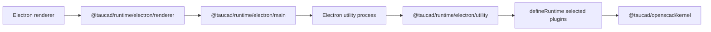

# Tau Runtime Electron Example

This example shows `@taucad/runtime` running in Electron with the OpenSCAD kernel hosted in an Electron utility process. The renderer talks to that host through first-class runtime Electron helpers.

## Commands

```bash
pnpm nx test example-electron --watch=false
pnpm nx build example-electron
pnpm nx test:e2e example-electron
pnpm nx serve example-electron
```

## Topology



## Runtime Boundary

- The utility process owns executable plugins and calls `serveElectronRuntime({ runtime, fileSystem })`.
- The main process registers a public runtime bridge with `registerElectronRuntimeMain(...)`.
- The preload script exposes the bridge with `exposeElectronRuntime()`.
- The renderer requests a port and creates `electronUtilityTransport({ port })`.
- The example uses selected capability subpaths, not broad barrels, so unused kernels and their assets stay out of the dependency graph.

## Selected Imports

```typescript
import { registerElectronRuntimeMain } from '@taucad/runtime/electron/main';
import { exposeElectronRuntime } from '@taucad/runtime/electron/preload';
import { electronUtilityTransport, requestElectronRuntimePort } from '@taucad/runtime/electron/renderer';
import { serveElectronRuntime } from '@taucad/runtime/electron/utility';
```

```typescript
import { openscad } from '@taucad/openscad/kernel';
import { fromNodeFs } from '@taucad/runtime/filesystem/node';
import { defineRuntime } from '@taucad/runtime/worker';
```
