# Tau Runtime Electron Example

This example shows `@taucad/runtime` running in Electron with the OpenSCAD kernel hosted in an Electron utility process. The renderer talks to that host through first-class runtime Electron helpers.
The `workspace/` folder is the disk-backed sample project mounted by the utility runtime.

## Commands

```bash
pnpm nx build example-electron
pnpm nx serve example-electron
```

## Build configuration

The app is Tau's electron-vite 6 beta/Vite 8 qualification lane. Its config contains
only application-owned roots, output directories, Tailwind, and the main-process
inputs:

```typescript
import { resolve } from 'node:path';
import { defineConfig } from 'electron-vite';
import { electronRuntimeConfig } from '@taucad/runtime/electron/vite';

export default defineConfig(
  electronRuntimeConfig({
    main: {
      build: {
        rolldownOptions: {
          input: {
            index: resolve(import.meta.dirname, 'src/main/index.ts'),
            'kernel-host': resolve(import.meta.dirname, 'src/tau/kernel-host.ts'),
          },
        },
      },
    },
    preload: {},
    renderer: {},
  }),
);
```

Main and the utility process build as one graph: electron-vite emits
`dist/main/kernel-host.js` beside `index.js`, where `src/main/main.ts` resolves it,
and the runtime modules both processes import are emitted once under
`dist/main/chunks`. On electron-vite 5/Vite 7 the same map goes under
`rollupOptions`. Importing the utility with `?modulePath` instead would build it
separately and bundle those shared modules a second time; that suits only a lone
utility sharing no module with main. Runtime assets are emitted from their literal
ESM URLs, so no dependency exclusion list or asset copier is needed.

## Topology

```mermaid
flowchart LR
  Renderer["Electron renderer"] --> Hook["@taucad/react useRuntime"]
  Hook --> Transport["@taucad/runtime/electron/renderer"]
  Transport --> Main["@taucad/runtime/electron/main"]
  Main --> Utility["Electron utility process"]
  Utility --> Host["@taucad/runtime/electron/utility"]
  Host --> Runtime["src/tau runtime boundary"]
  Runtime --> Kernel["@taucad/openrscad"]
```



## Runtime Boundary

- The `src/tau/` folder is the app-owned Tau runtime boundary.
- `src/tau/kernel-host.ts` owns executable plugins and calls `serveElectronRuntime({ runtime, fileSystem })`.
- The main process registers a public runtime bridge with `registerElectronRuntimeMain(...)`.
- `electronRuntimeConfig(...)` installs Tau's main/renderer build invariants and configures electron-vite's native externalizer.
- The preload script exposes the bridge with `exposeElectronRuntime()`.
- The renderer uses `@taucad/react` plus `createElectronClientOptions(...)`; the helper owns the port request and transport setup.
- The runtime definition includes parameter and geometry cache middleware so repeated parameter/source states use the cache-hit render path.
- The example uses selected capability subpaths, not broad barrels, so unused kernels and their assets stay out of the dependency graph.
- Maintainer e2e coverage for this topology lives in `apps/react-e2e`; the example itself stays test-framework agnostic.

## Parameters

`useRuntime` returns parameter defaults and JSON Schema. This example renders that schema with RJSF; consumers can use any JSON Schema form renderer with the same runtime state. Electron intentionally uses OpenSCAD and the visible `workspace/main.scad` fixture to show a disk-backed runtime with a different kernel than the browser examples.

## Selected Imports

```typescript
import { useRuntime } from '@taucad/react';
import { installElectronRuntimeHeaders, registerElectronRuntimeMain } from '@taucad/runtime/electron/main';
import { exposeElectronRuntime } from '@taucad/runtime/electron/preload';
import { createElectronClientOptions } from '@taucad/runtime/electron/renderer';
import { serveElectronRuntime } from '@taucad/runtime/electron/utility';
```

```typescript
import { openrscad } from '@taucad/openrscad';
import { fromNodeFs } from '@taucad/runtime/filesystem/node';
import { middleware, parameterUnits } from '@taucad/middleware';
import { defineRuntime } from '@taucad/runtime/worker';
```
