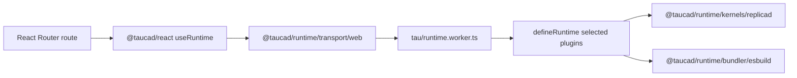

# Tau Runtime React Router Example

This example shows `@taucad/runtime` running in a React Router app with Vite and an app-owned module worker. The UI uses `@taucad/react` for lifecycle, parameters, geometry, and export state.

## Commands

```bash
pnpm nx dev example-react-router
pnpm nx typecheck example-react-router
pnpm nx build example-react-router
```

Open the URL printed by the dev server, usually [http://localhost:5173](http://localhost:5173).

## Topology



## Runtime Boundary

- The `tau/` folder is the app-owned Tau runtime boundary.
- The route imports `tau/runtime-definition.ts` as a type-only witness.
- `tau/runtime.worker.ts` owns executable plugins and awaits `serveWebWorkerRuntime({ runtime })`.
- `createWebWorkerClientOptions(...)` owns the browser transport plus the per-session in-memory filesystem.
- `@taucad/runtime/vite` supplies COI headers, WASM asset handling, worker format, and TypeScript worker-module URL support.
- The runtime definition includes parameter and geometry cache middleware so repeated parameter/source states use the cache-hit render path.
- The browser quickstarts use Replicad's single-threaded WASM variant so Next.js and React Router exercise the same deterministic asset path.
- The example uses selected capability subpaths, not broad barrels, so unused kernels and their assets stay out of the dependency graph.
- Maintainer e2e coverage for this topology lives in `packages/react/e2e`; the example itself stays test-framework agnostic.

## Parameters

`useRuntime` returns parameter defaults and JSON Schema. This example renders that schema with RJSF; consumers can use any JSON Schema form renderer with the same runtime state.

## Selected Imports

```typescript
import { useRuntime } from '@taucad/react';
import { createWebWorkerClientOptions } from '@taucad/runtime/transport/web';
import type { runtime } from '../../tau/runtime-definition';
```

```typescript
import { esbuild } from '@taucad/runtime/bundler/esbuild';
import { replicad } from '@taucad/runtime/kernels/replicad';
import { geometryCache } from '@taucad/runtime/middleware/geometry-cache';
import { parameterCache } from '@taucad/runtime/middleware/parameter-cache';
import { defineRuntime } from '@taucad/runtime/worker';
import { serveWebWorkerRuntime } from '@taucad/runtime/worker/web';
```
