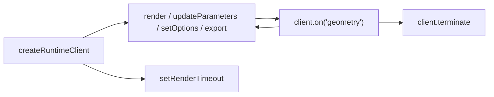

# @taucad/runtime

Multi-kernel CAD runtime that powers [tau.new](https://tau.new). Build a
client, send a command, consume the result.

## Quick start

`createNodeClient()` provides the bundled runtime, transport, and in-memory
filesystem. Its first command connects the runtime and returns an ordered,
non-empty export artifact set.

```typescript
import { createNodeClient } from '@taucad/runtime/node';

const client = await createNodeClient();
const result = await client.export('glb', {
  source: {
    files: {
      'main.ts': 'import { makeBaseBox } from "replicad";\nexport default () => makeBaseBox(10, 20, 30);',
    },
  },
});

if (!result.success) throw new Error(`Export failed: ${result.issues[0]?.message}`);
console.log(`Exported ${result.data[0].name}: ${result.data[0].bytes.byteLength} bytes`);
client.terminate();
```

## The lifecycle

Every consumer — UI panes, the CLI, RPC handlers, benchmarks, AI agents —
follows the same shape:

1. **Construct** — `createRuntimeClient(options)` produces an inert client.
   No network, no WASM, and the client itself never allocates a
   `SharedArrayBuffer` — SAB lifecycle is owned by the active
   {@link RuntimeTransportClient} (in-process, dedicated worker, or remote).
   The client is in `lifecycleState: 'unconnected'`.
2. **Command** — `client.render`, `client.updateParameters`,
   `client.setOptions`, and `client.export` drive the worker. Each
   command-shaped method (apart from `export`) returns a `RenderOutcome`
   so consumers can branch on supersession without try/catch flow control.
   The first command call lazy-connects the transport and (for inline
   `source.files` input) auto-provisions an in-memory filesystem.
   `client.setRenderTimeout(renderTimeout)` is different: it is a synchronous,
   connected-client control-plane setter for subsequent renders and never
   sends render intent to the worker.
3. **Consume** — `client.on('geometry' | 'error' | 'progress' | …, handler)`
   subscribes to the single ordered event stream the worker produces.
   Subscriptions auto-dispose on `client.terminate()`.



`client.connect()` advances the lifecycle without arguments; every
host-wiring concern (SAB pools, FS bridges, worker URLs, deferred filesystem
attachment) is owned by the wired {@link TransportPlugin} callable passed at
construction (`{ transport: webWorkerTransport({ ... }) }`). Opaque
filesystems are produced by the public factories
(`fromMemoryFs`, `fromNodeFs`, `fromBrowserFs`, `fromFsLike`,
`fromFileSystemBridge`); raw `MessagePort`s are not part of the public surface.
See [Embedding in a Host](https://github.com/taucad/tau/blob/main/apps/ui/content/docs/runtime/guides/embedding-in-a-host.mdx).

## Autonomous render loop (editors and live UIs)

`render` hands the worker a `(source, parameters)` pair and lets it own
re-rendering. A newer public preview command or an autonomous watched-filesystem
preview can supersede an in-flight call, whose `RenderOutcome` resolves with
`{ superseded: true }`. Subscribe to `geometry` for the authoritative selected
preview; an autonomous successor has no second public outcome. For inline
`source.files` input the runtime auto-provisions the filesystem on the first call.

```typescript
import { createRuntimeClient } from '@taucad/runtime';
import { fromMemoryFs } from '@taucad/runtime/filesystem';
import { presets } from '@taucad/runtime/presets';
import { inProcessTransport } from '@taucad/runtime/transport/in-process';

const runtime = presets.all();
const client = createRuntimeClient({
  transport: inProcessTransport({ runtime, fileSystem: fromMemoryFs() }),
});

const unsubscribe = client.on('geometry', (result) => {
  if (!result.success) {
    console.error('render failed', result.issues);
    return;
  }
  console.log('fresh geometry', result.data.content.byteLength, 'bytes');
});

await client.render({
  source: {
    files: {
      'main.ts':
        'import { drawCircle } from "replicad";\nexport default () => drawCircle(10).sketchOnPlane().extrude(20);',
    },
  },
  parameters: {},
});

await client.updateParameters({ height: 40 });

unsubscribe();
client.terminate();
```

For viewers that watch a real filesystem (Node fs, OPFS, the browser FM
worker), pass it once at construction so every `render({ source: { path } })` call
runs against it through the transport:
`createRuntimeClient({ transport: inProcessTransport({ runtime, fileSystem }) })`.

## Lifecycle states

`client.lifecycleState` is the single source of truth for what the client can
do right now:

| State         | Reachable methods                             | Notes                                                                                                                           |
| ------------- | --------------------------------------------- | ------------------------------------------------------------------------------------------------------------------------------- |
| `unconnected` | all public methods except `setRenderTimeout`  | The default after construction. Command methods (`render`/`updateParameters`/`setOptions`/`export`) lazy-connect on first call. |
| `connecting`  | `lifecycleState`                              | Concurrent command calls await the in-flight handshake.                                                                         |
| `connected`   | every public method                           | Steady state.                                                                                                                   |
| `terminated`  | `lifecycleState`, `terminate()`, `shutdown()` | All other methods throw `RuntimeTerminatedError`. `shutdown()` is idempotent.                                                   |

Connect failures leave the client in `unconnected` so retry is safe.
`connect()` is one-shot per client lifetime: once `connected`, subsequent
`connect()` calls return the existing connection. To bind a single client to
a different filesystem, `terminate()` (or `await shutdown()`) it and create a
fresh one. Filesystem source commands (i.e. `render({ source: { path } })`)
on a client whose transport has no filesystem bridge throw
`RuntimeNotConnectedError`.

### Termination

Two complementary termination methods are exposed:

- `terminate()` — synchronous, abrupt. Stops the worker immediately,
  rejects every in-flight intent with `RuntimeTerminatedError`, and
  releases the kernel-host port. Use this for hard-stop / unmount paths.
- `shutdown({ drain? })` — asynchronous, cooperative. Awaits in-flight
  intents to settle when `drain: true`, awaits one acknowledged worker cleanup
  behind the serialized operation lane, then closes transport-owned resources.
  `drain: false` is a hard close and makes no remote-cleanup guarantee. Use a
  draining shutdown for orderly server/test teardown. Both methods are idempotent.

## Render timeouts and cancellation

Worker-backed clients can enforce a wall-clock deadline for each preview. The
matching Promise rejects locally with `RenderTimeoutError`; it does not wait for
the worker to acknowledge cancellation, so the same contract holds without
`SharedArrayBuffer`.

```typescript
import { createRuntimeClient, isRenderTimeoutError } from '@taucad/runtime/client';
import { createWebWorkerClientOptions } from '@taucad/runtime/transport/web';
import type { runtime } from './runtime.worker';

const clientOptions = createWebWorkerClientOptions<typeof runtime>({
  createWorker: () => new Worker(new URL('./runtime.worker.ts', import.meta.url), { type: 'module' }),
  renderTimeout: 60_000,
});

const client = createRuntimeClient<typeof runtime>(clientOptions);

try {
  await client.render({ source: { files: { 'main.ts': 'export default () => model;' } } });
} catch (error) {
  if (!isRenderTimeoutError(error)) throw error;
  console.error(error.message);
}
```

After deadline settlement, the runtime targets only the timed-out render and
waits for bounded cooperative recovery. A responsive isolated host is retained.
An unresponsive host is terminated; work queued during recovery rejects with
`RuntimeTerminatedError` and `causeKind === 'render-timeout'`. Construct a new
client from the same module-scope options spec before retrying.

`setRenderTimeout(renderTimeout)` changes only later previews. Milliseconds.
Zero disables it. Same-isolate `inProcessTransport` rejects a non-zero timeout
because synchronous work can block the deadline timer itself, regardless of SAB
availability.

Plugin authors receive the same fresh operation signal through
`KernelRuntime.signal`, `KernelMiddlewareRuntime.signal`,
`MiddlewareDependencyRuntime.signal`, and `BundlerRuntime.signal`:

```typescript
import { defineMiddleware } from '@taucad/runtime/middleware';

export const remoteCalibration = defineMiddleware({
  id: 'remote-calibration',
  name: 'Remote calibration',
  async wrapCreateGeometry(input, handler, { signal }) {
    const response = await fetch('/api/calibration', { signal });
    const parameters = { ...input.parameters, ...(await response.json()) };
    return handler({ ...input, parameters });
  },
});
```

Pass the signal to cancellable platform APIs and never retain it after the
operation. Do not use `Promise.race()` to claim that mutating work stopped while
it continues in the background.

See [Configure Render Timeouts](https://github.com/taucad/tau/blob/main/apps/ui/content/docs/runtime/guides/render-timeouts.mdx)
and [Cooperate with Cancellation](https://github.com/taucad/tau/blob/main/apps/ui/content/docs/runtime/guides/cooperate-with-cancellation.mdx).

## Filesystem ownership

A runtime path identifies a file within the filesystem supplied to one client.
Normalized plugin paths begin with `/` (`/main.ts`, `/.tau/cache/**`,
`/node_modules/**`), but that slash names the supplied filesystem's root rather
than the host operating system's root. Consumer `source.path` accepts relative
or `/`-prefixed input; inline `source.entry` selects a key in `source.files`.
The filesystem authority chooses and confines a project root; kernels,
bundlers, middleware, and headless services receive no project id,
authority-global path, grant, or authorization callback. Rooted filesystems
remain writable so caches and generated files persist inside the project tree.

See [Path Namespaces](https://github.com/taucad/tau/blob/main/apps/ui/content/docs/runtime/concepts/path-namespaces.mdx)
for consumer, plugin-author, and host-adapter examples.

Watch-capable rooted filesystems own precise-versus-reset event semantics. The
worker acknowledges entry observation before discovery, replaces its complete
multi-path subscription with overlap-and-swap, and keeps current-preview watch
ownership independent from successful artifact publication. Watcherless adapters
reread volatile file state at each explicit source-bearing operation while
retaining kernel initialization and persistent project-local caches. Exact-source
exports use request-local ownership and cannot replace the active preview.

## Transports

`@taucad/runtime/transport` ships pluggable {@link RuntimeTransportPlugin}
implementations. A transport plugin is the client-side declaration that owns
channel construction, SAB allocation, abort signalling, geometry pool
resolution, and FS bridging:

- `inProcessTransport` — same realm; lowest latency. The runtime worker
  runs on the calling thread over an internal `MessageChannel`.
- `webWorkerTransport` — dedicated browser `Worker`. The plugin spawns
  the worker, posts the host port across `postMessage`, and forwards
  lifecycle errors as channel-level `lb` (lifecycle-bye) frames so the
  client surfaces typed termination errors.
- `nodeWorkerTransport` — Node.js `worker_threads`. Uses
  `MessageChannelMain`-style port handoff so the host and worker share
  the same `Port<unknown>` shape as the browser. The application supplies
  the worker entry URL because only its build owns that executable module.

Custom client transports are authored with
`defineRuntimeTransport({ id, clientOptionsSchema?, client })`. Host factories
remain standalone, environment-specific exports such as `webWorkerHost`,
`nodeWorkerHost`, and `electronUtilityHost`; importing a renderer/client subpath
therefore cannot pull host workers or Node-only code into its graph.
Their materialized client reserves each preview synchronously, exposes
`renderTimeoutRecovery: { kind: 'terminable' | 'unsupported' }`, and resolves
`closed` once with a typed cause (`requested`, `render-timeout`, `host-exit`, or
`wire-failure`). Terminable transports must abort the exact supplied render and
terminate only the host owned by that client.

All transports produce the same `Port<unknown>` so the channel — and
therefore everything above it — is transport-agnostic. Cross-origin
isolated pages also receive zero-copy geometry transfers via a
`SharedArrayBuffer` pool that the transport allocates internally.

## Framework build integration

- Vite and React Router: add `tauRuntime()` from `@taucad/runtime/vite`.
- Next.js: export `withTauRuntime(appConfig?, headerOptions?)` from `next.config.ts`.
- electron-vite: wrap the ordinary three-process config with
  `electronRuntimeConfig(...)` from `@taucad/runtime/electron/vite` and import
  the utility entry with electron-vite's native `?modulePath` query.

The framework helpers are version-neutral: the same implementation is qualified
with React Router 7/Vite 7 and React Router 8/Vite 8, electron-vite 5/Vite 7 and
electron-vite 6 beta/Vite 8, and Next.js 15/Webpack and Next.js 16/Turbopack.
Consumers do not need package aliases, semver branches, or version-specific
configuration.

## Plugin entry points

| Subpath                                | Purpose                                                                                   |
| -------------------------------------- | ----------------------------------------------------------------------------------------- |
| `@taucad/runtime`                      | Public client surface, connectors, types, error classes.                                  |
| `@taucad/runtime/presets`              | Zero-config built-in kernel, middleware, bundler, and transcoder composition.             |
| `@taucad/runtime/kernels`              | Bundled kernel factories (`replicad`, `opencascade`, `manifold`, `jscad`, `zoo`, `tau`).  |
| `@taucad/runtime/transcoder`           | Transcoder authoring API.                                                                 |
| `@taucad/runtime/transport`            | Author API only: `defineRuntimeTransport`, `runtimeProtocolSchemas`, shared types.        |
| `@taucad/runtime/transport/in-process` | `inProcessTransport` — same-isolate transport (cross-env).                                |
| `@taucad/runtime/transport/web`        | `webWorkerTransport` — browser `Worker` host.                                             |
| `@taucad/runtime/transport/node`       | `nodeWorkerTransport` — `node:worker_threads` host (gated to keep browser bundles clean). |
| `@taucad/runtime/middleware`           | Built-in middlewares (parameter cache, geometry cache, file resolver).                    |
| `@taucad/runtime/filesystem`           | `fromMemoryFs`, `fromBrowserFs`, bridge factories, and opaque filesystem types.           |
| `@taucad/runtime/filesystem/node`      | `fromNodeFs` for a host directory confined as the runtime root.                           |
| `@taucad/runtime/testing`              | `createMockRuntimeClient`, kernel testing utilities.                                      |
| `@taucad/runtime/node`                 | `createNodeClient` for headless/CLI usage.                                                |

## Further reading

- [Quick start](https://github.com/taucad/tau/blob/main/apps/ui/content/docs/runtime/getting-started/quick-start.mdx)
- [Live rendering](https://github.com/taucad/tau/blob/main/apps/ui/content/docs/runtime/guides/live-rendering.mdx) — autonomous loop, `RenderOutcome`, supersession
- [Embedding in a host](https://github.com/taucad/tau/blob/main/apps/ui/content/docs/runtime/guides/embedding-in-a-host.mdx) — rooted bridge factories and deferred filesystem binding
- [Architecture invariants](https://github.com/taucad/tau/blob/main/docs/architecture/runtime-topology.md)
- [Per-kernel guides](https://github.com/taucad/tau/tree/main/apps/ui/content/docs/runtime)
