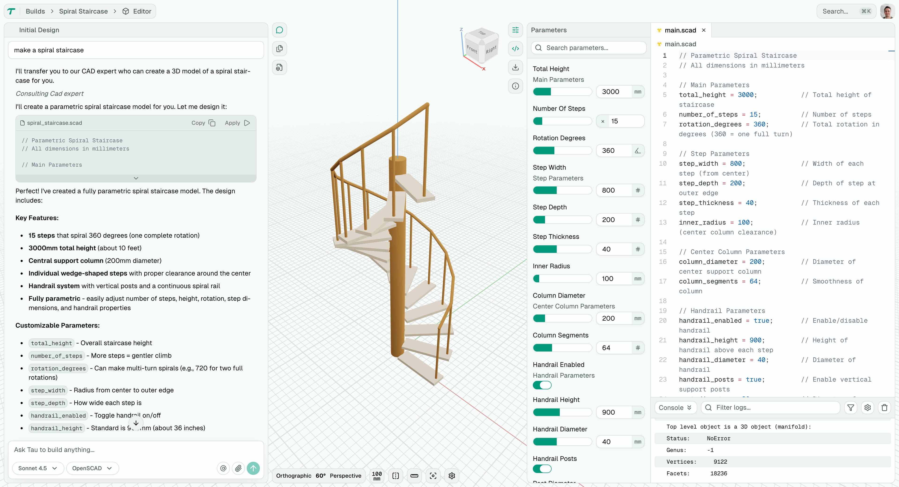

# Tau

Your AI-powered workshop companion — a free, open-source CAD platform that works offline. Design anything from 3D prints to woodworking projects with intelligent assistance, right in your browser.

**[Try it now at tau.new](https://tau.new)**

## Features

- **Open Source** — MIT licensed, free forever
- **Browser-Based** — Run CAD on mobile or desktop, no **installation** required
- **Code-Based CAD** — Precise, version-controlled designs through code
- **AI-Powered** — Natural language interface for design creation and modification
- **Parametric Editor** — Adjustable parameters with real-time preview
- **Multi-Kernel** — Choose the right CAD engine for your project
- **Embeddable** — Components to bring CAD into any web application

## Use Cases

### 3D Printing
Design and export models optimized for additive manufacturing. Export directly to STL, 3MF, or other slicer-compatible formats.

### CAD Prototyping
Rapid iteration with parametric code. Change dimensions, test variations, and version control your designs like software.

### Academic Research
Use kernel APIs for computational geometry research. Integrate CAD capabilities into research tools and educational platforms.

## Supported Kernels

Tau's multi-kernel architecture lets you choose the best CAD engine for your needs.

### Mechanical

- [x] **[OpenSCAD](https://openscad.org/)** — Script-based CSG modeling, perfect for 3D printing
- [x] **[Replicad](https://replicad.xyz/)** — TypeScript CAD with OpenCascade for precise engineering
- [x] **[Zoo (KCL)](https://zoo.dev/)** — Cloud-native CAD with AI integration
- [x] **[JSCAD](https://openjscad.xyz/)** — JavaScript parametric modeling
- [ ] Fusion360
- [ ] Build123D
- [ ] TrCAD
- [ ] ManifoldCAD
- [ ] Curv
- [ ] ScriptCAD

### Electrical

- [ ] **[TSCircuit](https://tscircuit.com/)** — Open-source PCB design
- [ ] **[Atopile](https://atopile.io/)** — Hardware description language

### Firmware

- [ ] **[Arduino](https://www.arduino.cc/)** — Electronics platform

## File Converter

Tau includes a powerful file converter supporting **41 input formats** and **11 output formats**.

### Supported Input Formats (41)

3dm, 3ds, 3mf, ac, amf, ase, brep, bvh, cob, dae, drc, dxf, fbx, glb, gltf, ifc, iges, igs, lwo, md2, md5mesh, mesh.xml, nff, obj, off, ogex, ply, smd, step, stl, stp, usda, usdc, usdz, wrl, x, x3d, x3db, x3dv, xgl

### Supported Output Formats (11)

3ds, dae, fbx, glb, gltf, obj, ply, stl, step, x, x3d

## Built With

Tau is built on a foundation of excellent open-source projects:

| Category | Technologies |
|----------|-------------|
| **State Management** | [XState V5](https://xstate.js.org/) |
| **Code Editor** | [Monaco Editor](https://microsoft.github.io/monaco-editor/) |
| **3D Rendering** | [Three.js](https://threejs.org/), [React Three Fiber](https://docs.pmnd.rs/react-three-fiber) |
| **UI Framework** | [React 19](https://react.dev/), [Radix UI](https://www.radix-ui.com/) |
| **File Tree** | [Headless Tree](https://headless-tree.lukasbach.com/) |
| **AI Orchestration** | [LangChain](https://js.langchain.com/) |
| **3D Processing** | [glTF-Transform](https://gltf-transform.dev/), [Assimp](https://assimp.org/) |
| **Documentation** | [Fumadocs](https://fumadocs.dev/) |
| **Database** | [Drizzle ORM](https://orm.drizzle.team/) |
| **Git Operations** | [Isomorphic Git](https://isomorphic-git.org/) |

## Community

- **Discord** — [Join our community](https://discord.gg/KnB7rxK3)
- **Documentation** — [tau.new/docs](https://tau.new/docs)
- **GitHub Discussions** — Ask questions and share ideas

## Contributing

We welcome contributions! Please see our [Contributing Guide](contributing.md) for development setup and guidelines.

## Security

For security concerns, please review our [Security Policy](security.md).

## Code of Conduct

Please read our [Code of Conduct](code_of_conduct.md) before participating.

## Acknowledgements

Tau wouldn't be possible without these amazing open-source projects:

- [OpenSCAD Playground](https://github.com/openscad/openscad-playground) — Inspiration for browser-based code-CAD architecture
- [Three.js](https://threejs.org/) & [React Three Fiber](https://docs.pmnd.rs/react-three-fiber) — 3D rendering engine
- [XState](https://xstate.js.org/) — State machine orchestration
- [Monaco Editor](https://microsoft.github.io/monaco-editor/) — The editor powering VS Code
- [Radix UI](https://www.radix-ui.com/) — Accessible UI primitives
- [OpenCascade.js](https://ocjs.org/) — CAD kernel (via Replicad)
- [Assimp](https://assimp.org/) — Multi-format 3D model importer
- [glTF-Transform](https://gltf-transform.dev/) — 3D file processing
- [LangChain](https://js.langchain.com/) — AI orchestration
- [Headless Tree](https://headless-tree.lukasbach.com/) — File tree component
- [Fumadocs](https://fumadocs.dev/) — Documentation framework

## License

Tau is dual-licensed:

- **[MIT License](license)** — For all components except the OpenSCAD kernel
- **GPL-2.0-or-later** — When using the OpenSCAD kernel

If you use Tau **without** the OpenSCAD kernel (e.g., only Replicad, Zoo, or JSCAD), the entire codebase is available under the permissive MIT License. If you use Tau **with** the OpenSCAD kernel, the combined work is subject to [GPL-2.0-or-later](https://www.gnu.org/licenses/gpl-2.0.html) terms due to the `openscad-wasm-prebuilt` dependency.

Third-party license information is available in [license-deps](license-deps).
