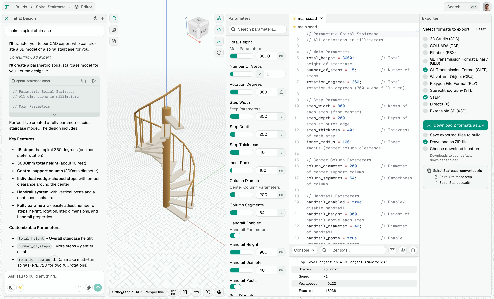

[](license)
[](https://discord.gg/KnB7rxK3)
[](https://github.com/xojs/xo)
[](https://nodejs.org)

# Tau

Your AI-powered workshop companion — a free, open-source CAD platform that works offline. Design anything from 3D prints to woodworking projects with intelligent assistance, right in your browser.

**[Try it now at tau.new](https://tau.new)**

<picture>
  <source media="(prefers-color-scheme: dark)" srcset="docs/assets/tau-desktop-dark.jpg">
  <source media="(prefers-color-scheme: light)" srcset="docs/assets/tau-desktop-light.jpg">
  
</picture>

## Features

- **Open Source** — MIT licensed, free forever
- **Browser-Based** — Run CAD on mobile or desktop, no **installation** required
- **Code-Based CAD** — Precise, version-controlled designs through code
- **AI-Powered** — Natural language interface for design creation and modification
- **Parametric Editor** — Adjustable parameters with real-time preview
- **Multi-Kernel** — Choose the right CAD engine for your project
- **Embeddable** — Components to bring CAD into any web application

## Use Cases

### 3D Printing
Design and export models optimized for additive manufacturing. Export directly to STL, 3MF, or other slicer-compatible formats.

### CAD Prototyping
Rapid iteration with parametric code. Change dimensions, test variations, and version control your designs like software.

### Academic Research
Use kernel APIs for computational geometry research. Integrate CAD capabilities into research tools and educational platforms.

## Supported Kernels

Tau's multi-kernel architecture lets you choose the best CAD engine for your needs.

### Mechanical

- [x] **[OpenSCAD](https://openscad.org/)** — Script-based CSG modeling, perfect for 3D printing
- [x] **[Replicad](https://replicad.xyz/)** — TypeScript CAD with OpenCascade for precise engineering
- [x] **[Zoo (KCL)](https://zoo.dev/)** — Cloud-native CAD with AI integration
- [x] **[JSCAD](https://openjscad.xyz/)** — JavaScript parametric modeling
- [ ] Fusion360
- [ ] Build123D
- [ ] TrCAD
- [ ] ManifoldCAD
- [ ] Curv
- [ ] ScriptCAD

### Electrical

- [ ] **[TSCircuit](https://tscircuit.com/)** — Open-source PCB design
- [ ] **[Atopile](https://atopile.io/)** — Hardware description language

### Firmware

- [ ] **[Arduino](https://www.arduino.cc/)** — Electronics platform

## File Converter

Tau includes a powerful file converter supporting **41 input formats** and **11 output formats**.

### Supported Input Formats (41)

3dm, 3ds, 3mf, ac, amf, ase, brep, bvh, cob, dae, drc, dxf, fbx, glb, gltf, ifc, iges, igs, lwo, md2, md5mesh, mesh.xml, nff, obj, off, ogex, ply, smd, step, stl, stp, usda, usdc, usdz, wrl, x, x3d, x3db, x3dv, xgl

### Supported Output Formats (11)

3ds, dae, fbx, glb, gltf, obj, ply, stl, step, x, x3d

## Built With

Tau is built on a foundation of excellent open-source projects:

| Category | Technologies |
|----------|-------------|
| **State Management** | [XState V5](https://xstate.js.org/) |
| **Code Editor** | [Monaco Editor](https://microsoft.github.io/monaco-editor/) |
| **3D Rendering** | [Three.js](https://threejs.org/), [React Three Fiber](https://docs.pmnd.rs/react-three-fiber) |
| **UI Framework** | [React 19](https://react.dev/), [Radix UI](https://www.radix-ui.com/) |
| **File Tree** | [Headless Tree](https://headless-tree.lukasbach.com/) |
| **AI Orchestration** | [LangChain](https://js.langchain.com/) |
| **3D Processing** | [glTF-Transform](https://gltf-transform.dev/), [Assimp](https://assimp.org/) |
| **Documentation** | [Fumadocs](https://fumadocs.dev/) |
| **Database** | [Drizzle ORM](https://orm.drizzle.team/) |
| **Git Operations** | [Isomorphic Git](https://isomorphic-git.org/) |

## Community

- **Discord** — [Join our community](https://discord.gg/KnB7rxK3)
- **Documentation** — [tau.new/docs](https://tau.new/docs)
- **GitHub Discussions** — Ask questions and share ideas

## Contributing

We welcome contributions! Please see our [Contributing Guide](contributing.md) for development setup and guidelines.

## Security

For security concerns, please review our [Security Policy](security.md).

## Code of Conduct

Please read our [Code of Conduct](code_of_conduct.md) before participating.

## Acknowledgements

Tau wouldn't be possible without these amazing open-source projects:

- [OpenSCAD Playground](https://github.com/openscad/openscad-playground) — Inspiration for browser-based code-CAD architecture
- [Three.js](https://threejs.org/) & [React Three Fiber](https://docs.pmnd.rs/react-three-fiber) — 3D rendering engine
- [XState](https://xstate.js.org/) — State machine orchestration
- [Monaco Editor](https://microsoft.github.io/monaco-editor/) — The editor powering VS Code
- [Radix UI](https://www.radix-ui.com/) — Accessible UI primitives
- [OpenCascade.js](https://ocjs.org/) — CAD kernel (via Replicad)
- [Assimp](https://assimp.org/) — Multi-format 3D model importer
- [glTF-Transform](https://gltf-transform.dev/) — 3D file processing
- [LangChain](https://js.langchain.com/) — AI orchestration
- [Headless Tree](https://headless-tree.lukasbach.com/) — File tree component
- [Fumadocs](https://fumadocs.dev/) — Documentation framework

## License

Tau is dual-licensed:

- **[MIT License](license)** — For all components except the OpenSCAD kernel
- **GPL-2.0-or-later** — When using the OpenSCAD kernel

If you use Tau **without** the OpenSCAD kernel (e.g., only Replicad, Zoo, or JSCAD), the entire codebase is available under the permissive MIT License. If you use Tau **with** the OpenSCAD kernel, the combined work is subject to [GPL-2.0-or-later](https://www.gnu.org/licenses/gpl-2.0.html) terms due to the `openscad-wasm-prebuilt` dependency.

Third-party license information is available in [license-deps](license-deps).

## Setup Guide & Requirements

**Prerequisites**

- **Node.js**: >= 24 (project and Dockerfiles target `24.3.0`). Use a Node version manager (nvm, nvm-windows, or Volta) or Docker.
- **pnpm**: workspace uses `pnpm`. Enable Corepack or install pnpm globally.
- **Docker** (recommended): used for production images and to avoid native-build issues on Windows.
- **WSL2 (recommended for Windows)**: run the project inside WSL2/Ubuntu to avoid PowerShell/Windows native-build friction.

**Quick WSL Setup**

1. Open WSL shell (Ubuntu).
2. Enable Corepack and install pnpm:

```bash
corepack enable
corepack prepare pnpm@latest --activate
pnpm install
```

3. Start development servers:

```bash
pnpm dev
```

**Install (non-WSL)**

```bash
# enable corepack and install dependencies
corepack enable
corepack prepare pnpm@latest --activate
pnpm install
```

If you're on Windows and must build native modules (sharp, canvas, swc, etc.), use WSL2 or install Visual Studio Build Tools.

**Development**

- Start all apps (workspace): `pnpm dev` (delegates to Nx).
- Start individual project:
  - UI: `pnpm nx dev ui` or `pnpm nx run ui:dev`
  - API: `pnpm nx dev api` or `pnpm nx run api:dev`

**Build**

- Build workspace: `pnpm build`
- Build Docker images (examples):

```bash
# API
docker build -t tau-api -f apps/api/Dockerfile --build-arg NODE_VERSION=24.3.0 .
# UI
docker build -t tau-ui -f apps/ui/Dockerfile --build-arg NODE_VERSION=24.3.0 .
```

**Tests & Linting**

- Run tests (workspace): `pnpm test` or `pnpm nx test <project>`
- Lint: `pnpm lint` or `pnpm nx lint <project>`
- Vitest configurations are present for UI (jsdom) and API (node).

**Deploy**

- Fly.io: `flyctl deploy --config apps/api/fly.prod.toml` (requires `flyctl`).
- Netlify: UI contains `netlify.toml`; build via `pnpm nx build ui` and publish output.

**Troubleshooting**

- If scripts use POSIX env vars (e.g., `CI=true ...`), run them inside WSL or use `cross-env`.
- If native modules fail to build, use WSL or Docker-based builds.
- If `pnpm` commands fail, run `corepack enable` or install pnpm globally.

**Recommended VS Code extensions**

- `Nx Console`, `ESLint`, `Prettier`, `Dev Containers`, `GitLens`.


## Setup Guide & Requirements

**Prerequisites**

- **Node.js**: >= 24 (project and Dockerfiles target `24.3.0`). Use a Node version manager (nvm, nvm-windows, or Volta) or Docker.
- **pnpm**: workspace uses `pnpm`. Enable Corepack or install pnpm globally.
- **Docker** (recommended): used for production images and to avoid native-build issues on Windows.
- **WSL2 (recommended for Windows)**: run the project inside WSL2/Ubuntu to avoid PowerShell/Windows native-build friction.

**Quick WSL Setup**

1. Open WSL shell (Ubuntu).
2. Enable Corepack and install pnpm:

```bash
corepack enable
corepack prepare pnpm@latest --activate
pnpm install
```

3. Start development servers:

```bash
pnpm dev
```

**Install (non-WSL)**

```bash
# enable corepack and install dependencies
corepack enable
corepack prepare pnpm@latest --activate
pnpm install
```

If you're on Windows and must build native modules (sharp, canvas, swc, etc.), use WSL2 or install Visual Studio Build Tools.

**Development**

- Start all apps (workspace): `pnpm dev` (delegates to Nx).
- Start individual project:
  - UI: `pnpm nx dev ui` or `pnpm nx run ui:dev`
  - API: `pnpm nx dev api` or `pnpm nx run api:dev`

**Build**

- Build workspace: `pnpm build`
- Build Docker images (examples):

```bash
# API
docker build -t tau-api -f apps/api/Dockerfile --build-arg NODE_VERSION=24.3.0 .
# UI
docker build -t tau-ui -f apps/ui/Dockerfile --build-arg NODE_VERSION=24.3.0 .
```

**Tests & Linting**

- Run tests (workspace): `pnpm test` or `pnpm nx test <project>`
- Lint: `pnpm lint` or `pnpm nx lint <project>`
- Vitest configurations are present for UI (jsdom) and API (node).

**Deploy**

- Fly.io: `flyctl deploy --config apps/api/fly.prod.toml` (requires `flyctl`).
- Netlify: UI contains `netlify.toml`; build via `pnpm nx build ui` and publish output.

**Troubleshooting**

- If scripts use POSIX env vars (e.g., `CI=true ...`), run them inside WSL or use `cross-env`.
- If native modules fail to build, use WSL or Docker-based builds.
- If `pnpm` commands fail, run `corepack enable` or install pnpm globally.

**Recommended VS Code extensions**

- `Nx Console`, `ESLint`, `Prettier`, `Dev Containers`, `GitLens`.

